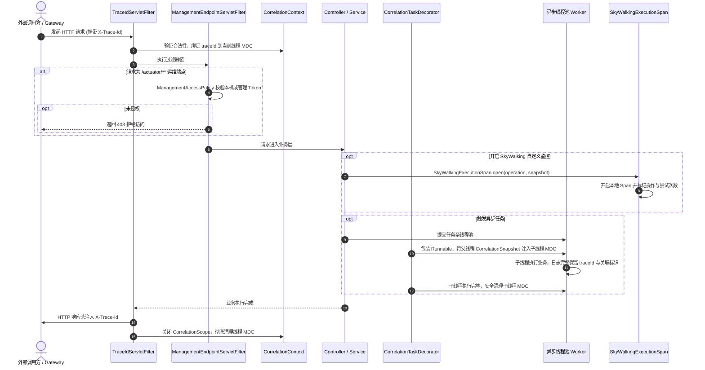

## 请求拦截与全链路追踪

### 一、目标与定位

微服务架构下，单次用户请求通常穿透网关、多个微服务、消息队列与异步线程池。`common-core` 提供跨进出站、跨线程池的统一追踪与遥测上下文能力，确保全链路日志具备唯一可溯源标识，同时对管理运维端点施加访问控制。

核心职责包括：

1. HTTP 进站请求拦截与 TraceId 提取、生成、回传。
2. 统一关联上下文 `CorrelationContext` 与快照恢复机制。
3. 线程池任务装饰器 `CorrelationTaskDecorator`，解决异步线程上下文丢失难题。
4. SkyWalking 自定义执行 Span 封装与跨进程透传。
5. Actuator 与 Prometheus 管理端点安全防护过滤器。

---

### 二、总体架构与时序

---

### 三、核心设计细节

#### 3.1 TraceIdServletFilter 请求过滤器

作为 Servlet 容器最高优先级（`Ordered.HIGHEST_PRECEDENCE`）过滤器，继承 `OncePerRequestFilter`，负责请求进出站生命周期：

1. **合法性提取**：读取请求头中的 `X-Trace-Id`。仅信任网关或 Feign 传入的合法格式；若头部缺失或格式非法，立即生成全新 UUID，保证链路标识始终有效。
2. **可恢复作用域**：通过 `CorrelationContext.openScope` 建立与当前请求绑定的上下文，并将标识压入 SLF4J MDC。
3. **响应头注入**：将最终确定的 `X-Trace-Id` 回写至 HTTP 响应头，方便前端、测试工具和抓包定位故障。
4. **请求耗时与审计**：在请求退出时记录 `HTTP_REQUEST_COMPLETED` 日志，输出 HTTP 方法、匹配路由模板、HTTP 状态码及耗时毫秒数。
5. **MDC 防污染清理**：在 `finally` 块中关闭作用域并清除 MDC，坚决杜绝 Tomcat 工作线程池复用导致不同请求日志串标。

#### 3.2 CorrelationContext 全链路关联上下文

传统框架往往只传递 `traceId`，LeetModel 的 `CorrelationContext` 统一管理多维度全链路标识：

- `traceId`：请求维度的全局唯一追踪 ID。
- `operationId`：人工治理、重试与后台运维命令标识。
- `eventId`：消息队列事件 ID。
- `taskId`：长任务或批处理调度任务 ID。
- `aiCallId`：大模型单次调用记录 ID。

通过 `CorrelationSnapshot` 承载不可变快照，支持嵌套调用时的作用域恢复，外层调用结束后自动恢复进入前的状态，不破坏上一级上下文。

#### 3.3 CorrelationTaskDecorator 线程池透传

在 Java 异步多线程执行时，父线程的 `ThreadLocal` 变量无法直接进入子线程：

1. `CorrelationTaskDecorator` 实现 Spring 的 `TaskDecorator` 接口。
2. 在主线程向线程池提交任务的瞬间，调用 `CorrelationContext.snapshot()` 捕获当前线程的不可变快照。
3. 在子线程正式执行目标任务前，调用 `snapshot.restore()` 将上下文注入子线程的 MDC。
4. 任务执行完毕后，执行清理逻辑。确保子线程打印的所有日志天然具备完整的 `traceId`、`taskId` 等信息。

#### 3.4 SkyWalkingExecutionSpan 链路增强

对于需要进入分布式 APM 监控的核心操作（如 Outbox 发送、Inbox 消费、PDF 解析、模型调用等）：

1. 封装 SkyWalking APM Toolkit 的追踪 API，创建轻量级自定义本地 Span。
2. 绑定 `ExecutionSpanOperation` 标准操作编码，记录成功、重试或阻断等执行结果。
3. 在无 SkyWalking 探针的本地开发或测试环境中，自动退化为安全无害的空操作，不抛出类缺失异常。

#### 3.5 ManagementEndpointServletFilter 端点防护

生产环境中，Spring Boot Actuator 与 Prometheus 端点包含系统拓扑与运行指标：

1. 拦截所有 `/actuator/**` 路径。
2. `/actuator/health` 探针默认放行，但遵循无详情暴露原则。
3. `/actuator/info` 与 `/actuator/prometheus` 要求必须来自本机环回地址，或者请求头携带由运行环境注入的 `MANAGEMENT_TOKEN`，防止公网直接抓取指标数据。

---

### 四、边界与设计取舍

1. **不使用跨请求全局继承**：上下文只在单次请求和当前请求衍生出的异步线程树中有效，请求结束后必须彻底销毁，不向容器上下文驻留数据。
2. **低基数原则**：进入遥测标签与 Span 维度的字段严格限制为预定义的枚举操作码，动态的业务入参、论文题目或用户信息坚决不作为标签，防止分布式追踪系统内存溢出。
