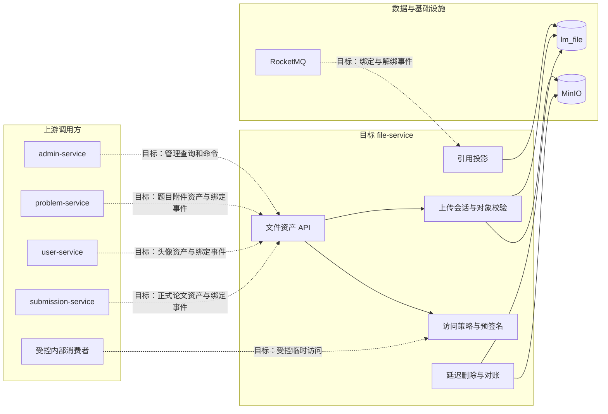

## 文件服务

> 服务状态：目标设计已确认，Maven 模块、数据库和运行时接口尚未实现。当前业务服务仍分别通过公共 StorageService 或专用 MinIO 适配器管理文件。

### 服务定位

file-service 是全平台文件资产控制面，拥有文件稳定身份、技术元数据、逻辑分组、访问策略、上传会话、引用投影和存储生命周期。MinIO 继续作为二进制数据面，业务服务继续拥有题目附件、头像选择、提交版本等领域关系。

建设该服务的依据不是复用 MinIO SDK，而是全平台已经出现手动资产管理、跨服务文件清单、统一访问策略和安全删除需求。file-service 只有在维护运行时文件事实与生命周期时才具有独立部署价值。

### 整体结构与宏观工作流程

图中虚线调用均为尚未实现的目标关系。第一阶段由 admin-service 提供管理入口，file-service 执行文件规则并保存事实；业务服务随后按迁移计划逐个接入。

### 负责

- 为每个正式文件分配稳定 fileId，并保存技术元数据。
- 管理 namespace、groupPath 和系统生成的唯一 objectKey。
- 创建上传会话，生成预签名凭证，并在完成时校验物理对象。
- 按访问级别和调用用途生成有界时效的上传或下载地址。
- 消费业务绑定与解绑事件，维护用于治理和删除保护的引用投影。
- 管理文件上传、可用、绑定、待删除、已删除和删除失败状态。
- 扫描 MinIO 并与文件资产表对账，识别缺失对象和未知对象。
- 管理员手动素材的上传、分组、查询、下载和删除。
- 在普通删除前执行引用和系统健康校验，异步完成延迟物理清理。
- 为高风险文件操作产生可追踪的领域审计事实。

### 不负责

- 不维护题目附件说明、排序和题目归属。
- 不维护用户当前头像选择。
- 不维护论文提交版本、最终提交和分片上传业务状态。
- 不解析 Markdown，也不自动下载其中的外部资源。
- 不负责服务端静态图标和宣传图片的动态替换。
- 不解压或在线预览压缩包。
- 不把所有文件字节强制代理经过 file-service。
- 不允许 admin-service 直连 lm_file 或 MinIO 绕过文件规则。
- 不把引用投影升级为其他业务关系的主数据。

### 数据与配置

file-service 目标独占 `lm_file` 数据库，拥有文件资产、上传会话、引用投影和生命周期任务。数据库保存稳定标识和元数据，不保存文件 BLOB，也不持久化有时效的预签名 URL。

MinIO 保存二进制对象。正式私有文件、公开资产和临时对象应按访问级别与生命周期逐步拆分 Bucket 或最小权限凭证。

file-service 拥有文件类型、大小、命名空间、访问级别、链接有效期、清理宽限期和重试策略配置。业务服务声明业务用途，但不能绕过系统允许的 namespace 和上传策略。

### 跨服务边界

- admin-service 负责管理员鉴权、请求代理和管理页面响应，不保存文件资产副本。
- problem-service 保存题目附件关系与业务字段，并通过 fileId 关联文件资产。
- user-service 保存当前头像 fileId，并负责用户是否可以修改头像的业务规则。
- submission-service 保存论文版本和最终提交关系。临时分片首期继续由 submission-service 管理。
- 业务服务通过本地事务 Outbox 发布绑定和解绑事件，file-service 幂等维护引用投影。
- 内部消费者不能自行拼接 MinIO 永久地址，只能取得明确用途和时效的访问能力。
- file-service 不直连任何业务服务数据库。

完整跨服务决策见 [文件资产管理架构](../../02-架构设计/文件资产管理架构.md)。

### 功能清单

| 功能 | 状态 | 功能说明 |
|------|------|----------|
| 文件资产登记 | 目标 | 创建稳定 fileId，维护对象路由、摘要、大小和状态 |
| 管理员手动素材 | 目标 | 在 manual 命名空间上传、分组和管理文件 |
| 上传会话 | 目标 | 为代理上传或预签名直传创建可校验、可过期的会话 |
| 文件访问 | 目标 | 按访问级别生成短时效下载或上传凭证 |
| 引用投影 | 目标 | 幂等消费业务绑定事件并支持删除保护 |
| 生命周期管理 | 目标 | 管理逻辑删除、宽限期、物理清理和失败重试 |
| 存储对账 | 目标 | 对比 MinIO、file_asset 和引用事件，报告异常对象 |
| 历史对象迁移 | 目标 | 将现有对象登记为 DISCOVERED 并逐步确认归属 |
| 强制删除 | 暂缓 | 独立高风险权限、原因和审计完成后再评估开放 |
| 外链自动本地化 | 非目标 | 当前不处理 Markdown 或其他内容中的外部链接 |
| 静态资源动态替换 | 非目标 | 当前不接管服务端构建资源和宣传位配置 |

### 文档索引

| 文档 | 内容摘要 |
|------|----------|
| [文件资产管理/](文件资产管理/) | 文件资产的模型、上传访问、引用删除和渐进迁移设计 |
