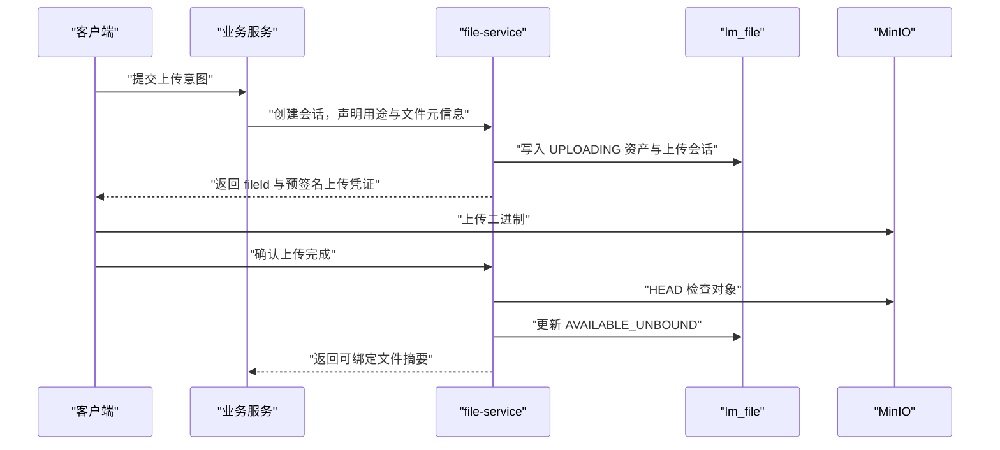

## 上传与访问

> 实施状态：已实现管理员小文件代理上传、按业务用途的业务文件代理登记、预签名分片直传会话与按需临时下载地址。

### 核心结论

file-service 统一管理上传授权、对象命名、完成校验和访问策略，但不要求所有文件字节经过服务进程。后台小文件可以代理上传，大文件优先使用预签名直传。

### 上传模式

| 模式 | 适用对象 | 取舍 |
|------|---------|------|
| 服务端代理上传 | 管理员手动图片、图标和小型题目附件 | 接口简单，但占用 file-service 带宽和连接 |
| 预签名直传 | 大型题目附件和正式论文 | 已实现：客户端按会话约定分片直传，完成时服务端合并并校验 |
| 专用分片上传 | 论文临时分片 | 首期继续由 submission-service 管理，不能强行套用普通文件上传 |
| 交接目录接管 | 分片合并后的正式论文 | 业务服务在受控交接目录生成对象后由 file-service 接管元数据与生命周期 |

交接目录接管只允许 `submission-uploads/` 与 `submissions/` 前缀（前者是分片临时对象、后者是合并后的正式论文交接对象）：调用方声明用途、对象路径与文件元信息，
file-service 核对对象存在性与实际大小后登记资产，物理对象不再经过业务服务或 file-service 中转。

### 上传会话流程

创建会话必须使用幂等键，避免客户端重试生成多个资产。上传会话到期后不允许继续确认，后台任务负责清理遗留对象与失败会话。

### 完成校验

file-service 不能只相信客户端提交的文件名和 Content-Type。确认上传完成时至少校验：

- 对象存在且 objectKey 与会话一致。
- 文件大小与声明值在允许范围内。
- 媒体类型符合业务用途白名单。
- 对需要完整性保证的文件计算或核对 SHA-256。
- 会话尚未过期且没有完成过。
- namespace 与调用方服务权限一致。

题目附件可以额外允许 ZIP、RAR、7Z、TAR、GZ、BZ2 和 XZ 等压缩格式。头像用途不能因为题目附件策略而同步允许压缩包。

压缩包首期只作为普通文件保存和下载，不解压、不在线预览，也不声明已经完成恶意内容扫描。

### 同名文件

原始文件名只用于展示。objectKey 使用 UUID，因此同一分组中多次上传 `data.zip` 会得到不同物理对象，不覆盖旧文件。

首期不根据文件名拒绝重复上传，也不根据 SHA-256 自动复用物理对象。是否提示内容重复属于后续产品能力，不能改变业务资产的一对一身份。

### 访问方式

数据库只保存 fileId、objectKey 和访问策略，不保存预签名 URL。

私有文件访问流程为：

1. 调用方提交 fileId 和用途。
2. file-service 校验资产状态、访问级别和调用身份。
3. file-service 生成短时效下载地址。
4. 调用方在有效期内访问 MinIO。

管理页面的“复制链接”必须明确标注为临时链接，并展示或说明有效期。到期后重新申请，不能将该地址写入长期业务字段。

### 未来公开资产边界

如果未来实现宣传图或 Markdown 图片的稳定公开访问，应使用稳定文件路由或 CDN 地址映射 fileId，再由服务解析实际对象。该能力不属于当前实施范围，也不能通过延长预签名 URL 有效期来冒充永久地址。

### 异常处理

- MinIO 上传成功但完成确认失败时，资产保持 UPLOADING 或进入 FAILED，由后台对账处理。
- 数据库创建成功但客户端未上传时，会话过期后清理，不长期保留占位资产。
- 生成预签名地址失败时返回明确错误，不返回空地址伪装成功。
- MinIO 对象缺失时资产进入异常状态并告警，不立即删除业务引用。
- file-service 不可用时，新的上传和临时链接生成可以失败；已经签发且仍有效的 MinIO 地址继续工作。

### 验收基线

2026-09-19 在本地真实环境（MinIO、MySQL 8.0.33、file-service 与 problem-service 经网关 8080 访问）完整复验预签名分片直传链路：

| 环节 | 实测结果 |
|------|----------|
| 创建会话 | `PROBLEM_ATTACHMENT` 用途、`text/csv`、34,000,000 字节，服务端返回会话与 16MiB 分片大小 |
| 分片直传 | 3 个分片分别 16,777,216、16,777,216、445,568 字节，预签名 PUT 全部返回 HTTP 200 |
| 完成合并 | 返回资产 fileId，`file_size` 为 34,000,000，字节数与声明一致 |
| 业务绑定 | 通过管理端绑定已登记文件到题目附件，题目详情返回预签名下载地址 |
| 下载校验 | 下载字节数 34,000,000，SHA-256 与本地原文完全一致 |
| 解绑投影 | 删除题目后，`file_binding` 按解绑事件更新为 `RELEASED`，`event_version` 递增 |

本次验证尺寸受本地环境限制，服务端上限（默认 5GiB、单分片 16MiB、会话 24 小时）由 `file-service` 上传配置决定；超过阈值的附件在管理端自动走本链路，小文件仍走服务端代理上传。
