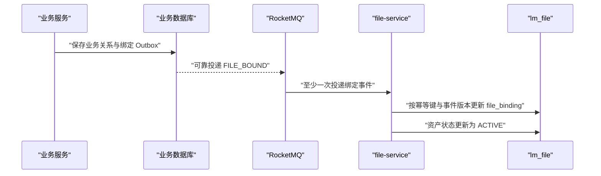
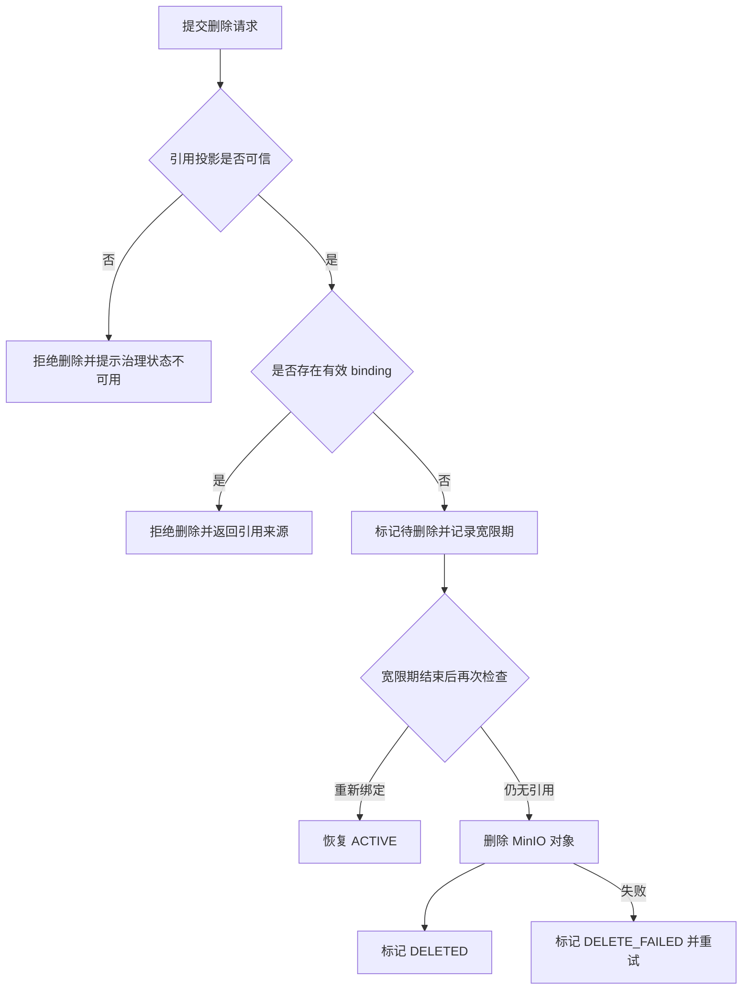

## 引用与删除

> 实施状态：第一阶段已实现仅 MANUAL 资产可进入宽限期、到期物理清理和失败重试；跨服务引用投影尚未实现，因此 DISCOVERED 与业务来源资产保持只读。

### 核心结论

业务服务拥有真实业务关系，file-service 维护用于文件治理的引用投影。绑定与解绑通过本地事务 Outbox 和幂等事件最终一致，文件解除最后一个引用后必须经过宽限期才能物理删除。

### 引用边界

| 关系 | 事实所有者 | file-service 保存内容 |
|------|-----------|----------------------|
| 题目拥有哪些附件 | problem-service | problem attachment 的文件绑定投影 |
| 用户当前使用哪个头像 | user-service | user avatar 的文件绑定投影 |
| 提交版本使用哪个正式 PDF | submission-service | submission paper 的文件绑定投影 |
| 管理员手动素材 | file-service | MANUAL_ASSET 绑定或等价受管状态 |

file-service 不能依据引用投影修改题目、用户或提交数据。admin-service 需要展示业务标题时向对应数据所有者查询，不把标题复制到 lm_file。

### 建立绑定

事件至少包含 fileId、ownerService、resourceType、resourceId、eventVersion 和 idempotencyKey。file-service 必须拒绝不存在、已删除或用途不兼容的 fileId，并将不可恢复冲突送入可诊断失败链路。

### 解除绑定

业务服务先在自己的事务中解除关系并写入解绑 Outbox。file-service 消费后将对应 binding 标记为无效。只有最后一个有效 binding 消失，资产才可以进入未绑定状态。

文件服务短暂不可用不应回滚已经完成的业务解绑。Outbox 持续重试，文件在引用投影未更新期间最多延迟清理，不会被提前删除。

### 普通删除流程

普通管理页面不得绕过 file-service 直接调用 MinIO 删除。引用消费积压、对账异常或所属服务状态不可确认时，删除必须 fail-closed。

### 逻辑删除与恢复窗口

逻辑删除至少保存删除请求人、请求时间、原因、计划清理时间和当时的引用摘要。宽限期用于覆盖以下场景：

- 绑定事件仍在 MQ 或 Outbox 中传播。
- 管理员误操作后需要恢复。
- 业务服务解绑后短时间内重新绑定。
- MinIO 或数据库发生短暂故障。

宽限期具体时长在实施任务中根据文件类型配置。临时文件可以较短，正式论文和题目附件应更保守。

### 强制删除

强制删除不是普通删除的确认框选项。第一阶段不开放该能力。

未来如确需开放，必须同时满足：

- 使用独立高风险权限。
- 管理员填写结构化原因。
- 展示全部已知绑定和引用投影健康状态。
- 写入不可变操作审计。
- 不因下游服务不可用而假定无引用。
- 明确物理删除通常不可恢复。

### 对账与漂移

引用投影采用最终一致，必须有持续对账能力：

- file_asset 存在但 MinIO 对象缺失时，标记物理对象缺失并告警。
- MinIO 对象存在但 file_asset 不存在时，登记为 DISCOVERED，不自动删除。
- 业务服务声明绑定但 file_asset 不存在时，进入高优先级异常清单。
- file_binding 与业务快照不一致时，以业务所有者事实为准修复投影。

对账任务只修复能够证明的状态，不根据路径前缀猜测后自动删除数据。
