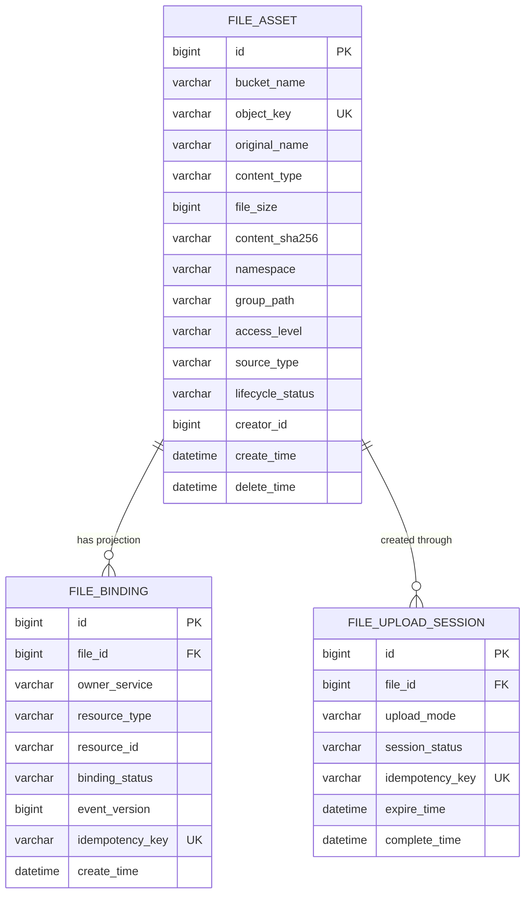

## 数据与分组

> 设计状态：目标设计，尚未实施。字段用于明确数据边界，不代表当前数据库已经存在。

### 核心结论

file-service 以 file_asset 作为物理文件资产事实，以 file_binding 作为跨服务引用的治理投影。业务服务保存 fileId 和自己的领域字段，MinIO 只保存二进制对象。

逻辑分组由 namespace 与 groupPath 表达，objectKey 只承担物理路由职责。管理员不能通过任意 objectKey 前缀伪造业务归属。

### 数据关系



### file_asset 边界

| 字段概念 | 规则 |
|---------|------|
| id | 平台内部稳定 fileId，业务表通过它关联文件 |
| bucketName | 物理 Bucket，不向普通客户端公开写权限 |
| objectKey | 服务端生成且全 Bucket 唯一，不使用原始文件名作为对象身份 |
| originalName | 仅用于展示和下载文件名，不参与唯一性判断 |
| contentType | 上传完成后结合对象校验保存，不能只信任客户端声明 |
| fileSize | 以 MinIO 对象检查结果为准 |
| contentSha256 | 用于完整性、迁移核对和可选去重，不自动合并业务资产 |
| namespace | 系统控制的顶层用途，如 problem、avatar、submission、manual |
| groupPath | namespace 内的逻辑分组，可为空或多级 |
| accessLevel | PUBLIC、AUTHENTICATED 或 BUSINESS_AUTHORIZED 等访问级别 |
| sourceType | MANUAL、PROBLEM_ATTACHMENT、USER_AVATAR、SUBMISSION_PAPER 等来源 |
| lifecycleStatus | 文件上传、可用、绑定、待删和失败状态 |

contentSha256 相同不代表业务语义相同。首期只用于校验和诊断，不自动做物理去重，避免一个业务删除共享对象影响另一个业务。

### file_binding 边界

file_binding 保存 file-service 用于治理的引用投影，不复制业务标题、附件说明、论文版本状态等领域数据。

唯一性至少覆盖 fileId、ownerService、resourceType 和 resourceId。事件消费使用 idempotencyKey 与 eventVersion 防止重复投递和旧事件覆盖新状态。

管理端展示引用来源时可以返回服务、资源类型和资源 ID。需要业务标题时由 admin-service 向数据所有者聚合查询，file-service 不保存标题镜像。

### namespace 与 groupPath

namespace 是安全和生命周期边界，只能从服务端用途映射得到。建议首期包含：

| namespace | 创建方 | 管理员能否任意上传 | 说明 |
|-----------|-------|------------------|------|
| manual | file-service 管理接口 | 可以 | 手动图片、图标、资料等非业务绑定素材 |
| problem | problem-service | 不可以 | 题目附件 |
| avatar | user-service | 不可以 | 用户头像 |
| submission | submission-service | 不可以 | 已完成的正式论文文件 |
| submission-temp | submission-service | 不可以 | 临时分片，首期仍由提交服务管理 |
| ai-temp | 对应 AI 服务 | 不可以 | 有明确过期时间的中间文件 |

管理员可以在 manual 下创建 `homepage/banner`、`icons/modeling` 等 groupPath。分组创建不需要独立空目录记录，第一个文件写入后即可显示；如果未来需要保存空分组、分组说明或排序，再增加 file_group，不在首期提前建表。

### objectKey 规则

目标 objectKey 由 file-service 生成，建议结构为：

```text
{namespace}/{groupPath}/{yyyy}/{MM}/{uuid}.{extension}
```

groupPath 为空时省略对应路径段。原始文件名必须经过安全处理，只保存在元数据中；对象身份使用 UUID，避免同名覆盖和路径遍历。

不允许调用方直接提交完整 objectKey。业务服务只提交用途、逻辑分组和原始文件信息，物理路由由 file-service 决定。

### 索引与查询原则

- objectKey 必须建立唯一索引。
- namespace、groupPath、lifecycleStatus 和 createTime 应支持组合查询。
- file_binding 应支持按 fileId 查询有效引用，也支持按业务资源反查文件。
- upload session 的 idempotencyKey 必须唯一。
- 管理列表默认查询 file_asset，不在每次页面加载时递归扫描整个 MinIO Bucket。
- MinIO 全量扫描属于后台对账任务，不属于普通分页查询主链。

