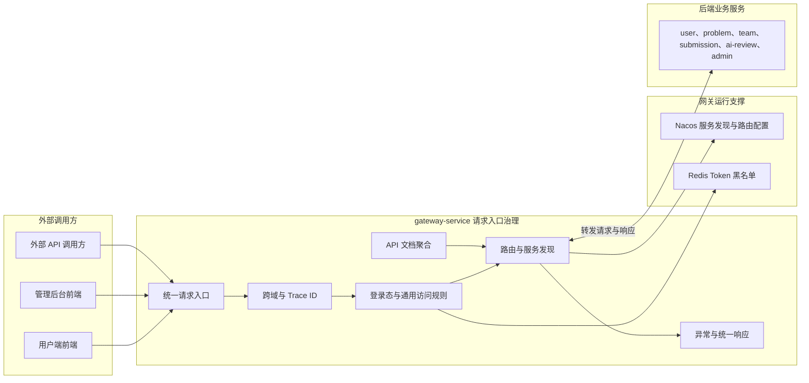

# API 网关服务

> API 网关是外部请求进入后端微服务的统一入口。

## 整体结构与工作流程

所有外部请求先完成跨域、追踪和通用登录态处理，再根据 Nacos 中的服务实例与路由配置转发到目标业务服务。业务服务仍负责资源归属、状态和细粒度权限校验。gateway-service 不进入服务之间的内部 AI 调用链，也不承担 ai-gateway-service 的模型治理职责。

## 职责边界

### 负责

- 根据路径将外部请求转发到目标微服务。
- 完成登录态校验、通用访问规则和管理端入口保护。
- 统一处理跨域请求和 OPTIONS 预检请求。
- 对网关层异常进行统一响应转换。
- 聚合各微服务的 API 文档入口。
- 在外部请求链路中生成或透传 Trace ID。

### 不负责

- 不实现用户、团队、题目、提交和评审的业务规则。
- 不直接访问业务服务数据库。
- 不代替业务服务执行数据归属、资源状态和细粒度权限校验。
- 不处理模型路由、密钥和 AI 调用治理。

## 数据与协作边界

API 网关不拥有业务数据库。它只维护路由、白名单、跨域和文档聚合等网关配置。业务服务必须对高风险操作继续执行自己的业务校验，不能仅依赖网关判断。

## 功能清单

| 功能 | 功能说明 |
|------|----------|
| 请求路由 | 将外部请求转发到对应业务服务 |
| 登录态校验 | 识别公开路径和受保护路径，执行通用登录校验 |
| 管理端入口保护 | 对管理后台入口执行统一访问保护 |
| 跨域处理 | 统一处理 CORS 响应和 OPTIONS 预检 |
| 网关异常转换 | 将路由、鉴权和下游不可用等异常转换为统一响应 |
| API 文档聚合 | 汇总各微服务的 API 文档入口 |
| 请求追踪 | 生成或透传请求追踪标识 |
| 网关路由配置 | 维护外部路径与内部服务的对应关系 |

## 文档索引

| 文档 | 内容摘要 |
|------|----------|
| [服务设计.md](服务设计.md) | 路由、认证鉴权、跨域、异常处理和 API 文档聚合 |
