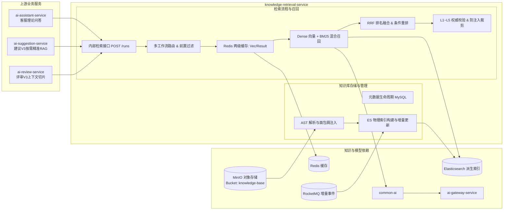

## 知识检索服务

> 实现状态：已建立独立 Maven 运行模块和内部检索接口（8093 端口），落地 `VECTOR_RAG_V1`、`AI_DIRECTORY_V1`、`HYBRID_RETRIEVAL_V1` 及 `SUGGESTION_DEEP_RETRIEVAL_V1` 四个不可变执行分支。AI 论文建议 V3 与 AI 客服新工作流均已正式接入该服务的混合检索；知识库存储解耦（MinIO 对象存储与 MySQL 元数据建模）与检索精准度/成本优化正作为当前核心架构持续演进。

knowledge-retrieval-service 负责管理数模知识库的物理存储、元数据生命周期与派生索引，并将受控知识转换为可版本化、可查询、带依据链与防注入边界的上下文，为 AI 客服、论文建议与评审提供统一检索服务。

### 整体结构与工作流程

知识内容的事实源正从代码仓库解耦迁移至 MinIO 对象存储，Elasticsearch 索引、轻量目录和 Redis 缓存均为可重建的派生视图。

### 职责边界

#### 负责

- 维护知识库正文存储（MinIO）与元数据全生命周期（草稿、发布、归档）。
- 基于 Markdown AST 结构化语法树执行切片，并在切片首行注入全局层级面包屑。
- 发布不可变检索工作流版本（`VECTOR_RAG_V1`、`AI_DIRECTORY_V1`、`HYBRID_RETRIEVAL_V1`、`SUGGESTION_DEEP_RETRIEVAL_V1`）。
- 执行 Dense 向量 + BM25 标题高权加权的混合多路召回与 RRF 融合打分。
- 维护 Redis 向量与结果两级缓存，结合元数据前置过滤实现低成本运行。
- 校验 L1 至 L5 来源权威级别，隔离跨题特异性规则，装配带防注入边界的切片上下文。
- 为每次运行生成 `retrievalRunId`，返回不可变快照供上游持久化依据链。

#### 不负责

- 不生成客服回答、论文评分或论文修改建议报告正文。
- 不读取用户完整论文、会话历史、密钥或业务数据库。
- 不拥有题目、赛事和提交主数据。
- 不执行任意文件访问、开放互联网搜索或知识内容写入。
- 不把相关度打分等同于业务事实正确性。

### 数据与协作边界

服务拥有知识文档元数据、检索工作流实现、切片与面包屑规则、缓存与索引配置；正文以对象存储（MinIO）为单一事实源。业务调用方保存 `retrievalRunId` 和产物所需的引用快照，不把检索结果全量镜像复制为主数据。服务运行日志与审计只记录脱敏摘要和性能指标，严禁落盘用户问题或知识正文。

### 功能清单

#### 模块一：知识库存储与管理

| 功能 | 状态 | 说明 |
|:---|:---|:---|
| 对象存储正文事实源 | 规划演进 | Markdown 正文迁移至 MinIO（`knowledge-base` 桶），解耦代码仓库 |
| 元数据生命周期建模 | 规划演进 | 建立 `knowledge_document` 表，支持草稿、发布、归档全生命周期状态机 |
| AST 解析与面包屑增强 | 实施中 | 解析 Markdown 语法树，提取 Frontmatter，并在切块首行注入层级面包屑 |
| ES 索引全量蓝绿切换 | 已实现 | 物理索引版本化隔离，全量构建 0 失败原子切换读别名 |
| 事件驱动增量更新 | 规划演进 | 监听 RocketMQ 变更事件，按 `contentHash` 幂等增量 Upsert / 清理切片 |

#### 模块二：检索流程与召回

| 功能 | 状态 | 说明 |
|:---|:---|:---|
| 单路向量 RAG | 已实现 | `VECTOR_RAG_V1` 分支，kNN Dense 向量检索与阈值过滤 |
| 受控 AI 目录选文 | 已实现 | `AI_DIRECTORY_V1` 分支，向模型暴露受控清单，白名单安全加载 |
| 双轨混合多路检索 | 已实现 | `HYBRID_RETRIEVAL_V1` / `SUGGESTION_DEEP_RETRIEVAL_V1`，Dense+BM25 RRF 融合 |
| Redis 向量与结果两级缓存 | 规划演进 | 缓存 Query 向量与高频命中切片，降低模型开销与响应延迟 |
| 分类元数据前置过滤 | 实施中 | 利用 `category` 目录元数据执行 ES filter 预减枝，隔绝无关噪声 |
| 来源权威层级校验 | 已实现 | L1 至 L5 权威校验，禁止改错类建议单由 L5 支撑，隔离题目专属规则 |
| 防注入上下文装配 | 已实现 | 使用结构化定界符包装只读参考事实，支持 Token 硬预算裁剪 |

### 运行接口

- Spring 服务名：`knowledge-retrieval-service`，本地端口 `8093`。
- 内部接口：`POST /internal/knowledge-retrieval/runs`。
- 请求锁定 `workflowVersion`、查询、分类、Top K、Token 预算和可选物理索引版本；当前正式建议固定使用 `SUGGESTION_DEEP_RETRIEVAL_V1`。
- 响应返回 `retrievalRunId`、实际执行分支、索引 / manifest / 内容版本以及带内容哈希的切片引用。
- 服务仅读取受控 Markdown 正文，不接受客户端传入任意本地文件路径。

### 文档索引

| 文档 | 内容 |
|:---|:---|
| [知识库存储与管理/](知识库存储与管理/README.md) | 对象存储规划、元数据建模、AST 面包屑增强、ES 索引全量构建与增量更新 |
| [检索流程与召回/](检索流程与召回/README.md) | 多工作流契约、Dense+BM25 混合召回、Redis 缓存前置过滤、权威校验与建议专属协议 |
