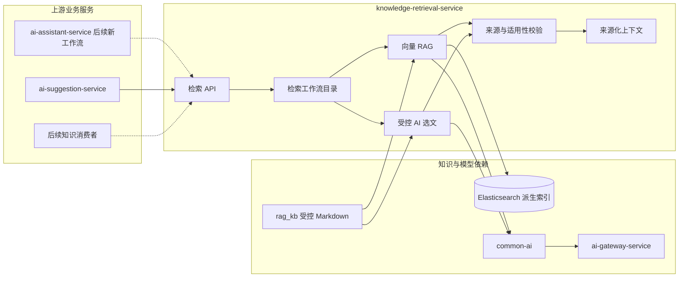

## 知识检索服务

> 实现状态：S12 已建立独立 Maven 运行模块和内部检索接口，落地 `VECTOR_RAG_V1`、`AI_DIRECTORY_V1`、`HYBRID_RETRIEVAL_V1` 三个不可变执行分支。正式论文建议只启用 `VECTOR_RAG_V1`；目录与混合分支在固定对比实验通过前保持实验用途。客服历史 `ASSISTANT_RAG_V1` 仍由 ai-assistant-service 内置执行。

knowledge-retrieval-service 负责把受控知识源转换为可版本化、可查询、可追溯的上下文，为 AI 客服、论文建议和后续业务提供统一检索能力。

### 整体结构与工作流程

实线表示当前已落地的论文建议协作，虚线表示必须通过新客服工作流完成的后续迁移。知识内容仍以 Git 管理的 `rag_kb/` Markdown 为事实源，Elasticsearch 和轻量目录都是可重建派生数据。

### 职责边界

#### 负责

- 维护受控知识源清单、内容元数据、派生索引和发布版本。
- 发布不可变的检索工作流版本。
- 执行向量 RAG、受控 AI 目录选文或明确组合的检索工作流。
- 校验路径、来源适用性、片段预算和返回契约。
- 为每次运行生成 `retrievalRunId`，返回实际分支、索引或目录版本和引用快照；当前由业务调用方随结果持久化所需快照。
- 返回带稳定来源标识的上下文片段。

#### 不负责

- 不生成客服回答、论文评分或论文修改建议。
- 不读取用户完整论文、会话历史、密钥或业务数据库。
- 不拥有题目、赛事和提交主数据。
- 不执行任意文件访问、开放互联网搜索或知识内容写入。
- 不把相关度分数解释为事实正确性或建议质量。

### 数据与协作边界

服务拥有检索工作流实现、受控目录清单生成、路径与来源校验；`rag_kb/` 内容仍由 Git 管理，不以数据库或 Elasticsearch 覆盖源文件。S12 不建立服务自有数据库：检索运行标识和完整引用快照由 ai-suggestion-service 锁定保存，运行日志只记录非正文摘要。索引构建和发布记录仍沿用 ai-assistant-service 的 S4 工具，后续迁移不得覆盖历史客服工作流。

调用方负责把业务事实转换成最小必要的检索问题和过滤条件。知识检索服务只解释检索契约，不理解“论文为什么扣分”或“客服最终怎样回答”。调用方保存 `retrievalRunId` 和业务结果所需的来源快照，不复制完整知识库。

### 功能清单

| 功能 | 状态 | 说明 |
|------|------|------|
| 向量 RAG 检索 | 已实现执行分支 | `VECTOR_RAG_V1` 复用 S4 索引格式，支持锁定物理索引版本、阈值和预算 |
| 受控 AI 选文 | 实验实现 | `AI_DIRECTORY_V1` 只向模型暴露受控清单，服务端校验精确成员后加载正文；未用于正式建议 |
| 组合检索 | 实验实现 | `HYBRID_RETRIEVAL_V1` 固定组合向量与目录结果；未用于正式建议 |
| 检索版本目录 | 代码常量发布 | 请求必须显式选择三个已实现版本；独立数据库目录和启停管理尚未建设 |
| 知识索引生命周期 | 沿用 S4 | 构建、原子切换和回滚仍由 ai-assistant-service 的既有工具负责 |
| 来源适用性校验 | MVP 已实现 | 返回 L3/L4/L5 权威层级与适用性；建议 V2 禁止 P0/P1 仅由 L5 支撑 |
| 检索运行审计 | MVP 已实现 | 返回运行标识和版本快照，记录不含正文的命中摘要；调用方保存业务快照 |
| 在线知识管理 | 非目标 | 本期不建设上传、审核、编辑和发布后台 |

### 运行接口

- Spring 服务名：`knowledge-retrieval-service`，本地端口 `8093`。
- 内部接口：`POST /internal/knowledge-retrieval/runs`。
- 请求锁定 `workflowVersion`、查询、Top K、Token 预算和可选物理索引版本；当前正式建议固定使用 `VECTOR_RAG_V1`。
- 响应返回 `retrievalRunId`、实际执行分支、索引 / manifest / 内容版本以及带内容哈希的引用。
- 服务只读取 `rag_kb/数学建模/` 下非 README 的受控 Markdown，不接受客户端文件路径。

### 文档索引

| 文档 | 内容 |
|------|------|
| [上下文检索/](上下文检索/README.md) | 检索输入输出、工作流、版本、资料适用性和失败边界 |
