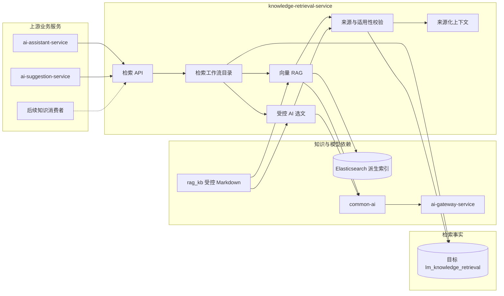

## 知识检索服务

> 设计状态：目标服务，尚无 Maven 模块、数据库、接口或运行时代码。当前 RAG V1 仍由 ai-assistant-service 内置实现。

knowledge-retrieval-service 负责把受控知识源转换为可版本化、可查询、可追溯的上下文，为 AI 客服、论文建议和后续业务提供统一检索能力。

### 整体结构与工作流程

实线表示已确认的目标协作，虚线表示出现真实需求后才能接入的消费者。知识内容仍以 Git 管理的 `rag_kb/` Markdown 为事实源，Elasticsearch 和轻量目录都是可重建派生数据。

### 职责边界

#### 负责

- 维护受控知识源清单、内容元数据、派生索引和发布版本。
- 发布不可变的检索工作流版本。
- 执行向量 RAG、受控 AI 目录选文或明确组合的检索工作流。
- 校验路径、来源适用性、片段预算和返回契约。
- 保存检索运行、实际分支、索引或目录版本和非敏感审计事实。
- 返回带稳定来源标识的上下文片段。

#### 不负责

- 不生成客服回答、论文评分或论文修改建议。
- 不读取用户完整论文、会话历史、密钥或业务数据库。
- 不拥有题目、赛事和提交主数据。
- 不执行任意文件访问、开放互联网搜索或知识内容写入。
- 不把相关度分数解释为事实正确性或建议质量。

### 数据与协作边界

目标服务拥有检索工作流目录、索引发布记录、目录版本、检索运行和派生索引。`rag_kb/` 内容仍由 Git 管理，不以数据库或 Elasticsearch 覆盖源文件。

调用方负责把业务事实转换成最小必要的检索问题和过滤条件。知识检索服务只解释检索契约，不理解“论文为什么扣分”或“客服最终怎样回答”。调用方保存 `retrievalRunId` 和业务结果所需的来源快照，不复制完整知识库。

### 功能清单

| 功能 | 状态 | 说明 |
|------|------|------|
| 向量 RAG 检索 | 待迁移 | 当前实现位于 ai-assistant-service，目标迁入本服务并保持原版本语义 |
| 受控 AI 选文 | 已有设计、待迁移实现 | 基于轻量目录由 AI 选择精确成员，再由服务端受限加载 |
| 组合检索 | 目标设计 | 只有明确发布的工作流可以组合向量与 AI 选文，不允许运行时自由拼接 |
| 检索版本目录 | 目标设计 | 查询启用和停用的不可变检索工作流 |
| 知识索引生命周期 | 待迁移 | 构建、原子切换、回滚和版本追踪 |
| 来源适用性校验 | 目标设计 | 防止其他题目的专属评分细则被错误用于当前题目 |
| 检索运行审计 | 目标设计 | 保存版本、耗时、命中数量、失败类型和调用标识，不保存业务正文 |
| 在线知识管理 | 非目标 | 本期不建设上传、审核、编辑和发布后台 |

### 文档索引

| 文档 | 内容 |
|------|------|
| [上下文检索/](上下文检索/README.md) | 检索输入输出、工作流、版本、资料适用性和失败边界 |
