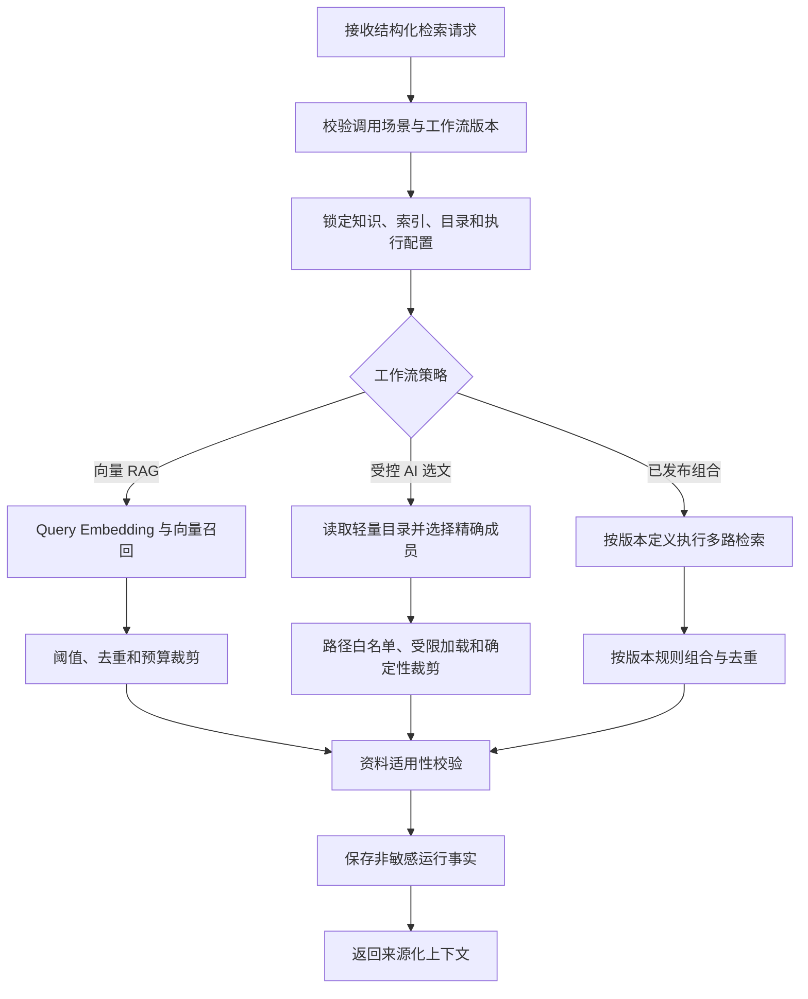

## 执行流程

### 总体流程

### 向量 RAG

向量工作流使用统一 Embedding 调用、指定物理 Elasticsearch 索引、Top K、阈值过滤、稳定去重和 Token 预算。索引别名只用于生产指针解析；任务一旦开始必须记录实际物理 `ragIndexVersion`，运行中不得跟随别名切换。

### 受控 AI 选文

AI 选文只向模型提供受控轻量目录和业务查询。模型只能返回目录中存在的精确成员和枚举原因码；服务端再次执行结构校验、路径白名单、普通文件边界、大小限制和确定性裁剪。

“AI 自己检索”不等于自由 Agent。模型不能构造任意路径、递归浏览文件系统、执行代码、访问网络或写回知识库。

### 组合工作流

组合只能由已发布工作流定义。版本必须固定执行顺序、并行关系、各路预算、去重优先级、超时和允许的降级分支。调用方不能提交一组策略名称要求服务运行时自由拼装。

### 业务隔离

检索服务只返回资料，不把论文发现、用户身份或对话历史写入长期知识。不同业务调用可以使用不同检索工作流和过滤策略，但共享检索基础设施不能改变各业务结果的所有权。
