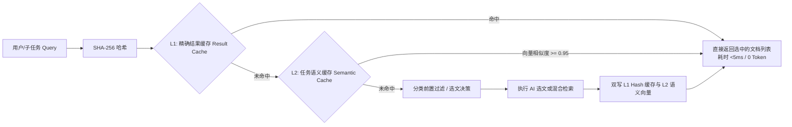

## 检索缓存与前置路由

### 成本痛点与降本思路

知识检索的核心运行开销主要集中在：
1. **AI 选文与 Embedding API 费用**：每次用户提问或子任务均发起大模型调用或向量化请求；
2. **下游 LLM Prompt Token 消耗**：召回冗余知识切片直接导致下游业务大模型输入费用激增；
3. **ES 算力开销**：全库 kNN 向量扫描消耗 CPU 与内存。

通过**任务语义缓存**、**两级物理缓存**与**元数据前置过滤（Pre-filtering）**构建高性价比防线。

### 缓存加速架构（Redis）



1. **L1 精确结果缓存（Result Cache）**：
   - Key 格式：`lm:kr:result:<workflow>:<md5(query + category + topK)>`；
   - 缓存高频提问的最终 `List<KnowledgeCitationDTO>` 快照，TTL 设为 2 小时；
   - 当底层发生全量索引切换或文档更新时，清空对应业务键。
2. **L2 任务语义缓存（Semantic Cache）**：
   - 针对表述不同但本质相同的任务（如“这道题需要做灵敏度分析”与“如何检验参数扰动的稳健性”）；
   - 将任务目标的 1024 维 Embedding 存入 Redis 向量索引；
   - 当新任务向量余弦相似度 $\ge 0.95$ 时，判定为高拟合历史任务，直接复用当时 AI 挑选的文档集合，**实现 0 毫秒、0 费用的极致加速**。
3. **Query Embedding 缓存**：
   - Key 格式：`lm:kr:vec:<model_version>:<sha256(query)>`；
   - 缓存标准化 query 的稠密向量，TTL 设为 7 天；
   - 杜绝相同或相似语义问题的重复模型调用支出。

### 分类元数据前置过滤（Category Pre-filtering）

利用知识库现有的树状清晰目录，在请求中传递 `category`（如 `题型方法/优化模型`）：
```json
{
  "bool": {
    "filter": [
      { "term": { "category": "题型方法/优化模型" } }
    ],
    "must": [
      { "knn": { ... } }
    ]
  }
}
```
前置过滤直接将 ES 检索空间减枝 80% 以上，从物理层面隔绝跨领域语义误召回。
