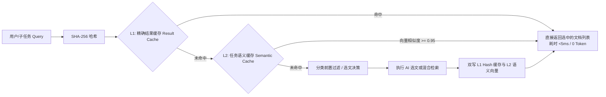
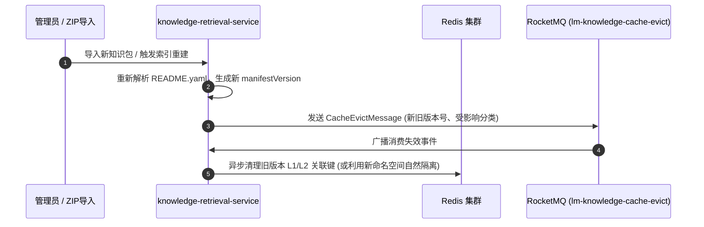

## 检索缓存与前置路由

### 成本痛点与降本思路

知识检索的核心运行开销主要集中在：
1. **AI 选文与 Embedding API 费用**：每次用户提问或子任务均发起大模型调用或向量化请求；
2. **下游 LLM Prompt Token 消耗**：召回冗余知识切片直接导致下游业务大模型输入费用激增；
3. **ES 算力开销**：全库 kNN 向量扫描消耗 CPU 与内存。

通过**任务语义缓存**、**两级物理缓存**与**元数据前置过滤（Pre-filtering）**构建高性价比防线。

### 缓存加速架构（Redis）



1. **L1 精确结果缓存（Result Cache）**：
   - Key 格式：`lm:kr:result:<workflow>:<md5(query + category + topK)>`；
   - 缓存高频提问的最终 `List<KnowledgeCitationDTO>` 快照，TTL 设为 2 小时；
   - 当底层发生全量索引切换或文档更新时，清空对应业务键。
2. **L2 任务语义缓存（Semantic Cache）**：
   - 针对表述不同但本质相同的任务（如“这道题需要做灵敏度分析”与“如何检验参数扰动的稳健性”）；
   - 将任务目标的 1024 维 Embedding 存入 Redis 向量索引；
   - 当新任务向量余弦相似度 $\ge 0.95$ 时，判定为高拟合历史任务，直接复用当时 AI 挑选的文档集合，**实现 0 毫秒、0 费用的极致加速**。
3. **Query Embedding 缓存**：
   - Key 格式：`lm:kr:vec:<model_version>:<sha256(query)>`；
   - 缓存标准化 query 的稠密向量，TTL 设为 7 天；
   - 杜绝相同或相似语义问题的重复模型调用支出。

### 两级缓存精细 Key 结构与数据字典

为避免缓存击穿、污染与版本脱节，缓存键强制按版本命名空间（Version Namespace）与哈希隔离：

#### 1. L1 精确结果缓存（Result Cache）

| 属性 | 规格要求 |
|:---|:---|
| **Key 结构** | `lm:kr:l1:result:<manifestVersion>:<md5(workflow + ":" + category + ":" + query + ":" + topK)>` |
| **数据结构** | String (JSON 序列化 `List<KnowledgeCitationDTO>`) |
| **TTL** | 7200 秒 (2 小时) |
| **命中判定** | 完整参数哈希严格匹配 |
| **加速效益** | 响应耗时 &lt; 2ms，消耗 0 Token，0 外部 API 调用 |
| **防击穿策略** | 空结果缓存（空列表）TTL 缩短为 180 秒，防止穿透攻击 |

#### 2. L2 任务向量语义缓存（Semantic Cache）

| 属性 | 规格要求 |
|:---|:---|
| **Key 结构** | 索引集合：`lm:kr:l2:idx:<category>` (Set of entryIds)<br/>实体数据：`lm:kr:l2:entry:<entryId>` (Hash) |
| **Hash 字段** | `entryId`, `query`, `category`, `embedding` (Base64/Float[]), `citationsJson`, `createdAt` |
| **TTL** | 86400 秒 (24 小时) |
| **相似度阈值** | 余弦相似度 $\cos(\mathbf{u}, \mathbf{v}) = \frac{\mathbf{u} \cdot \mathbf{v}}{\|\mathbf{u}\|_2 \|\mathbf{v}\|_2} \ge 0.95$ |
| **加速效益** | 响应耗时 &lt; 15ms，消耗 0 选拔模型 Token，复用历史高分选文 |

### 缓存失效与主动淘汰机制（Invalidation Strategy）

知识库具有高频只读、低频批量写入的典型特征。系统采用**“版本命名空间隔离为主，事件驱动广播淘汰为辅”**的双保险设计：



1. **自然版本隔离（Zero-Downtime Natural Invalidation）**：
   - L1 缓存 Key 包含 `manifestVersion`，一旦知识库发生更新生成新的 Manifest 哈希，所有新请求立即写入新版本键名，旧键随 TTL 自然过期淘汰，实现零停机、零锁竞争的无感切换。
2. **事件驱动显式广播（Active Eviction Broadcast）**：
   - 当通过管理端执行知识文档硬删除、紧急下线或强制全量重建时，发布 RocketMQ 广播消息 `lm-knowledge-cache-evict`；
   - 各服务实例监听到事件后，通过扫描或模式删除对应分类下的 L1/L2 缓存。

### 分类元数据前置过滤（Category Pre-filtering）

利用知识库现有的树状清晰目录，在请求中传递 `category`（如 `题型方法/优化模型`）：
```json
{
  "bool": {
    "filter": [
      { "term": { "category": "题型方法/优化模型" } }
    ],
    "must": [
      { "knn": { ... } }
    ]
  }
}
```
前置过滤直接将 ES 检索空间减枝 80% 以上，从物理层面隔绝跨领域语义误召回。
