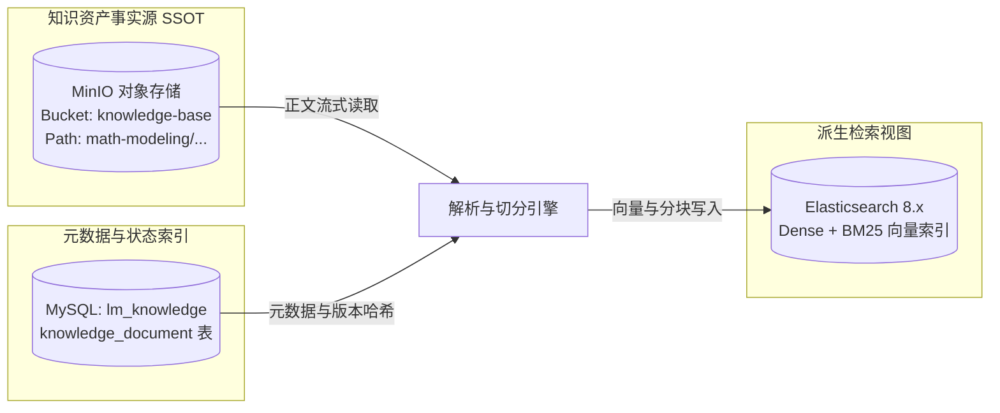

## 对象存储与事实源规划

### 背景与解耦痛点

在 MVP 初期，知识库以纯 Markdown 文件直接存放在应用代码仓库的 `rag_kb/` 目录下。在微服务分布式部署场景下，这一做法暴露出显著架构瓶颈：
1. 内容与代码耦合：修复错别字或增补数模知识需触发 Git 提交与微服务镜像重建；
2. 分布式容器孤岛：容器化部署的多个微服务实例无法原生共享宿主机磁盘路径；
3. 缺乏生命周期管控：文件系统无法提供版本锁定、状态审批与变更审计。

### 目标存储架构

知识库的事实源（SSOT）由代码仓库解耦迁移至对象存储（MinIO / S3），Elasticsearch 和本地缓存仅作为可重建的派生加速视图。



### 存储桶规划与 Key 命名规范

- **存储桶（Bucket）**：`knowledge-base`，独立于论文附件桶（`submission-files`），配置标准读写访问控制。
- **对象键（Object Key）**：严格保持既有清晰的树状目录结构，采用小写英文字符与连字符命名：
  ```text
  knowledge-base/
  ├── math-modeling/
  │   ├── methods/
  │   │   ├── optimization/
  │   │   │   ├── linear-programming.md
  │   │   │   └── integer-programming.md
  │   │   ├── prediction/
  │   │   │   └── time-series-arima.md
  │   │   └── evaluation/
  │   │       ├── ahp-method.md
  │   │       └── topsis-method.md
  │   └── review/
  │       ├── criteria/
  │       └── perspectives/
  ```

### 正文不可变性与哈希校验

每次写入或更新 Markdown 文件时，服务必须计算其 UTF-8 字节流的 SHA-256 哈希值作为 `contentHash`。
该哈希值随元数据一同保存，作为跨微服务比对、幂等排重以及 ES 索引同步的唯一版本指纹。
