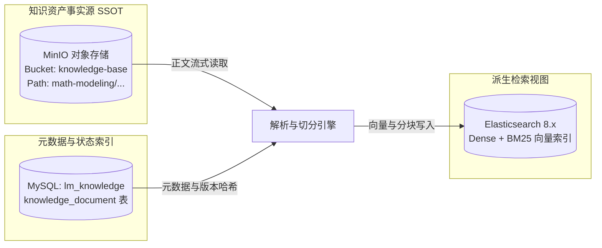

## 对象存储与事实源规划

### 背景与解耦痛点

在 MVP 初期，知识库以纯 Markdown 文件直接存放在应用代码仓库的 `rag_kb/` 目录下。在微服务分布式部署场景下，这一做法暴露出显著架构瓶颈：
1. 内容与代码耦合：修复错别字或增补数模知识需触发 Git 提交与微服务镜像重建；
2. 分布式容器孤岛：容器化部署的多个微服务实例无法原生共享宿主机磁盘路径；
3. 缺乏生命周期管控：文件系统无法提供版本锁定、状态审批与变更审计。

### 核心设计决策：物理目录与多维标签彻底解耦

在知识组织形式的设计上，团队深入权衡了纯目录分类与标签分类的优缺点，确立了**“物理目录定骨架 + 多维标签定属性”**的双轨架构：

#### 为什么不采用纯目录深度分类？（反模式剖析）
- **单继承树的局限**：物理目录本质上是一棵单继承的树，而现实中的专业知识是多维交织的网。
- **目录爆炸与深层嵌套**：以一篇国赛获奖论文为例，它同时具备“2024年”、“国赛”、“A题”、“非线性规划”、“遗传算法”、“敏感性正交分析”等多个维度。若完全依赖目录结构来组织（如 `/2024/国赛/A题/运筹优化/遗传算法/...`），会导致灾难性的目录深层嵌套；更致命的是，若该论文同时涉及启发式算法与统计检验，由于文件不能同时位于两个物理目录，必然导致文件重复冗余或漏分类。

#### 为什么不能完全抛弃物理目录改用纯扁平标签？
- **存储与迁移的底层依赖**：文件系统、对象存储（S3/MinIO Key）、压缩包归档（ZIP）以及开发者在本地磁盘编写文档时，物理目录是人类直观浏览与工程批处理最自然、最可靠的组织形式；
- **拆解论文的天然聚合**：一篇长篇优秀论文在原子化拆解后，通常被拆分为摘要、问题一模型、问题二求解、敏感性检验等 4 到 6 篇原子 Markdown。这些拆分后的文档天然适合存放在一个以该论文命名的子目录下（如 `优秀论文案例/2024_国赛_A题_一等奖_01/`）。

#### 双轨解耦的最佳实践
- **物理层（目录树）**：保持相对扁平、自然的粗粒度分类（如 `题型方法/`、`模型方法/`、`优秀论文案例/`、`论文评审规范/`），目录主要负责文件的物理落盘与模块归属；
- **逻辑层（多维标签网）**：年份、赛事、题号、算法族、质量等级、适用范围等全部通过标签（Tags）声明，支持多对多正交打标。

### 目标存储架构

知识库的事实源（SSOT）由代码仓库解耦迁移至对象存储（MinIO / S3），Elasticsearch 和本地缓存仅作为可重建的派生加速视图。



### 存储桶规划与 Key 命名规范

- **存储桶（Bucket）**：`knowledge-base`，独立于论文附件桶（`submission-files`），配置标准读写访问控制。
- **对象键（Object Key）**：严格保持既有清晰的树状目录结构，采用小写英文字符与连字符命名：
  ```text
  knowledge-base/
  ├── math-modeling/
  │   ├── methods/
  │   │   ├── optimization/
  │   │   │   ├── linear-programming.md
  │   │   │   └── integer-programming.md
  │   │   ├── prediction/
  │   │   │   └── time-series-arima.md
  │   │   └── evaluation/
  │   │       ├── ahp-method.md
  │   │       └── topsis-method.md
  │   ├── papers/
  │   │   └── 2024-cumcm-problem-a-prize-01/
  │   │       ├── 01-abstract-restatement.md
  │   │       ├── 02-mechanics-formulation.md
  │   │       └── 03-genetic-algorithm-solution.md
  │   └── review/
  │       ├── criteria/
  │       └── perspectives/
  ```

### 正文不可变性与哈希校验

每次写入或更新 Markdown 文件时，服务必须计算其 UTF-8 字节流的 SHA-256 哈希值作为 `contentHash`。
该哈希值随元数据一同保存，作为跨微服务比对、幂等排重以及 ES 索引同步的唯一版本指纹。
