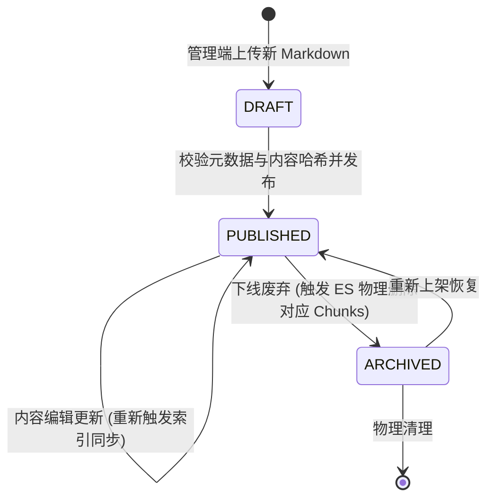

## 元数据建模与生命周期

### 状态与职责所有权

`knowledge-retrieval-service` 拥有知识文档的元数据定义与生命周期状态机。在引入独立数据库 `lm_knowledge` 前，元数据通过文件 Frontmatter 与代码常量维护；本设计为目标微服务数据库建模规范。

#### 为什么必须建立独立的 MySQL 元数据表？（设计权衡）
1. **对象存储缺乏结构化查询能力**：MinIO/S3 擅长存放非结构化 Markdown 正文，但无法进行多维条件组合过滤（如查询“2024年国赛且包含遗传算法且状态为 PUBLISHED 的文档”）；
2. **微服务数据自治原则**：不与业务主库（如题目库、提交库）混用，保证知识库存储与版本管理的完全独立；
3. **生命周期与审计追踪**：记录每篇文档的发布状态、最后索引时间、切片数量、Token 消耗以及内容哈希，为上游生成依据链提供权威数据底座。

### 拟议数据表结构设计

```sql
-- 知识库文档元数据表 (数据库: lm_knowledge)
CREATE TABLE IF NOT EXISTS knowledge_document (
    id BIGINT NOT NULL PRIMARY KEY COMMENT '主键ID (雪花算法生成)',
    doc_code VARCHAR(64) NOT NULL UNIQUE COMMENT '文档业务唯一编码 (如 KM_OPT_001)',
    title VARCHAR(128) NOT NULL COMMENT '文档标题',
    category VARCHAR(64) NOT NULL COMMENT '物理分类目录 (如 数学建模/模型方法)',
    file_name VARCHAR(128) NOT NULL COMMENT '物理 Markdown 文件名 (如 优化模型与算法分类.md)',
    relative_path VARCHAR(255) NOT NULL UNIQUE COMMENT '知识库相对路径',
    s3_key VARCHAR(255) NULL COMMENT 'MinIO 对象存储键路径',
    authority_level VARCHAR(16) NOT NULL DEFAULT 'L4' COMMENT '权威层级: L1/L2/L3/L4/L5',
    applicability_scope VARCHAR(64) NOT NULL DEFAULT 'GENERAL_MODELING' COMMENT '适用范围',
    tags JSON NULL COMMENT '多维复合标签 (JSON 数组)',
    methods JSON NULL COMMENT '算法模型族清单 (JSON 数组)',
    summary VARCHAR(512) NOT NULL DEFAULT '' COMMENT '一句话核心摘要',
    content_hash VARCHAR(64) NOT NULL COMMENT '文件正文 SHA-256 哈希',
    status VARCHAR(32) NOT NULL DEFAULT 'PUBLISHED' COMMENT '生命周期状态: DRAFT, PUBLISHED, ARCHIVED',
    estimated_tokens INT NOT NULL DEFAULT 0 COMMENT '预估 Token 总数',
    chunk_count INT NOT NULL DEFAULT 0 COMMENT '切片数量',
    indexed TINYINT(1) NOT NULL DEFAULT 0 COMMENT 'ES 索引同步状态: 0未同步, 1已同步',
    create_time DATETIME NOT NULL DEFAULT CURRENT_TIMESTAMP COMMENT '创建时间',
    update_time DATETIME NOT NULL DEFAULT CURRENT_TIMESTAMP ON UPDATE CURRENT_TIMESTAMP COMMENT '更新时间',
    deleted TINYINT NOT NULL DEFAULT 0 COMMENT '逻辑删除标记: 0未删除, 1已删除',
    INDEX idx_category_status (category, status),
    INDEX idx_authority (authority_level),
    INDEX idx_indexed (indexed)
) ENGINE=InnoDB DEFAULT CHARSET=utf8mb4 COMMENT='知识库文档元数据主表';
```

### 后端 Admin API 接口契约设计

管理端接口前缀统一为 `/admin/knowledge`，仅允许受信管理员角色调用：

| 端点 | 方法 | 响应数据结构 | 语义说明 |
|:---|:---:|:---|:---|
| `/admin/knowledge/tree` | GET | `List<KnowledgeTreeNodeVO>` | 按 Manifest 标准化 `path` 返回嵌套目录树与文档元数据 |
| `/admin/knowledge/export` | GET | `application/zip` 二进制流 | 一键将全量 Markdown 与自包含 `README.yaml` 打包下载 |
| `/admin/knowledge/import` | POST | `KnowledgeImportResultVO` | 上传自包含 ZIP 压缩包，无损解析并落库 |
| `/admin/knowledge/index/status` | GET | `KnowledgeIndexStatusVO` | 查询当前 Elasticsearch 物理索引版本与健康度 |
| `/admin/knowledge/index/rebuild` | POST | `KnowledgeIndexRebuildVO` | 手动触发 ES 物理索引全量蓝绿重建与读别名切换 |

#### 核心契约数据结构示例

```json
// GET /admin/knowledge/tree 响应节点
[
  {
    "name": "数学建模",
    "path": "数学建模",
    "title": "数学建模",
    "documentCount": 7,
    "directDocumentCount": 0,
    "virtual": true,
    "tags": [],
    "children": [
      {
        "name": "模型方法",
        "path": "数学建模/模型方法",
        "title": "数学建模核心模型与算法库",
        "documentCount": 7,
        "directDocumentCount": 7,
        "virtual": false,
        "tags": ["规划与优化", "时间序列与预测", "综合评价"],
        "children": [],
        "documents": [
          {
            "file": "优化模型与算法分类.md",
            "path": "数学建模/模型方法/优化模型与算法分类.md",
            "title": "优化模型与算法分类全景",
            "summary": "优化模型与算法全景分类...",
            "authorityLevel": "L4"
          }
        ]
      }
    ],
    "documents": []
  }
]
```

`path` 是节点唯一标识与父子归属依据，不能用目录显示名判断关系；因此不同父目录下允许存在同名节点。Manifest 未定义但物理路径存在的中间层返回 `virtual=true`，其 `documents` 为空。`directDocumentCount` 只统计当前节点文件，`documentCount` 递归聚合当前节点与全部后代文件，输入顺序不影响树的稳定排序。

### 前端管理端组件交互规范

在 `LeetModel-frontend/src/views/admin/pages/ContentHubPage.vue` 的知识库完整工作面中集成：

1. 顶部使用紧凑索引事实条展示物理索引版本、文档数、分块数和健康度，并提供导出、导入、重建与刷新操作。
2. 左侧 `el-tree` 以 `path` 作为 `node-key`，展示任意深度目录、展开状态与聚合文档数。
3. 右侧表格只展示所选目录的直接文件，以文件名为第一识别信息，同时呈现标题、权威等级、标签、方法和 Token。
4. 搜索命中深层目录或文件元数据时保留祖先链并自动展开；虚拟父目录不伪造直接文件。

### 文档生命周期状态机



1. **草稿态（DRAFT）**：已上传至 MinIO，但尚未通过内容与元数据核验，不参与 ES 索引构建，对所有在线业务不可见。
2. **已发布（PUBLISHED）**：处于活跃服务状态，必须已被完整切分并写入当前 Elasticsearch 物理索引，可供检索。
3. **已归档（ARCHIVED）**：弃用或过时的历史参考资料，其在 ES 中的所有向量分块被物理剔除，业务检索不可召回。
