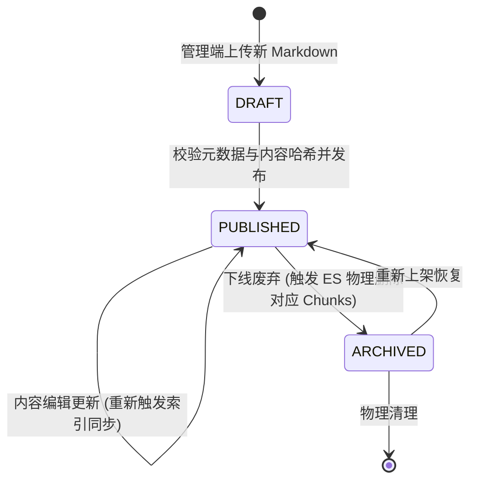

## 元数据建模与生命周期

### 状态与职责所有权

`knowledge-retrieval-service` 拥有知识文档的元数据定义与生命周期状态机。在引入独立数据库 `lm_knowledge` 前，元数据通过文件 Frontmatter 与代码常量维护；本设计为目标微服务数据库建模规范。

### 拟议数据表结构设计

```sql
CREATE TABLE knowledge_document (
    id BIGINT PRIMARY KEY AUTO_INCREMENT COMMENT '主键ID',
    doc_code VARCHAR(64) NOT NULL UNIQUE COMMENT '文档业务编码 (如 KM_OPT_001)',
    title VARCHAR(128) NOT NULL COMMENT '文档标题',
    category VARCHAR(64) NOT NULL COMMENT '所属分类目录 (如 题型方法/优化模型)',
    s3_key VARCHAR(255) NOT NULL COMMENT 'MinIO 对象存储键路径',
    authority_level VARCHAR(16) NOT NULL DEFAULT 'L4' COMMENT '权威层级: L1/L2/L3/L4/L5',
    applicability_scope VARCHAR(64) NOT NULL DEFAULT 'GENERAL_MODELING' COMMENT '适用范围',
    content_hash VARCHAR(64) NOT NULL COMMENT '文件正文 SHA-256 哈希',
    status VARCHAR(32) NOT NULL DEFAULT 'DRAFT' COMMENT '生命周期状态: DRAFT, PUBLISHED, ARCHIVED',
    estimated_tokens INT NOT NULL DEFAULT 0 COMMENT '预估 Token 总数',
    chunk_count INT NOT NULL DEFAULT 0 COMMENT '切片数量',
    indexed TINYINT(1) NOT NULL DEFAULT 0 COMMENT 'ES索引同步状态: 0未同步, 1已同步',
    created_at DATETIME NOT NULL DEFAULT CURRENT_TIMESTAMP COMMENT '创建时间',
    updated_at DATETIME NOT NULL DEFAULT CURRENT_TIMESTAMP ON UPDATE CURRENT_TIMESTAMP COMMENT '更新时间',
    INDEX idx_category_status (category, status),
    INDEX idx_authority (authority_level)
) ENGINE=InnoDB DEFAULT CHARSET=utf8mb4 COMMENT='知识库文档元数据主表';
```

### 文档生命周期状态机



1. **草稿态（DRAFT）**：已上传至 MinIO，但尚未通过内容与元数据核验，不参与 ES 索引构建，对所有在线业务不可见。
2. **已发布（PUBLISHED）**：处于活跃服务状态，必须已被完整切分并写入当前 Elasticsearch 物理索引，可供检索。
3. **已归档（ARCHIVED）**：弃用或过时的历史参考资料，其在 ES 中的所有向量分块被物理剔除，业务检索不可召回。
