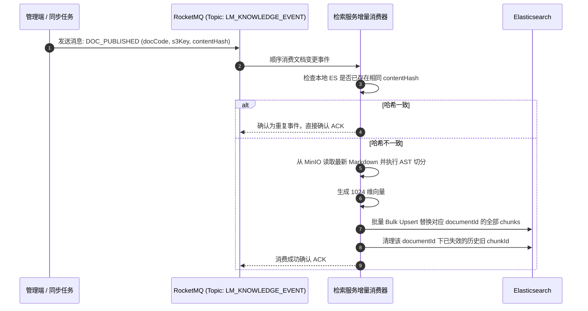

## 索引构建与增量同步

### Elasticsearch 物理索引与 Mapping 设计

服务采用独立的物理索引加读别名机制：
- **物理索引名**：`leetmodel-rag-v1-<ragIndexVersion>`
- **稳定读别名**：`leetmodel-rag-v1-read`
- **核心 Mapping 字段**：
  - `chunkId` (keyword): 文档与分块唯一确定性标识；
  - `documentId` (keyword): 所属文档业务标识；
  - `category` (keyword): 所属分类目录（支持前置过滤）；
  - `authorityLevel` (keyword): L1 至 L5 权威级别；
  - `title` (text, analyzer=ik_max_word): 文档标题，BM25 检索加权；
  - `content` (text, analyzer=ik_smart): 正文分块，BM25 基础字段；
  - `embedding` (dense_vector, dims=1024, index=true, similarity=cosine): 向量字段；
  - `contentHash` (keyword): 内容校验哈希。

### 全量构建与蓝绿原子切换（Blue-Green）

当切分算法调整、Embedding 模型升级或冷启动时，触发全量重建：
1. 新建全新物理索引 `leetmodel-rag-v1-<newVersion>`；
2. 批量读取已发布的 Markdown，分块并批量生成 Embedding，分批写入新索引；
3. 全程统计失败计数 `failures`。若 `failures > 0`，立即中断并保留旧索引运行，不污染线上流量；
4. 若全部批次零故障完成，通过 ES `_aliases` 接口执行原子变更：将 `leetmodel-rag-v1-read` 别名从旧物理索引无缝移至新物理索引。

### 基于 RocketMQ 的事件驱动增量更新

在日常运维中，当某篇 Markdown 发生新增、修改或下线时，避免昂贵的全量重算，采用事件驱动增量同步机制：

