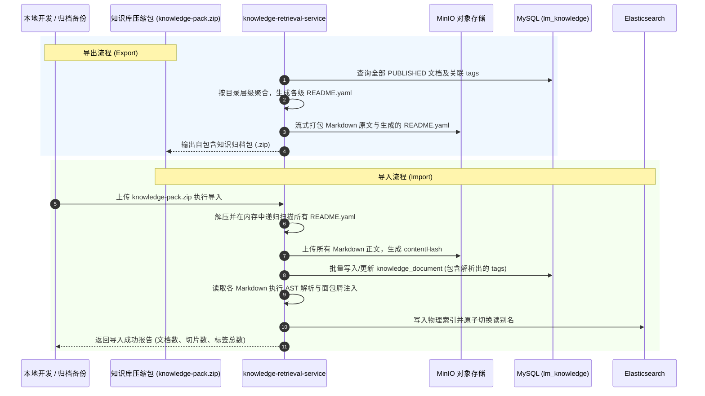

## 自包含迁移与 README.yaml 规范

### 设计初衷：自描述与无损迁移

在传统的企业知识库中，文档存储在文件系统，而标签与分类元数据存储在专属数据库中。这会导致严重的**“迁移脱节”**痛点：当开发者在本地整理知识库并试图上传，或者在不同测试/生产环境之间迁移时，必须同时导出数据库 SQL 转储与文件归档，极易出现文件丢失对应标签、版本错位或数据库 schema 不兼容的问题。

为了实现真正的**自描述、自包含与高度可移植性（Self-describing & Portable Knowledge Package）**，系统采用统一的 `README.yaml` 作为每个层级目录的元数据载体。
知识库脱离外部数据库也能独立完整存在：只要将目录打包成 ZIP，任何环境解压后通过解析 `README.yaml`，就能 100% 无损重建数据库元数据、多维标签体系与 ES 派生索引。

### README.yaml 格式规范与 Schema 定义

每个具备明确归属的主题目录或优秀论文拆解目录下，必须维护一份符合固定规范的 `README.yaml`：

```yaml
# README.yaml 规范定义
schema_version: "v1.0"
directory_name: "2024_CUMCM_ProblemA_FirstPrize_01"
title: "2024年高教社杯国赛A题一等奖论文拆解"
description: "针对复杂螺栓连接非线性刚度推导与遗传算法多目标优化的高水平论文"

# 1. 目录级继承标签 (该目录下所有原子文档默认继承)
tags:
  contest: "国赛"
  year: 2024
  problem: "A题"
  prize: "一等奖"
  problem_type: "运筹与机理"
  methods:
    - "非线性规划"
    - "机理微分"
    - "遗传算法"
  authority_level: "L3"

# 2. 目录下属原子文档清单与专有属性
documents:
  - file: "01-摘要与问题重述.md"
    title: "论文摘要与三线表结果展示"
    summary: "展示了四要素完整摘要及高质量量纲三线表排版规范"
    doc_tags:
      - "摘要范例"
      - "学术规范"
    estimated_tokens: 1200

  - file: "02-力学机理微分模型建立.md"
    title: "螺栓接触面非线性微元受力推导"
    summary: "详细推导了连续介质力学微分方程组与接触形变边界条件"
    doc_tags:
      - "机理推导"
      - "公式自洽"
    estimated_tokens: 1800

  - file: "03-遗传算法多目标求解与收敛判据.md"
    title: "基于 Pareto 前沿的参数智能搜索"
    summary: "包含交叉变异算子设计、适应度曲线及收敛证明判据"
    doc_tags:
      - "智能优化"
      - "算法避坑"
    estimated_tokens: 2200

  - file: "04-正交试验参数扰动敏感性检验.md"
    title: "载荷与摩擦系数多因子稳健性分析"
    summary: "设计了 L9 正交试验表，量化各参数对形变量的灵敏度贡献"
    doc_tags:
      - "敏感性分析"
      - "模型检验"
    estimated_tokens: 1500
```

### 导入与导出完整工程闭环



### 为什么选用 YAML 而非 JSON/XML 作为离线格式？
1. **人类可读可编辑**：开发者在本地整理知识库时，YAML 语法天然亲和人类阅读与手写，不需要繁琐的双引号和转义；
2. **无缝与 Frontmatter 融合**：Markdown 内部的 Frontmatter 规范本身就是 YAML，统一语法栈大幅降低了解析与维护的心智负担。
