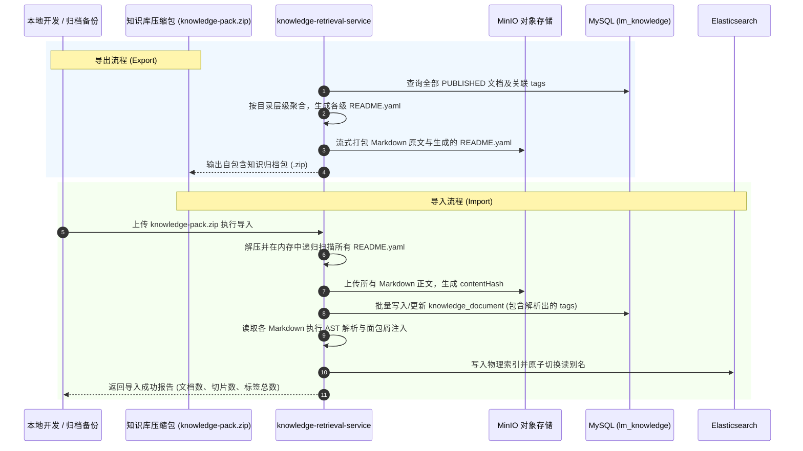

## 自包含迁移与 README.yaml 规范

### 设计初衷：自描述与无损迁移

在传统的企业知识库中，文档存储在文件系统，而标签与分类元数据存储在专属数据库中。这会导致严重的**“迁移脱节”**痛点：当开发者在本地整理知识库并试图上传，或者在不同测试/生产环境之间迁移时，必须同时导出数据库 SQL 转储与文件归档，极易出现文件丢失对应标签、版本错位或数据库 schema 不兼容的问题。

为了实现真正的**自描述、自包含与高度可移植性（Self-describing & Portable Knowledge Package）**，系统采用统一的 `README.yaml` 作为每个层级目录的元数据载体。
知识库脱离外部数据库也能独立完整存在：只要将目录打包成 ZIP，任何环境解压后通过解析 `README.yaml`，就能 100% 无损重建数据库元数据、多维标签体系与 ES 派生索引。

### README.yaml 格式规范与 Schema 定义

每个具备明确归属的主题目录或优秀论文拆解目录下，必须维护一份符合固定规范的 `README.yaml`：

```yaml
# README.yaml 规范定义
schema_version: "v1.0"
directory_name: "2024_CUMCM_ProblemA_FirstPrize_01"
title: "2024年高教社杯国赛A题一等奖论文拆解"
description: "针对复杂螺栓连接非线性刚度推导与遗传算法多目标优化的高水平论文"

# 1. 目录级继承标签 (该目录下所有原子文档默认继承)
tags:
  contest: "国赛"
  year: 2024
  problem: "A题"
  prize: "一等奖"
  problem_type: "运筹与机理"
  methods:
    - "非线性规划"
    - "机理微分"
    - "遗传算法"
  authority_level: "L3"

# 2. 目录下属原子文档清单与专有属性
documents:
  - file: "01-摘要与问题重述.md"
    title: "论文摘要与三线表结果展示"
    summary: "展示了四要素完整摘要及高质量量纲三线表排版规范"
    doc_tags:
      - "摘要范例"
      - "学术规范"
    estimated_tokens: 1200

  - file: "02-力学机理微分模型建立.md"
    title: "螺栓接触面非线性微元受力推导"
    summary: "详细推导了连续介质力学微分方程组与接触形变边界条件"
    doc_tags:
      - "机理推导"
      - "公式自洽"
    estimated_tokens: 1800

  - file: "03-遗传算法多目标求解与收敛判据.md"
    title: "基于 Pareto 前沿的参数智能搜索"
    summary: "包含交叉变异算子设计、适应度曲线及收敛证明判据"
    doc_tags:
      - "智能优化"
      - "算法避坑"
    estimated_tokens: 2200

  - file: "04-正交试验参数扰动敏感性检验.md"
    title: "载荷与摩擦系数多因子稳健性分析"
    summary: "设计了 L9 正交试验表，量化各参数对形变量的灵敏度贡献"
    doc_tags:
      - "敏感性分析"
      - "模型检验"
    estimated_tokens: 1500
```

### 详细 Schema 字段规范与校验规则

整个 `README.yaml` 文档必须遵循确定性的 Schema 规范，解析器在加载阶段执行强类型校验：

#### 1. 根级字段定义

| 字段名 | 类型 | 必填 | 约束说明 | 缺省行为 |
|:---|:---|:---:|:---|:---|
| `schema_version` | String | 是 | 固定格式 `vX.Y`，当前必须为 `"v1.0"` | 缺失或版本不支持直接抛出解析异常 |
| `directory_name` | String | 是 | 必须与当前所在物理文件夹名称完全一致 | 校验不一致时抛出 `DirectoryMismatchException` |
| `path` | String | 否 | 知识库根目录起的标准化相对路径（斜杠分隔） | 缺省时由解析器通过物理文件树相对路径自动推导 |
| `title` | String | 是 | 当前目录的中文业务名称，长度限制 2~64 字符 | 必填，为空时阻断加载 |
| `description` | String | 否 | 业务范畴与知识定位说明，长度限制 0~500 字符 | 缺省为空字符串 |
| `tags` | Object | 否 | 目录级继承标签结构体（详见下表） | 缺省为空对象，下属文档按默认基准处理 |
| `documents` | List | 否 | 当前目录下属原子文档列表（若有 Markdown 则必填） | 若无 Markdown 文档可为空数组 |

#### 2. 目录级标签（`tags`）字段规范

目录级标签是挂载在目录节点上的通用特征，供目录下所有原子文档自动继承与级联：

| 字段名 | 类型 | 示例值 | 语义说明 |
|:---|:---|:---|:---|
| `contest` | String | `"国赛"`, `"美赛"`, `"研赛"` | 竞赛分类，用于按竞赛体系筛选 |
| `year` | Integer | `2024` | 赛事年份，用于年份权重与时效性排序 |
| `problem` | String | `"A题"`, `"B题"`, `"C题"` | 赛题编号，用于赛题专属规则匹配与跨题隔离 |
| `prize` | String | `"一等奖"`, `"特等奖(O奖)"` | 论文获奖级别，决定知识权威度基础打分 |
| `problem_type` | String | `"运筹与机理"`, `"数据挖掘与统计"` | 赛题数学大类（优化/评价/预测/机理/统计） |
| `methods` | List&lt;String&gt; | `["非线性规划", "机理微分"]` | 该目录下沉淀的核心算法与模型族清单 |
| `authority_level` | String | `"L3"`, `"L4"`, `"L5"` | 目录基准权威层级，默认为 `"L4"`（优秀论文目录为 `"L3"`） |

#### 3. 文档清单（`documents`）字段规范

明确当前目录包含的原子 Markdown 及其专有属性：

| 字段名 | 类型 | 必填 | 约束说明 | 缺省行为 |
|:---|:---|:---:|:---|:---|
| `file` | String | 是 | Markdown 文件名（如 `"01-摘要.md"`），必须存在于当前目录 | 物理文件不存在时抛出 `FileNotFoundException` |
| `title` | String | 是 | 原子文档标题，长度 2~64 字符 | 必填，为空时阻断加载 |
| `summary` | String | 是 | 一句话核心摘要（10~300 字符），供 AI 智能选拔阅读 | 必填，严禁空字符串 |
| `doc_tags` | List&lt;String&gt; | 否 | 针对该单篇文档的细粒度属性标签 | 缺省为空列表 |
| `methods` | List&lt;String&gt; | 否 | 针对该文档涉及的专有算法清单 | 缺省继承目录级 `tags.methods` |
| `authority_level` | String | 否 | 允许覆盖目录级的权威级别（如 `"L3"`） | 缺省继承目录级 `tags.authority_level` |
| `estimated_tokens` | Integer | 否 | 预估 Token 数，供 Token 预算裁剪预判 | 缺省由分块器按字数自动估算 |

### 目录级联与标签继承覆盖矩阵

在加载解析时，系统依据以下确定性规则将目录元数据下沉到每一篇原子文档，生成最终的内存 Manifest 实体：
1. **权威级别（Authority Level）覆盖逻辑**：`文档级 authority_level` &gt; `目录级 tags.authority_level` &gt; 默认值 `"L4"`；
2. **算法模型（Methods）合并逻辑**：最终算法集合为 `目录级 tags.methods` 与 `文档级 methods` 的去重并集（Union）；
3. **全局检索多维标签（All Tags）聚拢**：文档在数据库与 ES 中的多维标签数组自动汇总整合为：`[contest, String.valueOf(year), problem, prize, problem_type] + methods + doc_tags`，自动清洗去重并剔除空值；
4. **路径强约束校验**：`file` 指向的文件必须位于当前目录下，严禁包含 `..` 或跨目录路径穿透符。

### 导入与导出完整工程闭环



### 为什么选用 YAML 而非 JSON/XML 作为离线格式？
1. **人类可读可编辑**：开发者在本地整理知识库时，YAML 语法天然亲和人类阅读与手写，不需要繁琐的双引号和转义；
2. **无缝与 Frontmatter 融合**：Markdown 内部的 Frontmatter 规范本身就是 YAML，统一语法栈大幅降低了解析与维护的心智负担。

### 前端管理端运维集成（Admin Portal Integration）

在前后端全链路闭环中，该能力必须在管理员控制台提供可视化交互入口：
- **入口位置**：`LeetModel-frontend/` 管理端【内容中心】（`ContentHubPage.vue`）抽屉式工具集成或专属路由；
- **核心运维功能**：
  1. **知识库大纲与标签树浏览**：直观展示目录结构、包含文档数、已打标签与最新更新时间；
  2. **一键自包含 ZIP 导出**：点击触发后台序列化生成各级 `README.yaml` 并打包下载；
  3. **ZIP 压缩包上传与无损导入**：支持管理员上传新的知识包，前端展示解析进度（文档数、标签数、切片数）并刷新列表；
  4. **索引状态监控与手动触发重建**：展示当前物理索引版本、切片总量与健康度，支持手动触发 ES 蓝绿全量重建。
