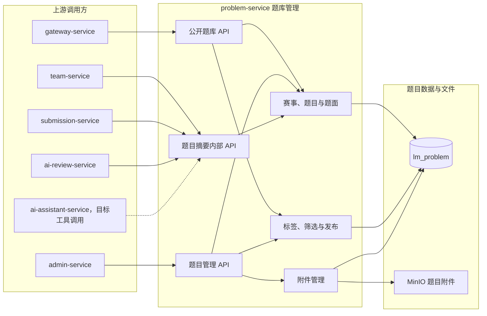

# 题目服务

> 题目服务以预置赛事为题库组织核心，拥有赛事、题目、附件、标签和题库查询规则。

> 关键设计：题目量非常有限（通常 <= 10000，年新增 < 100），题号采用短顺序编号供用户展示，内部主键不作为展示用。详见 [题号设计](题号设计.md)。

## 服务定位

problem-service 负责将赛事与题目组织为可管理、可发布、可查询的公开题库。首版的题目详情只提供标题、Markdown 题面和附件信息。

## 整体结构与工作流程

公开用户通过 API 网关查询已发布题目，管理员通过 admin-service 维护赛事、题目、标签和附件。team-service、submission-service 与 ai-review-service 只通过内部摘要接口获取必要题目事实。结构化数据归 `lm_problem` 所有，附件二进制归 MinIO 保存。

## 职责边界

### 负责

- 维护预置赛事以及题目的赛事归属、难度和允许完成时长。
- 维护可直接渲染的 Markdown 题面、题目附件及其对象存储路由。
- 维护题目标签和题目标签关系。
- 提供题目管理、公开题库查询、条件筛选和内部题目摘要单个及批量查询。
- 校验标签使用约束、题目公开可见性和题目数据完整性。
- 向团队、提交和评审链路提供必要的题目与赛事快照信息。

### 不负责

- 不维护队伍、成员、提交和评审结果。
- 不因为题目被练习就复制其他服务的主数据。
- 不提供赛事创建、删除和真实比赛生命周期管理。
- 不负责将 PDF 或其他格式自动转换为 Markdown。
- 不支持 PDF、HTML 或富文本作为并行题面格式。
- 不建设跨服务通用文件中心。
- 当前不负责 Elasticsearch 全文搜索和 AI 题目推荐工作流。
- 不聚合管理看板和跨领域运行统计。

## 数据与协作边界

problem-service 独占 `lm_problem` 数据库，预置赛事、题目、Markdown 题面、附件元数据、标签和题目标签关系以这里的数据为事实源。题目必须归属一个赛事，附件只属于一道题目。附件二进制内容保存在 MinIO，数据库只保存对象路径和必要元数据。

team-service 通过内部接口获取题目摘要，用于创建绑定队伍和计算练习时间。submission-service 通过内部接口校验提交对应的题目。ai-review-service 只获取评审路由所需的题目和赛事信息，不直接读取题目数据库。

目标工具版 AI 客服通过内部只读查询获取已发布题目的摘要、题面概览和受控推荐候选。problem-service 负责发布状态、筛选条件、稳定排序和结果上限；ai-assistant-service 负责工具选择和推荐解释。该目标接口尚未实现。

## 功能清单

| 功能 | 功能说明 |
|------|----------|
| 赛事基础数据 | 预置国赛、美赛和力模三个赛事，不开放创建与删除 |
| 题目管理 | 创建、修改、查询和管理题目基本信息 |
| 题面管理 | 在题目表中维护可为空的 Markdown 题面 |
| 附件管理 | 维护一道题目的零个或多个附件及其说明 |
| 题目发布管理 | 维护题目公开状态并保护未发布内容 |
| 题目难度与时长 | 维护题目难度和允许完成时间 |
| 标签管理 | 维护标签及题目标签关系，处理标签使用约束 |
| 公开题库 | 提供已发布题目的列表和详情 |
| 条件筛选 | 按赛事、难度、标签和关键条件筛选题目 |
| 随机题目 | 为练习选题提供简单随机能力 |
| 题目摘要 | 向队伍、提交、AI 评审和 AI 质量评价提供必要的单个或批量题目信息 |
| AI 客服题目查询 | 设计已确认、未实现；向受控客服工具提供已发布题目查询和确定性候选筛选 |

## 文档索引

| 功能 | 内容摘要 |
|------|----------|
| [赛事管理/](赛事管理/) | 预置赛事的定位与题目归属规则 |
| [题目内容/](题目内容/) | Markdown 题面和可选附件的维护规则 |
| [公开题库/](公开题库/) | 已发布题目的查询流程和筛选规则 |
