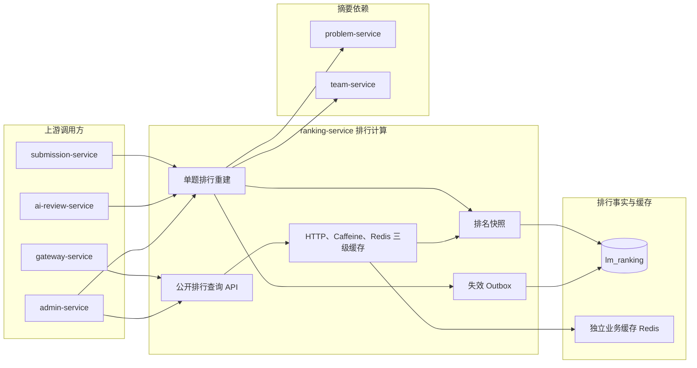

# 排行服务

ranking-service 负责根据最终提交和已完成评审重建可追溯的题目当前排行，并提供列表、关键词过滤、队伍定位和管理统计查询。

### 整体结构与工作流程

重建流程完整读取指定题目的最终提交和已完成评审，再校验题目、队伍与评审归属，按分数倒序、提交时间和队伍 ID 稳定排序并写入新批次快照。依赖读取失败时不会覆盖已有当前排行。

公开查询缓存每道题的整份 `RankingOverviewVO`，关键词过滤和队伍附近定位在命中后执行。重建事务同时写入该题目的 `cache_invalidation_outbox`，提交后通过区域版本与 Pub/Sub 让各实例收敛。

### 职责边界

#### 负责

- 从事实所有者读取最终提交、已完成评审、队伍和题目摘要。
- 按题目建立可追溯当前排行快照。
- 处理同分、稳定排序和全量重建。
- 提供排行列表、队伍排名、排名摘要和管理统计查询。
- 保存排行所使用的评审工作流版本和必要快照。
- 为当前排行提供 HTTP、Caffeine、Redis 三级缓存和事务后可靠失效。

#### 不负责

- 不产生或修改论文评分。
- 不拥有题目、队伍、提交和评审主数据。
- 不将 AI 评审稳定性统计作为论文排行分数。
- 不执行 AI 评审或稳定性评价。

### 数据与协作边界

ranking-service 独占 `lm_ranking` 数据库，拥有排行快照与缓存失效 Outbox。最终提交由 submission-service 提供，论文评分由 ai-review-service 提供，题目摘要由 problem-service 提供，队伍摘要由 team-service 提供。

### 功能清单

| 功能 | 功能说明 |
|------|----------|
| 数据选择 | 每队选择最新最终提交，并为提交选择最新已完成评审 |
| 题目排行 | 计算同一题目下各队伍的排名 |
| 同分处理 | 同分共享名次，再按提交时间和队伍 ID 保持稳定顺序 |
| 排名重建 | 在评分变化或管理操作时原子生成新当前批次 |
| 排行列表查询 | 查询题目当前排行并支持队伍名称关键词过滤 |
| 队伍排名查询 | 查询指定队伍的分数、名次和附近排名 |
| 管理统计 | 查询当前记录数和跨题目全局统计 |
| 三级缓存 | 公开排行返回 10 秒 HTTP 缓存，L2 15 秒，L3 5 分钟 |
| 可靠失效 | 重建事务记录单题 Outbox，提交后推进版本并广播本地失效 |

### 当前边界

- 不修改提交、评审、题目或队伍事实。
- 不把管理端全局统计纳入首期缓存。
- 不缓存关键词过滤结果和队伍定位结果，只缓存整份单题当前排行。
- Redis 不可用时继续查询 `lm_ranking`，只使用五秒本地降级缓存。
