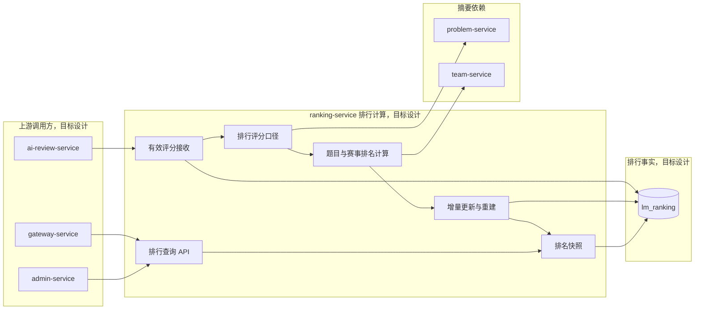

## 排行服务

ranking-service 负责根据有效的论文评分建立和查询排行结果。

当前只建立服务边界和功能目录，评审分数口径稳定后再逐个完成功能设计。

> 当前服务尚无 Maven 运行模块，以下结构与职责均为目标设计。

### 整体结构与工作流程

目标流程由 ai-review-service 提供可用于排行的有效论文评分，ranking-service 锁定评分口径后计算题目或赛事排名，并保存可追溯快照。查询只读取排行事实和必要的题目、队伍摘要，不修改原始评审分数。当前整张图均为目标设计。

### 职责边界

#### 负责

- 接收可用于排行的论文评分。
- 按题目或赛事建立排行结果。
- 处理同分、评分更新和排名重建。
- 提供排行列表、队伍排名和排名摘要查询。
- 保存排行所使用的评分口径和必要快照。

#### 不负责

- 不产生或修改论文评分。
- 不拥有题目、队伍、提交和评审主数据。
- 不将 AI 评审稳定性统计作为论文排行分数。
- 不执行 AI 评审或稳定性评价。

### 数据与协作边界

ranking-service 独占 `lm_ranking` 数据库，拥有排行记录、评分口径和排名快照。论文评分由 ai-review-service 提供，题目与赛事由 problem-service 提供，队伍摘要由 team-service 提供。

### 功能清单

| 功能 | 功能说明 |
|------|----------|
| 评分接收 | 接收可用于排行的有效论文评分 |
| 评分口径选择 | 确定正式排行使用的评审版本和结果范围 |
| 题目排行 | 计算同一题目下各队伍的排名 |
| 赛事排行 | 在赛事维度组织排名结果 |
| 同分处理 | 根据明确且稳定的口径处理相同评分 |
| 排名更新 | 在有效评分变化后更新对应排名 |
| 排名重建 | 在评分口径变化或数据异常时重新生成排名 |
| 排行列表查询 | 查询题目或赛事下的排行列表 |
| 队伍排名查询 | 查询指定队伍的分数、名次和附近排名 |
| 排名快照 | 保留特定口径下的排名结果，支持历史追溯 |

### 文档规则

后续先确定排行评分口径，再逐个设计排名更新和查询功能。当前不创建空文档。
