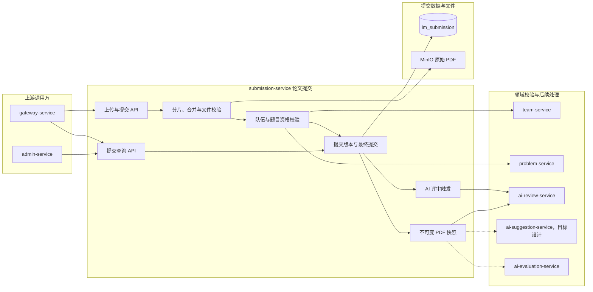

# 提交服务

> 提交服务拥有论文文件、提交记录、提交版本和提交归属数据。

提交服务只保证 PDF 文件完整上传、可访问和可追溯，不解析论文内容。

## 整体结构与工作流程

论文先完成分片、文件和提交资格校验，再形成可追溯的提交版本并保存原始 PDF。提交成功后触发 ai-review-service，同时向 AI 建议、排行和质量评价服务提供稳定的最终提交契约。评审执行状态仍由 ai-review-service 自己维护。

## 职责边界

### 负责

- 维护分片上传任务、分片完整性和 PDF 文件合并。
- 维护论文提交记录、提交版本、上传者和队伍归属。
- 校验文件类型、大小、分片数量、队伍上传资格和题目绑定。
- 维护原始 PDF 在 MinIO 中的路由与必要文件元数据。
- 在提交成功后触发评审链路，并提供不可变的提交与文件快照。
- 提供提交历史、当前状态和提交详情查询。

### 不负责

- 不解析 PDF 内容，不维护解析产物。
- 不执行 AI 评审、AI 裁判和评审质量计算。
- 不拥有队伍成员关系和题目主数据。
- 不把评审服务的执行状态复制为第二份事实源。

## 数据与协作边界

submission-service 独占 `lm_submission` 数据库，并拥有原始 PDF 对象路由、上传任务、提交记录和版本事实。它通过 team-service 校验队伍与成员关系，通过 problem-service 校验题目信息，向 ai-review-service 提供评审使用的 PDF 快照。ai-review-service 拥有评审执行状态，submission-service 只保留面向提交查询的必要关联和最终结果引用。

## 功能清单

| 功能 | 功能说明 |
|------|----------|
| PDF 上传 | 接收论文 PDF 并完成基本文件校验 |
| 分片上传 | 维护大文件上传任务、分片完整性和文件合并 |
| 对象存储 | 将原始 PDF 保存到 MinIO 并只持久化对象路由 |
| 提交资格校验 | 校验队伍成员、题目绑定和提交时间窗口 |
| 提交版本 | 为同一队伍的多次成功提交维护递增版本 |
| 提交历史 | 查询队伍的历史提交记录 |
| 最终提交锁定 | 在截止时间后锁定符合规则的最终提交版本 |
| AI 评审触发 | 提交成功后请求 ai-review-service 创建评审任务 |
| 提交详情与下载 | 查询提交摘要并为有权访问者生成文件访问地址 |
| 内部 PDF 快照 | 向 AI 评审、AI 质量评价和 AI 改善建议提供不可变的提交摘要与文件引用 |

## 文档索引

| 文档 | 内容摘要 |
|------|----------|
| [论文提交/](论文提交/) | PDF 上传、提交归属、权限和文件存储 |
