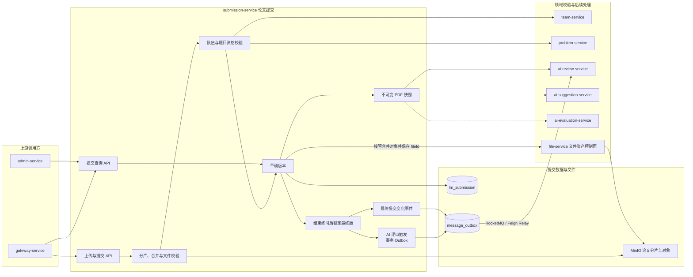

# 提交服务

> 提交服务拥有论文文件、提交记录、提交版本和提交归属数据。

提交服务只保证 PDF 文件完整上传、可访问和可追溯，不解析论文内容。

## 整体结构与工作流程

论文先完成分片、文件和提交资格校验，再形成可继续覆盖的草稿版本，上传本身不触发普通用户正式评审。练习到期或队长提前结束后，submission-service 锁定截止时刻前最新成功版本，并在同一本地事务写入 `FINAL_SUBMISSION_CHANGED` 与 `REVIEW_TASK_READY` Outbox。默认由 Relay 异步发布 RocketMQ，用户请求不等待 ai-review-service；重复锁定会按业务幂等键补建缺失事件，但不会重复创建正式评审。评审执行状态仍由 ai-review-service 自己维护。临时分片仍由 submission-service 管理；合并后的正式论文由 file-service 接管并返回稳定 fileId，submission-service 只保存 fileId 并发布绑定/解绑事件，AI 链路按 fileId 换取预签名地址读取论文。

## 职责边界

### 负责

- 维护分片上传任务、分片完整性和 PDF 文件合并。
- 维护论文提交记录、提交版本、上传者和队伍归属。
- 提供题目详情页使用的公开提交聚合统计，按题目计算未删除且状态为 `SUCCESS` 的提交总次数。
- 校验文件类型、大小、分片数量、队伍上传资格和题目绑定。
- 继续拥有论文版本关系，通过 fileId 关联正式文件资产；对象路由与物理生命周期归 file-service。
- 在最终提交锁定后触发一次正式评审链路，并提供不可变的提交与文件快照。
- 拥有评审请求与最终提交变化的生产端 Outbox，并提供评审消息等待、已派发和阻塞状态。
- 提供提交历史、当前状态和提交详情查询。

### 不负责

- 不解析 PDF 内容，不维护解析产物。
- 不执行 AI 评审和评审稳定性统计。
- 不拥有队伍成员关系和题目主数据。
- 不把评审服务的执行状态复制为第二份事实源。
- 不管理题目附件、头像和管理员手动素材等其他文件资产。

## 数据与协作边界

submission-service 独占 `lm_submission` 数据库，并拥有上传任务、提交记录、论文版本事实和 `message_outbox`。正式论文的技术元数据和物理生命周期归 file-service，submission-service 保存稳定 fileId 并在创建提交版本时发布绑定事件；临时分片、合并流程与交接目录仍归 submission-service。它通过 team-service 校验队伍与成员关系，通过 problem-service 校验题目信息，向 ai-review-service 提供评审使用的 PDF 快照。ai-review-service 拥有评审执行状态，submission-service 只保存需要发起评审的消息事实和派发状态，不复制 review_task。

## 功能清单

| 功能 | 功能说明 |
|------|----------|
| PDF 上传 | 接收论文 PDF 并完成基本文件校验 |
| 分片上传 | 维护大文件上传任务、分片完整性和文件合并 |
| 文件资产 | 合并完成后把正式论文登记到 file-service 并只持久化 fileId |
| 提交资格校验 | 校验队伍成员、题目绑定和提交时间窗口 |
| 提交版本 | 为同一队伍的多次成功提交维护递增版本 |
| 提交历史 | 查询队伍的历史提交记录 |
| 最终提交锁定 | 在到期或队长提前结束后锁定符合规则的最终提交版本 |
| AI 评审触发 | 最终锁定事务同时写 `REVIEW_TASK_READY` Outbox，默认由 RocketMQ 异步派发 |
| 最终提交事件 | 最终提交锁与 `FINAL_SUBMISSION_CHANGED` Outbox 同事务提交 |
| 提交详情与下载 | 查询提交摘要并为有权访问者生成文件访问地址 |
| 内部 PDF 快照 | 向 AI 评审、AI 质量评价和 AI 改善建议提供不可变的提交摘要与文件引用 |

## 评审派发配置

`SUBMISSION_REVIEW_TRANSPORT` 默认是 `MQ_PRIMARY`。`FEIGN_RELAY` 在 Broker 长故障时继续读取和推进同一 Outbox，只把发布端替换为幂等 Feign；两者都要求 `leetmodel.messaging.relay.enabled=true`。用户请求线程旧 Feign 触发已删除，启动校验会拒绝没有 Relay 的危险组合。

## 文档索引

| 文档 | 内容摘要 |
|------|----------|
| [论文提交/](论文提交/) | PDF 上传、提交归属、权限和文件存储 |
| [文件资产管理架构](../../02-架构设计/文件资产管理架构.md) | 正式论文、临时分片与 file-service 的迁移边界 |
