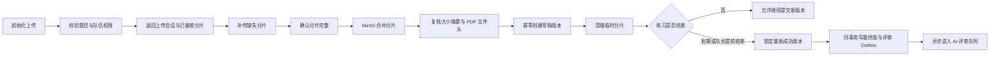
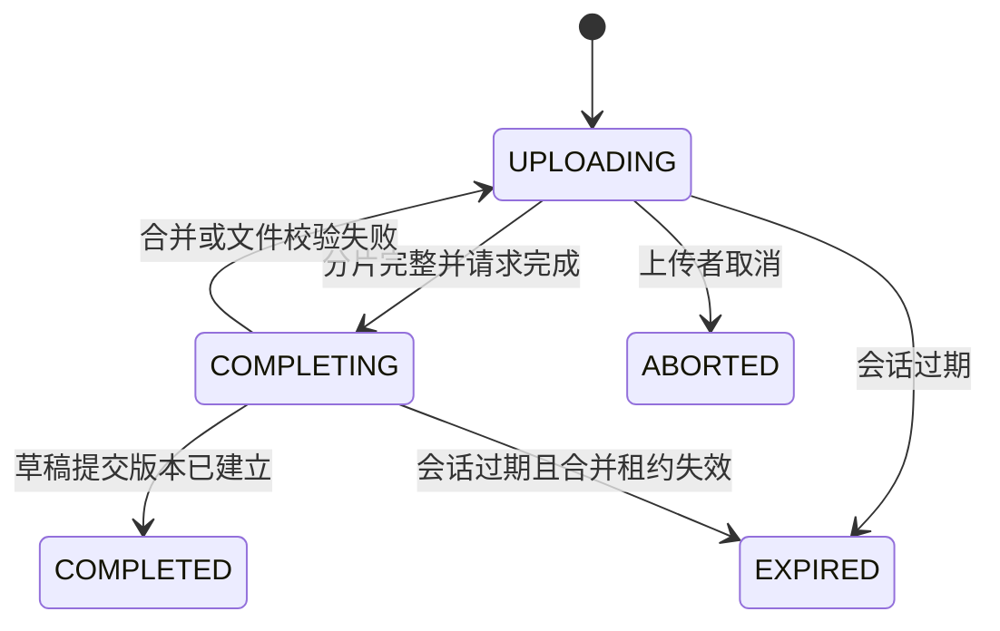

## 上传流程

上传初始化阶段完成业务权限和队伍互斥校验。服务端固定返回 5MiB 分片大小，上传会话有效期为 24 小时。前端以文件名、文件大小和 SHA-256 识别同一文件，网络中断或页面刷新后重新选择同一文件时，初始化接口返回原会话和已接收分片，前端只补传缺失部分。

分片存放在 `submission-uploads/{uploadId}/` 临时对象路径。完成接口在数据库短事务外调用 MinIO 对象合并，不在 JVM 内存或本地磁盘组装完整 PDF。合并完成后重新校验总大小、SHA-256 和 `%PDF-` 文件头，校验成功才创建草稿提交版本。普通用户可以在练习期间持续覆盖版本；只有结束练习后锁定的最终版本会进入一次正式评审，避免每份草稿消耗模型资源并产生多份相互冲突的正式结果。

### 接口与状态

| 接口 | 用途 |
|------|------|
| `POST /api/submissions/uploads` | 初始化或恢复上传会话 |
| `GET /api/submissions/uploads/{uploadId}` | 查询会话和已接收分片 |
| `PUT /api/submissions/uploads/{uploadId}/chunks/{chunkIndex}` | 上传并校验一个分片 |
| `POST /api/submissions/uploads/{uploadId}/complete` | 合并 PDF 并创建提交版本 |
| `DELETE /api/submissions/uploads/{uploadId}` | 取消尚未合并的会话 |

具体接口、字段、分片状态和持久化方式以当前代码与 Flyway SQL 为准。

### 最终版与评审派发

`POST /api/submissions/teams/{teamId}/finalize` 只在队伍已经结束后生效。服务以队伍的实际结束时刻为边界，锁定此前最新的 `SUCCESS` 版本，并在同一事务产生最终提交变化事件与 V3 评审就绪事件。已有最终锁重复调用时返回同一版本，并补偿缺失 Outbox。

历史版本曾在每次上传后生成评审消息。迁移 `V6__cancel_unfinalized_review_events.sql` 仅把未锁定草稿对应的待发送、发送中或阻塞消息标记为 `CANCELLED`，保留审计记录；已发布消息和真实最终版本不被修改。对外查询将 `CANCELLED` 映射为 `NOT_REQUESTED`。
