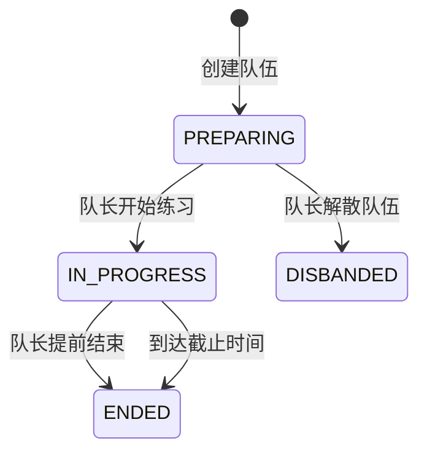

## 状态流转

### 状态定义

| 业务状态 | 内部状态 | 含义 |
|----------|----------|------|
| 组建中 | `PREPARING` | 队伍已经创建但尚未确定成立，可以继续招募和调整成员 |
| 练习中 | `IN_PROGRESS` | 队伍已经确定成立，正在进行所选题目的限时练习 |
| 练习结束 | `ENDED` | 练习已由队长提前结束或因倒计时到期结束，不再接受作品上传 |
| 已解散 | `DISBANDED` | 队伍在组建阶段被队长解散，不再参与后续练习 |

作品已提交和作品已锁定是 submission-service 的业务事实，评审已完成是 ai-review-service 的业务事实，不再写入队伍生命周期状态。

### 流转规则

- 所有状态流转不可逆，不支持恢复到前一状态。
- 只有队长可以主动开始、提前结束或解散队伍。
- 开始练习时记录开始时间和截止时间，并立即停止招募、关闭待处理申请。
- 提前结束时记录实际结束时间，不等待原截止时间。
- 到达截止时间后，即使后台状态尚未完成持久化，任何写操作也必须按练习已经结束处理，防止依赖调度延迟继续上传。
- team-service 负责到期状态收敛，可以通过定时任务持久化 `ENDED`；查询和写入校验同时以截止时间兜底。
- `ENDED` 与 `DISBANDED` 都是终态。
