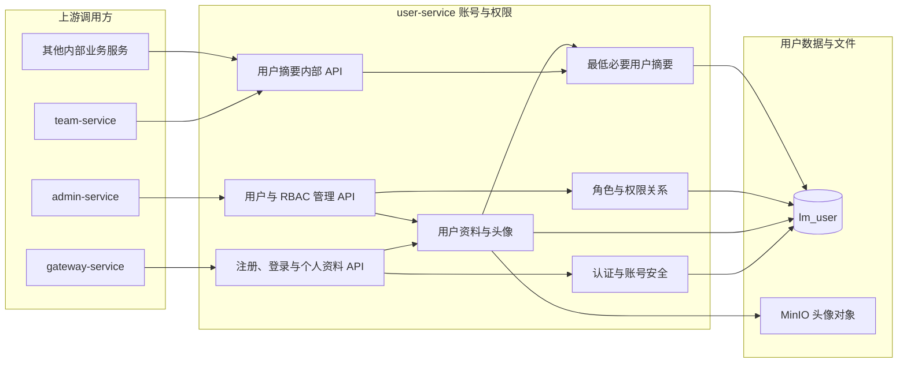

# 用户服务

> 用户服务拥有用户账号、登录状态和 RBAC 权限数据；AUD-05 已接入身份/RBAC 语义审计 Outbox 与服务侧二次鉴权。

## 整体结构与工作流程

用户端请求通过 API 网关进入注册、认证和资料能力；管理后台通过 admin-service 调用用户与 RBAC 管理接口；团队等内部服务只读取最低必要的用户摘要。账号、资料和权限事实统一保存在 `lm_user`，头像二进制保存到 MinIO，其他服务不得复制用户主数据。

## 职责边界

### 负责

- 处理用户注册、登录、退出和登录态建立。
- 维护用户基本资料、密码和账号状态。
- 维护角色、权限、用户角色和角色权限关系。
- 提供当前用户信息、公开用户摘要、简约个人名片和内部用户查询能力。
- 校验用户、角色和权限数据的合法性并保证 RBAC 变更事务一致性。

### 不负责

- 不维护队伍成员关系和团队职责。
- 不维护题目、提交、评审和排行数据。
- 不代替其他业务服务校验资源归属和业务操作权限。
- 不聚合管理看板和跨领域统计。

## 数据与协作边界

user-service 独占 `lm_user` 数据库，用户、角色和权限以这里的数据为事实源。其他服务只通过内部接口获取必要摘要或权限信息，不直连 `lm_user`。队伍成员关系由 team-service 维护，管理后台通过 admin-service 聚合用户统计。

## 功能清单

| 功能 | 功能说明 |
|------|----------|
| 用户注册 | 创建账号并建立初始账号状态 |
| 用户登录与退出 | 校验凭证、建立登录态并处理退出 |
| 当前用户信息 | 查询当前登录用户的账号、资料和权限摘要 |
| 个人资料管理 | 维护昵称、个人介绍和头像等资料 |
| 账号安全 | 修改密码、处理账号状态和必要安全校验 |
| [用户公开名片](用户公开名片/README.md) | 向队伍等场景提供头像、昵称等最低必要公开信息及展示边界 |
| 角色管理 | 维护角色及其基本状态 |
| 权限管理 | 维护权限定义和资源操作语义 |
| 用户角色分配 | 维护用户与角色关系 |
| 角色权限分配 | 维护角色与权限关系 |
| 管理端用户管理 | 为 admin-service 提供用户查询和账号管理能力 |

## 文档索引

| 文档 | 内容摘要 |
|------|----------|
| [服务设计.md](服务设计.md) | 用户信息、注册登录、角色与权限 |
| [用户公开名片](用户公开名片/README.md) | 简约个人名片的公开字段、触发方式和动效规则 |
