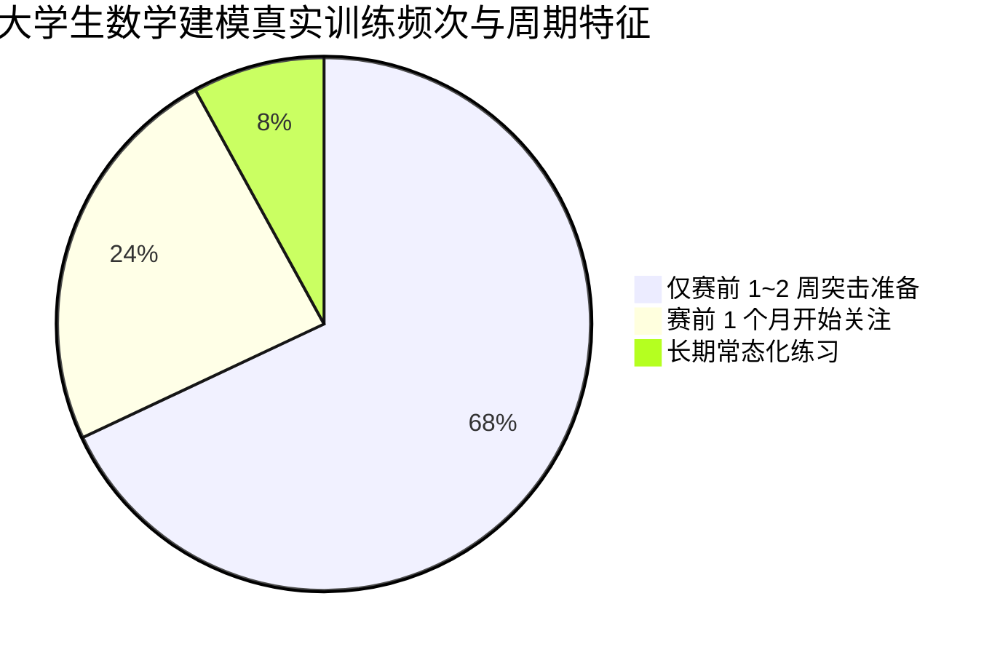
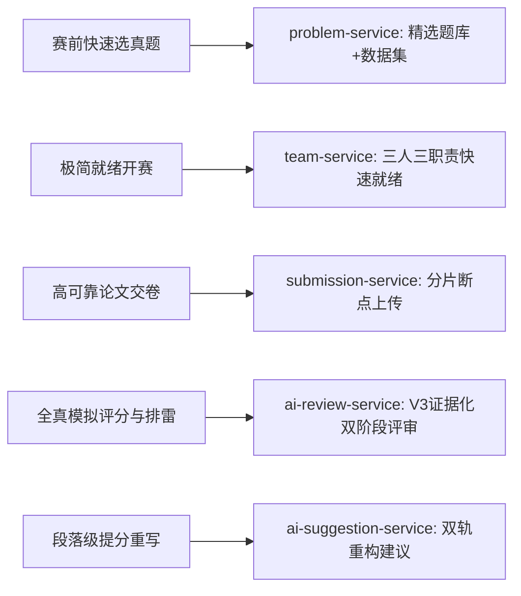

## 产品定位

> 本文档结合真实网络爬取数据（知乎、小红书、竞赛论坛等 370+ 真实语料）、平台现有微服务源码与业务逻辑，客观界定 LeetModel 的真实产品定位、用户意愿矩阵与核心功能权衡。

---

### 一、现实生态与真实用户行为洞察

基于本地知识库采集的知乎深度回答、小红书参赛实录与国赛/美赛论坛真实数据分析，当代大学生数学建模参赛存在极其特殊的客观行为规律：



#### 1. 频次极低、短周期强突击、总量极其有限
- **不是高频刷题平台**：传统算法学习（力扣等）可以每天刷题、一年积累几百道；而数学建模需要连续高强度消耗 3~4 天才能写完一篇完整论文。
- **单人全生涯论文不超过 5 篇**：绝大多数参赛大学生大学四年仅参加 1~2 次比赛（如一次校赛/省赛热身，一次国赛或美赛）。**全流程模拟练习普遍仅进行 1~2 次**，总撰写论文数量极少超过 5 篇。
- **“赛前一周抱佛脚”是绝对常态**：全网最高频检索词为“赛前一周速成”、“国赛突击”、“4天从零到精通”。用户在每年 3~7 月几乎不活跃，流量与使用行为呈现**强脉冲式爆发**（主要集中在每年 8 月下旬至 9 月初国赛前夕，以及 1 月至 2 月美赛前夕）。

#### 2. AI 建模时代的颠覆性转变与全新焦虑
- **AI 协同成为事实主流**：真实调研显示，高水平参赛队伍中程序代码与初稿构建几乎 100% 深度使用大模型辅助（Copilot、ChatGPT、Claude、DeepSeek）。
- **从“不会做”转变为“怕违规、怕通报、怕幻觉”**：
  - 2026 年高教社杯数模国赛出台严格 AI 试行新规，格式规范、AI 工具说明、查重红线全面收紧。
  - 学生最恐惧的不是“做不完”，而是**“AI 编写的符号前后矛盾”、“AI 编造伪数据与虚假定理”、“论文格式跳号或漏写关键词直接被判定违规判零分”**。

---

### 二、LeetModel 的真实产品定位

**LeetModel（力模）不是“日常打卡刷题的 OJ”，也不是“通用 Chatbot 对话框”，而是：**

> **数学建模赛前全真模拟演练场 ＆ 论文 AI 深度合规审查与提分诊断中枢。**

平台聚焦于在大学生最焦虑、最紧迫的**赛前窗口期（前 1 个月至交卷前数小时）**，提供确定性、高效率的闭环支持：

1. **全真赛程沙盒（1~2 次宝贵模拟的高效承载）**：无需繁复流程，快速拉起 3 人队伍或单人身兼三职，启动标准倒计时，体验从选题到终稿的完整压力测试。
2. **交卷前的“预演体检仪”（最具杀伤力的刚需核心）**：写完初稿后，由平台按照国赛/美赛真实评审尺度（规范性审查 + 建模逻辑推演）进行全真预判打分，指出格式雷区与推导断点。
3. **双轨结构化改进指导**：拒绝空洞评语，直接指出“缺陷在第几页、问题是什么、规范范文怎么写、对应 LaTeX 公式如何修正”。

---

### 三、功能重要性矩阵：用户愿意做什么 vs 不愿意做什么

结合真实用户心理，对平台各功能特性进行优先级重构：

```mermaid
quadrantChart
    x-axis 低意愿投入 --> 高意愿使用
    y-axis 低核心价值 --> 高核心价值
    quadrant-1 核心拳头能力 (重中之重)
    quadrant-2 高价值轻量补充
    quadrant-3 冗余/应当极简的功能
    quadrant-4 辅助参考
    "AI 论文合规体检与预评分": [0.95, 0.95]
    "格式雷区审查 (摘要/符号/图表)": [0.90, 0.90]
    "双轨论文改进建议 (直接改写)": [0.85, 0.85]
    "限时全真倒计时实训": [0.75, 0.70]
    "分片大文件稳定上传": [0.80, 0.75]
    "赛题排行榜 (横向摸底)": [0.65, 0.60]
    "复杂多级队伍权限审批": [0.15, 0.20]
    "日常刷题打卡/绿墙/积分": [0.10, 0.15]
    "泛化长篇博客/社交水贴": [0.20, 0.25]
```

| 功能维度 | 用户真正愿意做 / 迫切需要的（High Priority） | 用户绝对不愿意做 / 视作负担的（Low Priority / Anti-Pattern） |
|---------|-------------------------------------------|---------------------------------------------------------|
| **题库与练习** | 快速浏览 2~3 道近两年真题，阅读高清 Markdown + 公式，直接下载附件数据集。 | 天天签到、按难度刷几百道题、背诵算法模板。 |
| **组队与开赛** | 赛前 10 分钟快速把队友拉齐；或者**一人身兼三职一键开赛**，直接开始模拟。 | 填冗长的队伍简历、审核复杂的申请流、维护队伍文化。 |
| **论文提交** | 几十兆包含复杂矢量图的 PDF 稳妥上传，进度条实时可见，保证交得上。 | 繁琐的提交前表单填写、强制附带冗余元数据。 |
| **AI 评审（杀手锏）** | **“告诉我能得几等奖”、“格式会不会被通报”、“前后推导有没有脱节”**。 | 通用大模型式的车轱辘套话、虚无缥缈的“建议继续努力”。 |
| **论文建议** | 针对扣分点，直接给出**改写范例、规范句式与正确 LaTeX 公式**。 | 宽泛的方法论宣讲、纯文本长篇大论。 |
| **排行榜** | 看看自己的预评分在同题目所有队伍里排在前百分之几（摸底）。 | 炫耀积分榜、全站经验值排名。 |

---

### 四、代码级闭环与特性支撑现状

平台现有的微服务架构，已经为上述真实定位提供了完整的底层闭环：



1. **`problem-service`**：收录国赛/美赛经典真题，提供标准 Markdown 题面、LaTeX 公式排版与数据集打包下载，满足赛前快速锁定题目的需要。
2. **`team-service`**：严格判定 `hasModelingRole`, `hasProgrammingRole`, `hasWritingRole` 三职责全覆盖。允许队长单人兼顾三职快速开赛，既保全了数学建模“建模、编程、写作”的严肃规约，又满足了敏捷开题的需要。
3. **`submission-service`**：以 50MB PDF 分片断点上传与 SHA-256 校验为核心，彻底消除赛前倒计时读秒交卷时的网络焦虑。
4. **`ai-review-service`**：落地 `DEEP_EVIDENCE_REVIEW_V3` 双阶段评审（阶段一 25 分静态学术审查 + 阶段二 75 分小题推演并发），直接击中用户对“格式是否合规、模型是否自洽”的刚性需求。
5. **`ai-suggestion-service`**：结合题面与论文，生成带证据链高亮与规范公式范例的双轨改写建议，给学生提供可落地的改写依据。

---

### 五、前端重构指导思想

1. **做“利器”，不做“社交圈”**：界面去除一切花哨无用的打卡社交元素，强化**工具效率、信息可读性与确定性状态**。
2. **极简前置，重度交付**：开赛前建队与选题路径必须极短、极快；而开赛后的倒计时看板、提交进度与评审结果必须极度专业、详尽、严肃。
3. **安全感第一**：针对赛前高压心理，界面必须在倒计时提醒、上传进度、评审排队状态、格式风险提示上给予最清晰的确定性反馈。
