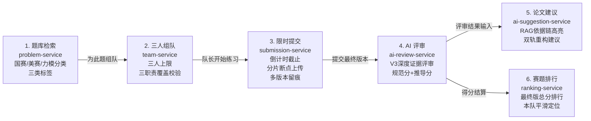

## 产品定位

> 本文档结合 LeetModel 现有微服务代码实现与需求设计，系统界定平台的产品定位、业务本质、差异化竞争壁垒与核心业务闭环，作为全站前端重构的总体纲领。

---

### 一、业务本质与现实背景

#### 1. 数学建模竞赛的实训痛点

数学建模竞赛（全国大学生数学建模竞赛 CUMCM、美国大学生数学建模竞赛 MCM/ICM、LeetModel 官方赛事等）是高等教育中规模最大、跨学科最广的综合性赛事之一。与传统的计算机算法做题（如力扣做题、在线 OJ 判题）相比，数学建模练习具有独特的行业规律：

1. **交付物是长篇学术论文而非简短可执行代码**：一支参赛队伍需要在 3~4 天内完成题面剖析、模型假设、机理推导、算法仿真，并最终撰写一篇 20~30 页包含摘要、图表、LaTeX 复杂公式推导与灵敏度分析的完整 PDF 格式学术论文。
2. **没有非黑即白的客观“标准答案”**：不同队伍选用的假设前提、建模路径（机理分析、微分方程、运筹优化、图论网络或机器学习）截然不同。评价一篇论文的优劣，依赖于假设是否严谨、推导是否闭环、代码与结果是否自洽、排版是否符合学术规范。
3. **日常备赛训练反馈周期极长、评阅门槛极高**：高校教练与指导老师精力极其有限，无法在备赛期间逐篇精读、打分并提出修改意见。参赛学生在平时模拟中普遍陷入“写完论文不知道得多少分、不知道推导缺陷在哪、更不知道如何改写”的困境。

#### 2. LeetModel 的核心定位

**LeetModel（力模）是面向数学建模参赛者与自学者的在线实训与 AI 论文自动深度评审平台。**

平台的核心定位是**“平时模拟演练、高频限时实训、版本化打磨论文、客观量化评分与深度改进建议”**的实训中枢。平台不承办官方竞赛的报名与行政赛程，而是收录高含金量的经典赛题，提供全真模拟与即时智能反馈。

---

### 二、核心价值主张与差异化壁垒

#### 1. 一句话价值主张

> **让每一篇建模论文都被认真评审。**

通过自动化 PDF 结构化解析、大模型证据化多维量表评审与 RAG 论文改进建议，将原本需要资深教练数小时的人工评阅，缩短为数分钟的高确定性量化分析与段落级改写指导。

#### 2. 差异化竞争壁垒分析

```mermaid
quadrantChart
    x-axis 低协同交互 --> 高协同实训闭环
    y-axis 浅层打分/黑盒对话 --> 深度证据化学术评审
    quadrant-1 LeetModel 核心定位
    quadrant-2 通用大模型/学术翻译工具
    quadrant-3 传统网盘/云文档提交
    quadrant-4 传统算法刷题平台 (力扣/牛客)
    "传统算法OJ": [0.2, 0.2]
    "网盘收集表": [0.3, 0.1]
    "通用Chatbot": [0.2, 0.7]
    "LeetModel": [0.85, 0.9]
```

| 对比维度 | 传统算法 OJ（力扣等） | 通用大模型（ChatGPT 等） | LeetModel（本项目） |
|---------|---------------------|------------------------|--------------------|
| **核心实体** | 编程语言、输入输出用例、AC/WA | 纯文本提示词、单次聊天上下文 | 题目、三人小队、PDF 论文版本、评审量表、改进建议 |
| **交互形态** | 网页 IDE 代码编辑器 | 对话框气泡流 | 团队工作台、分片断点上传器、学术试卷、维度雷达 |
| **评审机制** | 单元测试黑盒跑用例 | 主观生成长文本（易幻觉、无标准） | 基于 `DEEP_EVIDENCE_REVIEW_V3`：阶段一规范审查（0~25分）+ 阶段二小题推演（0~75分）+ 证据链高亮 |
| **团队机制** | 单兵作战 | 单人问答 | 严格绑定题目的三人小队，强制建模/编程/论文三职责全覆盖 |

---

### 三、代码级端到端业务闭环

LeetModel 的系统实现紧密围绕**“选题 → 组队 → 限时实训 → 提交 → 评审 → 建议 → 排行”**展开，各环节在微服务与数据结构上均有强约束支撑：



1. **题目浏览与分类检索 (`problem-service`)**：
   - 题源收录：全国大学生数学建模竞赛（CUMCM）、美国大学生数学建模竞赛（MCM/ICM）、力模杯。
   - 检索维度：年份、赛事、难度（入门/进阶/挑战）、语种（中/英）、三类独立标签（背景领域、题目类型、模型算法）。
   - 详情形态：标准化 Markdown 题面、LaTeX 数学公式排版、原始数据集与附录附件下载。

2. **组队与三职责就绪体系 (`team-service`)**：
   - 规则约束：一队最多三人，队长终身固定不可转让；一队永久绑定一道赛题。
   - 三职责覆盖检查：`hasModelingRole`（建模手）、`hasProgrammingRole`（编程手）、`hasWritingRole`（论文手）。开赛前通过 `TeamErrorCode.ROLES_NOT_COVERED` 强制校验，三者完全就位方可开赛。
   - 队伍状态机：`PREPARING`（组建中） $\rightarrow$ `IN_PROGRESS`（练习中，启动倒计时） $\rightarrow$ `ENDED`（练习已结束）。

3. **PDF 分片断点上传与多版本留痕 (`submission-service`)**：
   - 协议设计：初始化上传 $\rightarrow$ 分块并行传输（支持暂停与断点续传） $\rightarrow$ 服务端分片合并 $\rightarrow$ SHA-256 去重校验。
   - 练习过程留痕：支持提交多个版本（V1 草稿, V2 中期版...），队长可随时标记 `final_version` 作为终态交付。

4. **版本化可解释 AI 评审工作流 (`ai-review-service`)**：
   - 核心版本 `DEEP_EVIDENCE_REVIEW_V3`：
     - 阶段一：论文结构与学术规范性静态审查（满分 25 分）。
     - 阶段二：针对具体小题的建模合理性、算法推导与求解动态推演（满分 75 分）。
     - 产出物：全局总分（0~100）、分阶段量表明细、具体页码与段落证据链。

5. **基于依据链的论文改进建议 (`ai-suggestion-service`)**：
   - 输入整合：消费原始题面要求 + PDF 论文解析文本 + AI 评审缺陷报告。
   - 交付形态：段落级诊断报告、学术写作规范参考、双轨重构建议（指出问题在哪，并给出改写范例）。

6. **题目排行榜与个人技能分析 (`ranking-service` & `profile`)**：
   - 赛题排行：按赛题归属展示各小队最终提交版本的客观得分排名，支持前三甲荣耀榜与本队排位高亮。
   - 个人沉淀：五维技能图表（建模、编程、写作、分析、推导）记录成长轨迹。

---

### 四、产品边界与非目标（Out of Scope）

为保持平台定位聚焦，明确以下边界规则：

1. **不承办真实官方赛事的赛程与报名**：平台不开发赛事报名收费、准考证打印、赛区初赛复赛晋级等行政流程，所有题目均作为常态化训练题库开放。
2. **不建设自由发帖的泛化社区广场**：平台核心是严肃的练习与协作，不做闲聊社区、水贴讨论区，组队广场仅服务于真实的找队友需求。
3. **不做无确定性依据的纯娱乐打分**：AI 评审必须具备版本化、结构化与量表证据支撑，拒绝一句话式的主观评语。
