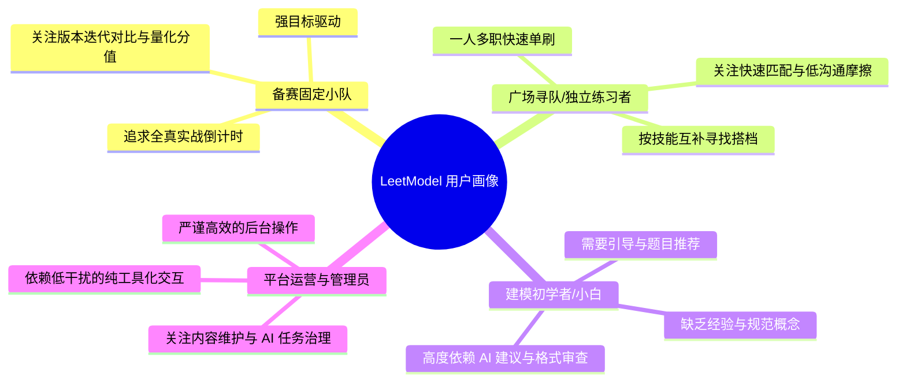
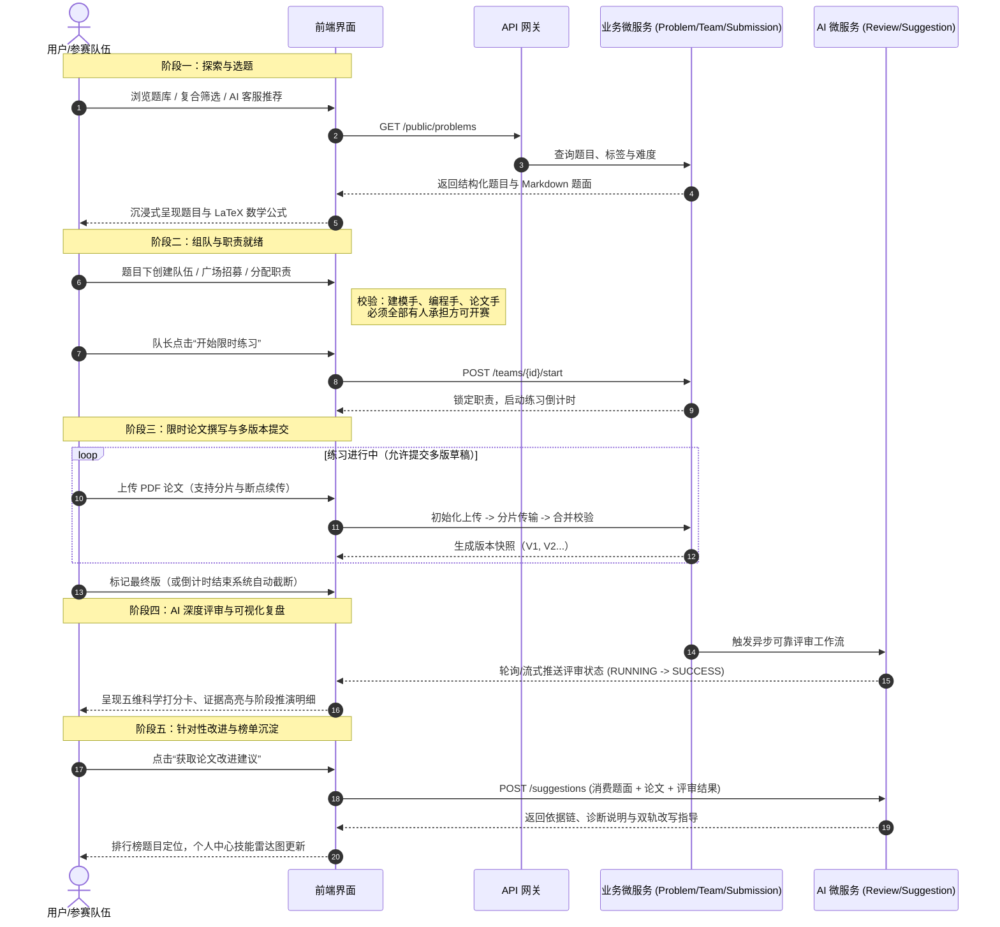

## 产品定位与用户旅程

> 本文档系统梳理 LeetModel 的产品定位、核心心智模型、目标用户画像与端到端实训体验旅程地图，作为全站信息架构与 UI/UX 设计的基石。

---

### 产品定位

#### 领域背景与核心痛点

数学建模竞赛（如国赛 CUMCM、美赛 MCM/ICM、LeetModel 官方赛事）是多学科综合性学术竞赛。与传统算法竞赛（如力扣做题、输入输出判题）存在本质差异：

1. **产出物是学术论文而非简短代码**：最终交付是一篇 20~30 页、包含摘要、问题重述、模型假设、符号说明、模型建立与求解、灵敏度分析、优缺点评价的完整 PDF 论文。
2. **没有绝对的客观标准答案**：模型的合理性、假设的边界、推导的严谨性、可视化的美观度以及结论的鲁棒性决定论文质量。
3. **日常实训反馈周期极长、成本极高**：参赛学生在赛前练习时，普遍面临“写完论文无人评阅”、“不知假设与推导缺陷何在”、“无法量化自身水平”的困境。

#### LeetModel 的产品定位

**LeetModel（力模）是面向数学建模参赛者与学习者的在线实训与 AI 论文自动化深度评审平台。**

- **核心心智**：不是单纯的“比赛报名系统”，而是**“选题、组队、限时实训、论文提交、AI 自动评审打分、改进建议复盘、题目排行”**的端到端学习与备赛闭环。
- **核心价值主张**：**让每一篇建模论文都被认真评审**。通过大模型深度证据化评审与 RAG 论文改进建议，将原本需要资深教练数小时的人工评阅，缩短为数分钟的确定性量化分析与结构化指导。

---

### 目标用户画像

| 画像类别 | 核心诉求 | 关键界面与行为路径 | UI/UX 重点设计方向 |
|---------|---------|------------------|-------------------|
| **备赛固定小队** | 模拟 3-4 天限时封桩练习；阶段性交付多版 PDF 论文；横向对比不同版本的评分提升 | 题目详情 → 创建队伍 → 邀请队友 → 开启限时倒计时 → 多次分片上传草稿 → 锁定最终版 → 查阅多维量表与依据 | 醒目的倒计时看板、高可靠的断点续传进度指示、清晰的版本演进对比树、严谨的五维量表打分卡 |
| **寻队/独立参赛者** | 缺少建模手/编程手/论文手搭档；或希望独揽三项职责快速练题 | 队伍广场 → 浏览招募需求 → 申请入队；或自己建队一键补齐三职责直接开赛 | 标签化展示队伍缺口、高效的入队操作流、灵活的职责分配面板 |
| **建模初学者** | 不懂选题、缺乏论文框架感知；需要范式指导与答疑 | 首页 → AI 客服推荐题目 → 阅读 Markdown 题面与公式 → 参考论文建议复盘 | 结构化题面排版与 KaTeX 公式渲染、浮动 AI 客服直达、图文并茂的双轨建议卡片 |
| **系统管理员** | 题库维护、赛事标签管理、AI 版本治理与审计排查 | 管理端各专业控制台（Dashboard、访问控制、内容中心、运营中枢、AI 中心） | 高信息密度的数据表格、批量操作、低认知负荷的专业仪表板、纯工具化视效 |

---

### 端到端实训体验旅程地图（User Journey Map）

---

### 核心交互场景与心智预期

#### 1. 题库检索心智：学术严谨与高效锁定
- 用户希望通过**赛事来源（国赛/美赛/力模）**、**年份**、**题型（优化/预测/评价/统计）**、**算法（差分方程/规划/图论/机器学习）**迅速锁定想练的题。
- 题面必须提供接近学术试卷的高品质渲染：段落分明、行内与块级数学公式清晰对齐、附录数据支持一键下载。

#### 2. 组队与分工心智：契约感与团队就绪
- 数学建模的灵魂是**三人协同**。队长对职责分配拥有权威控制。
- 界面必须以直观的“就绪指示器”反馈当前队伍状态：建模手是否就位？编程手是否就位？论文手是否就位？当且仅当三者均满足，核心操作按钮“开始限时实训”才会从置灰变为高亮，营造出强烈的开赛仪式感。

#### 3. 提交与倒计时心智：紧张感与确定性安全感
- 倒计时组件必须常驻可见，进入尾声时提供警示色视觉增强。
- PDF 文件体积通常较大（包含高分辨率图表与长篇公式），分片上传必须具备清晰的进度百分比、速度与完成状态，给参赛者确定的安全感，避免“不知是否成功上传”的焦虑。

#### 4. 评审结果复盘心智：可信度、可解释性与学术尊严
- 拒绝毫无依据的“黑盒数字”。评审结果必须呈现：
  - **全局总得分** 与分项量表得分（阶段一静态格式审查 + 阶段二小题建模推演）。
  - **证据高亮引用**：指出具体哪一页、哪个小题建立了何种假设、使用了什么方程。
  - **论文改进建议**：指出缺陷成因，并给出清晰可行的改进方向与参考文献。
