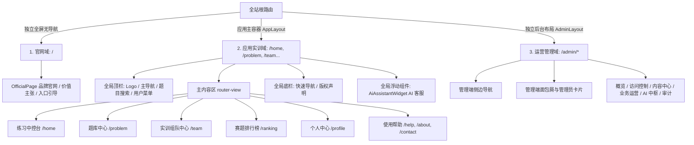
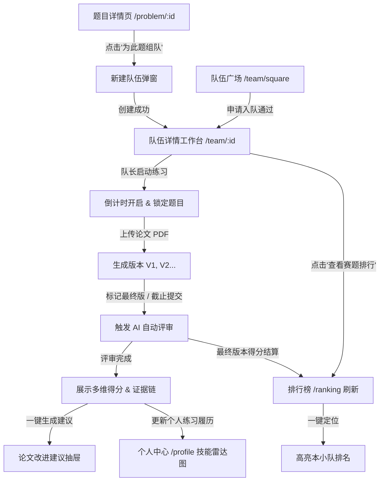

## 全站信息架构

> 本文档定义 LeetModel 前端重构后的页面拓扑结构、布局容器分层、模块职责划分与跨页面核心数据信息流。

---

### 页面拓扑与容器分层

全站划分为三大容器域，互不干扰，边界清晰：

---

### 模块职责与页面组织

#### 1. 独立官网域 (`/`)
- **定位**：面向访客与初次接触者的全屏着陆页，无应用级导航栏，避免干扰。
- **核心内容**：品牌 Logo、产品一句话价值主张、四大实训主流程（选题/建队/提交/评审）、典型评分成果展示、注册与登录行动召唤（CTA）。

#### 2. 练习中控台 (`/home`)
- **定位**：登录用户的实训工作台首页，未登录时提供体验式功能索引与登录引导。
- **核心区块**：
  - 问候区：个性化问候语、用户角色标签。
  - 快捷入口栅格：题库训练、队伍广场、我的队伍、排行榜、个人设置直达。
  - 核心工作区（进行中的队伍）：以卡片列表直观呈现当前正在备赛或组建的队伍，标明所选赛题、队伍状态、成员数与快捷入口。
  - 最近提交时序卡：按时间倒序展示本小队最近上传的论文版本（V1, V2...）及最终版标记。

#### 3. 题库中心 (`/problem`)
- **题目列表页 (`/problem/problemListPage`)**：
  - 复合筛选面板：赛事（国赛/美赛/力模）、年份、语言（中文/英文）、难度分级（入门/进阶/挑战）。
  - 标签组筛选：背景领域标签、题目类型标签、涉及模型与算法标签（互斥/组合）。
  - 列表视图：题号、标题、所属赛事年份、难度勋章、标签组、附件标记、操作按钮（立即查看 / 快速组队）。
  - 顶部操作栏：关键词检索、随机一题（快速开题）。
- **题目详情页 (`/problem/:id`)**：
  - 试卷头部：题号、题目名称、难度徽标、允许完成时长、题面语言。
  - 题面正文（核心）：Markdown 渲染，数学公式严格通过 KaTeX 排版，图表居中自适应。
  - 附件资源区：题目数据集、背景参考资料直接下载。
  - 协同操作条：常驻操作（“以此题创建队伍”、“在队伍广场寻找此题队伍”）。

#### 4. 组队与实训工作台 (`/team`)
- **我的队伍页 (`/team`)**：
  - 分组标签切换：全部队伍、组建中（PREPARING）、练习中（IN_PROGRESS）、已结束（ENDED）。
  - 队伍管理卡片：显示队名、赛题号、成员头像列表、实训状态与进入工作台按钮。
  - 新建队伍弹窗：选择赛题、命名队伍、设置招募宣言。
- **队伍广场页 (`/team/square`)**：
  - 招募信息流：公开招募中的队伍列表，显著高亮当前缺失的职责（缺建模手/缺编程手/缺论文手）。
  - 筛选与搜索：按赛题筛选、按缺失职责筛选。
  - 申请入队交互：快速查看队长信息与一键申请。
- **队伍详情工作台 (`/team/:id`)（全站交互核心）**：
  - 顶栏概览区：队伍名称、绑定赛题、倒计时面板（开始练习后动态递减）。
  - 成员与职责矩阵：
    - 成员列表（队长、成员1、成员2），清晰标注“建模手 / 编程手 / 论文手”职责徽章。
    - 开赛前校验指示器：三项职责全覆盖校验状态。
    - 队长管理面板：邀请成员、移除成员、修改职责分配、发布/关闭招募。
  - 论文提交区：
    - 分片上传器：支持超大 PDF 文件分片上传、秒级计算 SHA-256、实时进度条。
    - 提交历史树：按版本（V1, V2...）展示全部提交记录，支持在线预览 PDF、标记最终提交版本。
  - 评审结果区：
    - 评审状态指示：等待调度 / 正在评审 / 评审成功 / 评审失败重试。
    - 维度打分仪表盘：总得分、阶段一学术规范分、阶段二建模推演分。
    - 改进建议联动：一键拉起基于题面、论文与评审结果的结构化建议弹窗。

#### 5. 赛题排行榜 (`/ranking`)
- **定位**：按题目展示最终提交论文的客观排名。
- **核心区块**：
  - 赛题选择器：切换不同赛事年份的具体题目。
  - 榜单头部：第一名（金）、第二名（银）、第三名（铜）荣耀卡片。
  - 排行数据表格：名次、队伍名称、成员列表、评审总分、最终提交版本号、提交时间。
  - “定位我的队伍”快捷悬浮条：一键平滑滚动并高亮本队在榜单上的具体排位。

#### 6. 个人中心 (`/profile`)
- **个人主页 (`/profile`)**：个人资料卡片、统计指标（练习赛题数、参与队伍数、最高评审分、平均分）。
- **技能分析页 (`/profile/analysis`)**：基于历史评审数据的五维雷达图（假设建立、数学推导、编程求解、论文排版、结果分析）。
- **提交履历页 (`/profile/history`)**：跨队伍的所有历史论文提交时间线。
- **设置页 (`/profile/settings`)**：个人昵称、头像上传、密码修改与安全绑定。

---

### 跨页面核心业务信息流

