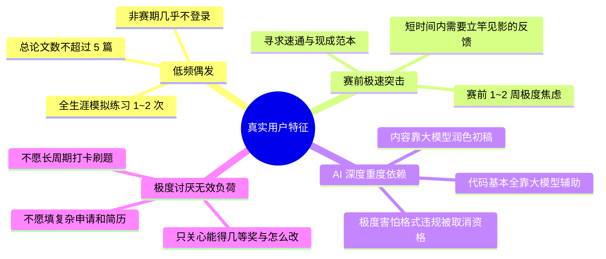
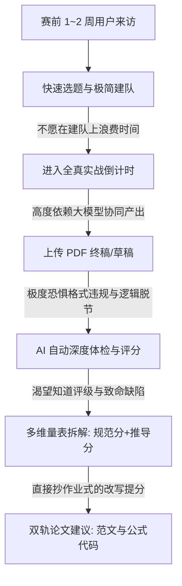

## 用户群体定位

> 本文档基于知乎、小红书与论坛等真实采集数据，深入剖析数学建模参赛大学生的现实特征、痛点演变（尤其是 AI 时代新痛点）、行为意愿边界与心智模型，为前端重构提供精准的用户锚点。

---

### 一、用户群体特征图谱：颠覆传统刻板印象

真实的数学建模参赛群体，呈现出与常规程序员、LeetCode 刷题者截然不同的行为模式：

---

### 二、三大真实核心角色画像（Personas）

#### Persona 1：临战抱佛脚的队长 —— “焦虑的最后把关人”
- **背景**：大三工科学生，为了保研综测加分报名了下周举行的数模国赛。这是他大学里第二次参赛，此前只在校赛里草草写过一次。
- **真实行为**：
  - 平时两个月一次都没练过。离比赛还有 10 天，三个人终于在图书馆聚齐，打算做一次为期 3 天的模拟。
  - 队友用大模型生成了一堆代码和分析，他作为队长负责把所有内容粘合成一篇 25 页的论文。
- **核心焦虑**：
  - “图表编号有没有跳号？格式符不符合国赛 2026 最新要求？听说没有关键词或漏了附录会被直接取消评奖资格！”
  - “AI 编出来的那些微分方程到底通不通？审稿老师会不会一眼看出来是生成的？”
  - “交卷前最后两小时，如果上传 PDF 卡死怎么办？”
- **对前端的核心期望**：
  - **开箱即用的极速建队**：拉两个人直接开赛，不需要做各种复杂设置。
  - **全真倒计时与分片断点上传**：看得见剩余时间，上传大文件时有清晰百分比和速度，心里踏实。
  - **交卷前的“预审排雷看板”**：一键体检，把格式隐患、摘要漏洞、逻辑缺陷挑出来。

#### Persona 2：手忙脚乱的初学三人组 —— “全靠 AI 但心虚的新手”
- **背景**：大二非数学专业同学，三个人都是第一次参赛，纯零基础。
- **真实行为**：
  - 面对赛题完全不知道如何下手，开着 DeepSeek/ChatGPT 疯狂提问。
  - 拼拼凑凑弄出了一篇论文，但心里完全没底：“我们这篇论文到底算不算数学建模论文？交上去会不会得 0 分被老师通报？”
- **核心焦虑**：
  - “这道题到底属于什么类型？需要用什么经典模型？”
  - “评委到底按什么打分？为什么别人拿国一我们可能连参赛奖都不是？”
- **对前端的核心期望**：
  - **AI 客服直接推荐适合小白练习的历年赛题**。
  - **极其客观细致的评分量表**：明确告诉他们阶段一格式分拿了多少、阶段二各个小题推导拿了多少。
  - **双轨改进建议**：指出缺陷在哪里，并直接给出正确的学术范文与公式，让他们知道正确的论文长什么样。

#### Persona 3：单枪匹马的算法推导者 —— “敏捷单刷验题者”
- **背景**：数学系或统计学研究生，对自己的建模推导能力很有信心，想验证某个经典算法或深度学习模型在特定赛题上的效果。
- **真实行为**：
  - 不想花精力去广场找队友磨合，只想找一道感兴趣的往年真题（如 2025 国赛 A 题），自己花半天推导求解并写一份简报。
- **核心焦虑**：
  - 平台是否强制要求三个人才能开始？如果强卡三个人，他就直接流失了。
- **对前端的核心期望**：
  - **单人快速自开赛**：允许一人兼任建模、编程、写作三项职责，一键直接进入倒计时实训。

---

### 三、核心用户心智模型与行为准则

1. **不爱“长跑”，只爱“速成”**：
   - 用户不会长期陪伴平台成长，他们的生命周期高度浓缩在“赛前突击的几天”。
   - 前端信息架构必须将最核心的**“题目浏览”、“实战倒计时工作台”、“论文深度评审报告”**暴露在最显眼位置，减少一切中间跳转层级。
2. **“摘要与格式”决定生死的心智**：
   - 数模老手都知道：评卷老师看一篇论文往往只有几分钟，首先扫摘要、关键词、图表编号与格式规范，格式不过关直接降档淘汰。
   - 评审结果页必须将**“阶段一规范性审查（0~25分）”**作为前置第一视觉焦点，明确告知格式合规性。
3. **从“评分”到“改写”的即时转化**：
   - 用户看到扣分后，最迫切的心理是“那我怎么改才能拿到这个分？”。
   - 论文建议的交互必须是**“点选具体扣分项 $\rightarrow$ 联动展开对应段落修改范本”**，让改写过程流畅无阻。

---

### 四、前端重构设计准则（以真实用户为中心）

1. **极简入口原则**：在首页和题库页，支持一键直接创建队伍并自动补全职责，30 秒内进入练习状态。
2. **无缝安全感原则**：文件上传进度精准到百分比和 MB；倒计时醒目；评审排队有明确进度告知。
3. **权威可信原则**：评审结果严禁给出模糊笼统的套话，必须展示结构化数据、分数拆解与证据页码引用，让赛前焦虑的用户感到真实与信服。
