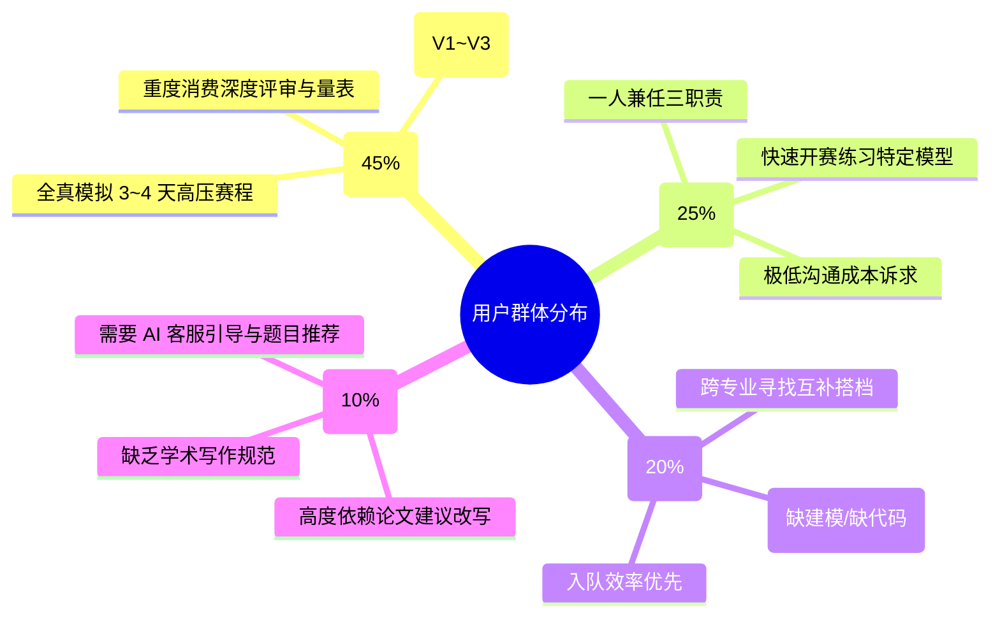
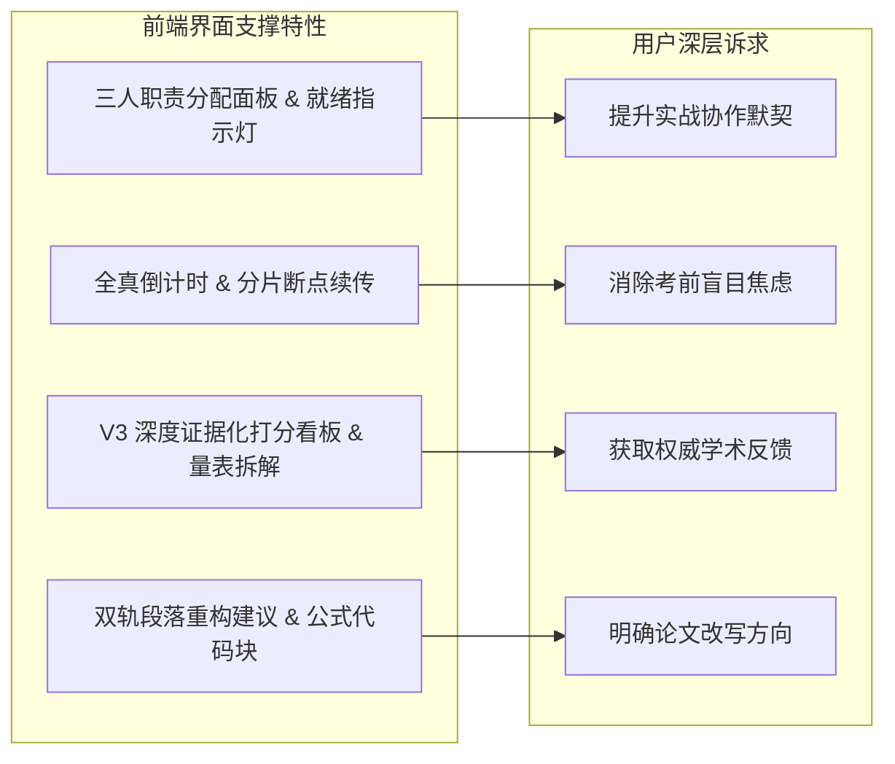

## 用户群体定位

> 本文档系统梳理 LeetModel 的目标用户群体画像、核心痛点、场景诉求、心智模型与行为特征，为前端页面组织、交互动线与视觉信息分发提供以用户为中心的设计准则。

---

### 一、目标用户群体细分

LeetModel 的核心用户群体集中在理工科、经管类在校高校大学生及竞赛指导人员，按照实训组织模式与能力阶段可细分为四大核心用户群体与一类系统管理员：

---

### 二、典型用户角色画像（User Personas）

#### Persona 1：统筹兼备的固定队队长 —— “强目标型实战者”
- **代表人物**：陈同学，应用数学系大三，国赛备赛固定队队长兼建模手。
- **使用动机**：在国赛正式开赛前两周，每周进行一次 72 小时全真模拟，检验三人磨合程度与论文输出质量。
- **核心痛点**：
  - 无法准确掌握队员是否真正进入状态，缺乏任务就绪感知。
  - 每次写完论文给指导老师看都要等好几天，考前根本来不及反复修改。
  - 担心上传超大 PDF（几十页包含高清矢量图）出现网络超时或丢文件。
- **行为路径与界面期望**：
  - 选择指定赛题 $\rightarrow$ 创建队伍 $\rightarrow$ 确认三人职责覆盖 $\rightarrow$ 点击开赛启动倒计时。
  - 期望看到：**极具仪式感的开赛就绪指示器**、**常驻且醒目的倒计时面板**、**进度可视的分片上传器**、**多版本历史对比树**。

#### Persona 2：寻觅搭档的编程/论文手 —— “技能互补寻队者”
- **代表人物**：李同学，计算机系大二，擅长 Python 数据分析与算法仿真，但不会撰写规范学术论文。
- **使用动机**：希望在队伍广场快速找到具备较强论文撰写能力的队友一起组队练习。
- **核心痛点**：
  - 很多队伍招募信息含糊不清，不知道到底缺什么角色。
  - 申请入队后缺乏反馈，沟通成本高。
- **行为路径与界面期望**：
  - 浏览队伍广场 $\rightarrow$ 按“缺少编程手”精准筛选 $\rightarrow$ 查看队长与已有队员画像 $\rightarrow$ 一键申请。
  - 期望看到：**醒目的缺失职责标签（缺建模/缺编程/缺论文）**、**轻量直接的申请入队交互**。

#### Persona 3：能力全面的自驱单刷者 —— “高频敏捷刷题者”
- **代表人物**：张同学，运筹学研究生，希望针对特定图论与差分方程赛题快速自测求解思路。
- **使用动机**：不愿花费时间等待队友沟通，一人独揽三职责，快速提交精简论文验证模型分值。
- **核心痛点**：
  - 讨厌繁冗的组队确认前置流程，希望“一个人就是一个小队”。
- **行为路径与界面期望**：
  - 题目详情 $\rightarrow$ 点击建队 $\rightarrow$ 一键将三项职责全赋予自己 $\rightarrow$ 立即开赛。
  - 期望看到：**顺畅的单人建队快捷操作**、**开箱即用的快速开始流程**。

#### Persona 4：懵懂起步的建模新手 —— “引导学习型新人”
- **代表人物**：王同学，大一新生，初次接触数学建模，不知如何选题、不知论文包含哪些模块。
- **使用动机**：了解数学建模竞赛模式，学习优秀论文结构与评价标准。
- **核心痛点**：
  - 面对几十道往年赛题无从下手，不知道哪道题适合新手入门。
  - 对学术论文格式一无所知，担心交上去直接零分。
- **行为路径与界面期望**：
  - 首页浏览 $\rightarrow$ 向 AI 客服提问“新手推荐练习什么题” $\rightarrow$ 点击推荐卡片直达题面 $\rightarrow$ 查看题面与 LaTeX 公式。
  - 期望看到：**右下角常驻且智能的 AI 客服助手**、**高保真 Markdown + 公式排版**、**结构化论文改进建议中详尽的改写指导**。

---

### 三、用户核心心智模型与认知摩擦点

| 环节与心智模型 | 潜在认知摩擦与焦虑点 | UI/UX 设计防线与应对策略 |
|---------------|--------------------|------------------------|
| **组队协作心智**：三人协作，权责分明 | “我们队到底能不能开始了？谁还没到位？” | **三职责就绪状态指示器**：直观展示建模/编程/论文三色指示灯；未全部覆盖时禁用开赛按钮并附带友好 Tooltip 提示。 |
| **实战倒计时心智**：分秒必争，临场高压 | “还剩多少时间？会不会因为系统延迟错过截止时间导致提交无效？” | **动态色系倒计时看板**：健康期为中性蓝；剩余时间<20%切换为警戒橙；最后 1 小时切换为紧迫红，并给出最终版本自动锁定说明。 |
| **大文件上传心智**：高价值长篇论文，安全可靠 | “PDF 很大（30MB+），点提交会不会卡死？进度到底动没动？” | **分片上传可视化进度条**：展示当前分片序号、上传百分比、即时传输速率与 SHA-256 完整性校验动画，提供暂停与重试入口。 |
| **学术评审心智**：渴望专业指点，拒绝黑盒打分 | “为什么给我打 75 分？扣在哪里？是格式不对还是模型小题没推导出来？” | **双阶段五维量表仪表盘**：明确拆分阶段一规范审查（0~25分）与阶段二小题推演（0~75分），提供具体页码引用的证据链标签。 |
| **改进复盘心智**：学以致用，指导改写 | “知道扣分了，那我具体怎么改？公式怎么写才标准？” | **双轨论文改进建议**：左轨指明缺陷成因与原文段落，右轨给出规范范例文本与对应 LaTeX 公式代码块。 |

---

### 四、功能对用户价值的映射矩阵（Feature-to-Value Mapping）

---

### 五、前端 UI/UX 设计准则

基于上述用户群体定位与心智模型，确立前端重构的五项黄金设计准则：

1. **契约就绪原则（Readiness Principle）**：关键节点（如组队开赛、最终版锁定）必须提供明确的系统前置条件检查与可视化就绪状态，给用户确定的掌控感。
2. **确定性反馈原则（Deterministic Feedback）**：对于长耗时异步任务（分片上传、AI 评审调度、建议生成），杜绝静默等待，必须具备分阶段状态通知与兜底机制。
3. **学术尊严原则（Academic Dignity）**：界面风格保持克制、深邃、严谨的学术工程基调，公式排版与论文渲染达到期刊预印本级别的审美水准。
4. **低摩擦协作原则（Low Friction Collaboration）**：广场招募、职责分配、申请审核等队伍高频操作路径缩短至两步以内，减少人际沟通摩擦。
5. **梯度信息展开原则（Progressive Disclosure）**：列表页与中控台保持精炼低认知负荷；详情页与评审量表支持层层展开，满足不同深度用户的探索需求。
