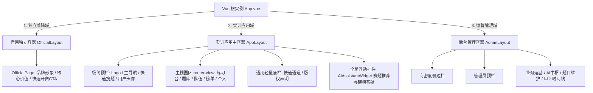
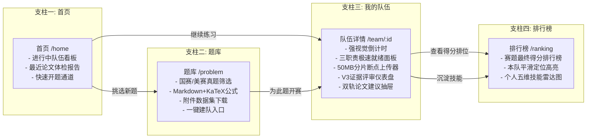
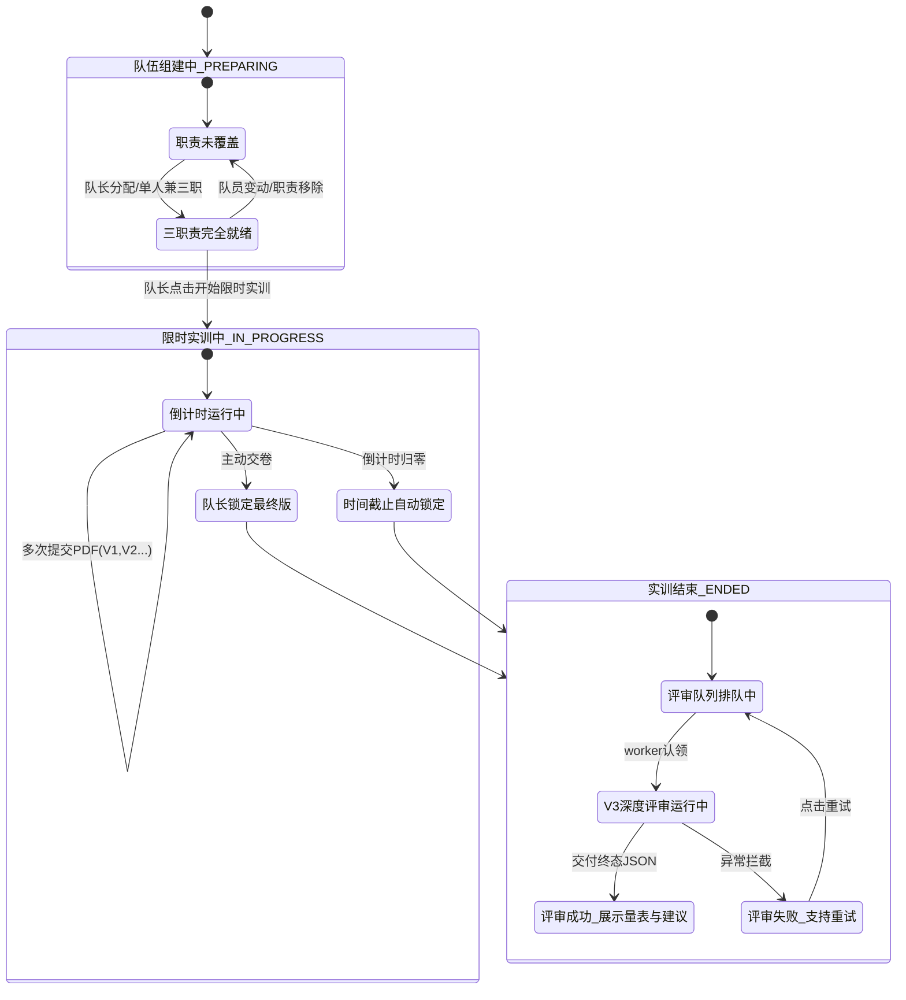
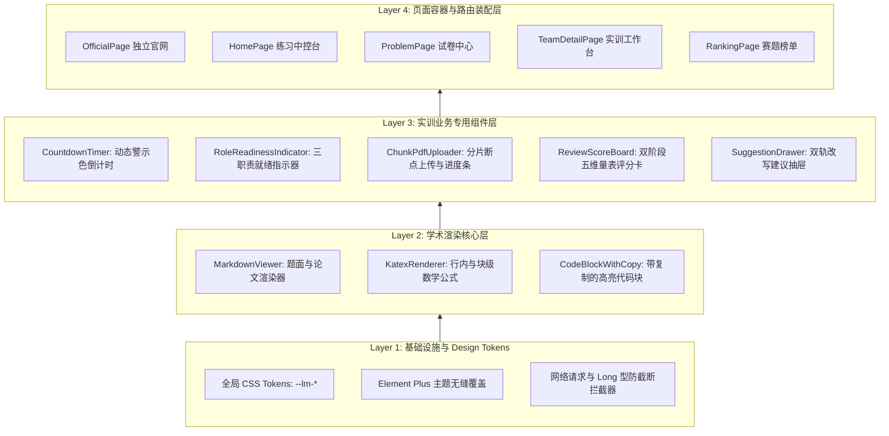

## 前端架构设计

> 本文档基于 LeetModel 的真实产品定位（赛前全真演练场 ＆ 论文 AI 体检提分中枢）与低频突击型用户心智，全面搭建前端的整体架构骨架。细节实现暂不展开，重点确立全局容器分层、路由拓扑、核心业务状态流与组件工程分层。

---

### 一、架构设计目标与核心原则

结合真实调研中“平时不练、赛前一周高压突击、1~2 次全流程模拟、全靠大模型辅助但极度害怕格式翻车与逻辑断点”的特征，前端架构确立以下四大顶层原则：

1. **极简前置，零认知摩擦**：建队、选题、开赛必须以最短路径闭环（支持一人兼任三职一键开赛），绝不让用户在繁琐的表单与流程中消耗赛前宝贵的突击精力。
2. **高保真学术排版能力原生化**：题面、AI 评审诊断、改进建议包含海量数学公式推导与代码，将 Markdown + KaTeX + 高亮代码块作为系统的一等公民（First-Class Citizen），确保学术视觉精度。
3. **全生命周期的确定性状态机**：针对赛前交卷高压与对 AI 产物的恐慌，倒计时、大文件分片上传进度、双阶段评审状态必须有严密的状态机支撑，杜绝黑盒与不可预期的界面悬挂。
4. **三大容器物理隔离**：品牌官网、实训主应用、管理后台各自独立，职责单一，互不干扰。
5. **现代极简黑白灰（Monochrome Grayscale）主视觉**：全站摒弃高饱和度彩色，主色收敛为炭黑（`#18181b`）、深黑（`#09090b`）、纯白（`#ffffff`）与多级中性冷灰（`#52525b` / `#71717a` / `#e4e4e7`），契约严密、排版克制，打造具备顶尖专业工程质感的数模实训体验。

---

### 二、全局容器分层架构（三大物理视窗）

全站划分为三大容器体系，彼此在布局、路由守卫与交互范围上完全解耦：

| 容器体系 | 适用路由 | 导航与视效规则 | 核心职责 |
|---------|---------|--------------|---------|
| **官网独立域** | `/` | 纯净全屏、无顶栏、无全局底栏、无客服挂件 | 赛前访客第一触点，传达一句话核心价值，引导注册登录与一键进入题库。 |
| **实训应用域** | `/home`, `/problem/*`, `/team/*`, `/ranking`, `/profile/*` | 常驻轻量顶栏，支持快捷搜题；右下角挂载 AI 客服悬浮球 | 全站核心业务枢纽，承载选真题、组小队、限时倒计时、大文件上传、AI 深度评审与提分改写。 |
| **运营管理域** | `/admin/*` | 专业后台多栏布局，高信息密度，纯工具化视效 | 面向管理员，负责题目导入、标签维护、AI 模型版本治理、任务监控与审计日志查询。 |

---

### 三、实训应用域核心信息架构（四大支柱）

根据确定的**方案 A（直觉极简风）**标准命名体系，全站大板块名称正式确立为唯一标准，杜绝概念生僻与多源称谓冲突：

| 标准板块名称 | 对应核心路由 | 导航展示层级 | 核心用户心智与功能定位 |
|------------|------------|-------------|----------------------|
| **官网** | `/` | 独立全屏着陆页 | 赛前访客第一触点，极简展示产品价值主张与开赛引导。 |
| **首页** | `/home` | 顶部主导航一 | 练习中枢控制台，直达进行中的队伍倒计时、最近体检报告与开题通道。 |
| **题库** | `/problem` | 顶部主导航二 | 真题试卷中心，提供国赛/美赛试卷、KaTeX 公式渲染与数据集下载。 |
| **我的队伍** | `/team` | 顶部主导航三 | 队伍实训主入口，直达本队备赛进度（下设二级扩展：**队伍广场** `/team/square`）。 |
| **排行榜** | `/ranking` | 顶部主导航四 | 赛题客观得分排位，横向摸底本小队在全体参赛队伍中的分位。 |
| **队伍详情** | `/team/:id` | 核心交互详情页 | 承载三职责就绪开赛、全真倒计时、50MB分片交卷、AI V3评审看板与改进建议。 |
| **AI 助手** | 全局右下角浮窗 | 全局常驻辅助 | 替代旧“AI 客服”叫法，提供赛题推荐、建模咨询与操作答疑。 |
| **个人中心** | `/profile` | 右上角用户下拉 | 个人做题履历、五维技能雷达图、单次提交详情与账号安全设置。 |
| **管理端** | `/admin` | 独立后台布局 | 面向管理员，题目维护、AI 调用治理与审计看板。 |

围绕真实用户“赛前突击开题 $\rightarrow$ 紧凑实训提交 $\rightarrow$ 即时体检排雷 $\rightarrow$ 针对性提分”的黄金闭环，四大主导航支柱架构拓扑如下：

#### 1. 首页（`/home`）—— 赛前作战指挥部
- **核心定位**：登录用户的默认大本营。去除一切花哨的日常打卡与冗余统计，直奔主题：
  - **进行中的实训（Hero Focus）**：若有正在倒计时的队伍，以最高视觉优先级呈现队伍名、赛题号、倒计时钟与“进入工作台”直接通道。
  - **最近体检报告（Quick Diagnostic）**：展示最近一次提交的 AI 评审总分（0~100）、规范分、推导分及“查看改进建议”快捷入口。
  - **快速开赛（Fast Track）**：推荐热门备赛真题，支持 30 秒内单人/三人快速建队开赛。

#### 2. 题库（`/problem`）—— 严肃学术试卷库
- **列表页 (`/problem/problemListPage`)**：以赛事来源（国赛/美赛/力模）、年份、难度、背景领域/模型算法为维度，极简筛选；提供“随机真题”功能。
- **详情页 (`/problem/:id`)**：标准化学术试卷形态，高保真渲染复杂公式与插图，提供数据集一键打包下载；底部常驻核心按钮：“以此题开赛（支持单人单刷/组队开赛）”。

#### 3. 我的队伍 与 队伍详情（`/team` & `/team/:id`）—— 全站交互灵魂与主战场
- **我的队伍与队伍广场 (`/team` & `/team/square`)**：展示我的队伍状态列表，广场支持按缺少职责（缺建模/缺代码/缺论文）精准筛选。
- **核心定位**：小队在 3~4 天高压实训期间唯一常驻的操作界面，高度集成四大核心功能区：
  - **状态与倒计时区**：赛题元数据、全真动态警示色倒计时面板。
  - **三职责就绪面板**：可视化显示建模手、编程手、论文手就绪状态，支持队长单人一键全选或邀请队友，三职责就绪后激活开赛。
  - **分片断点上传与版本树**：支持拖拽 50MB PDF，实时展示分片上传速率与百分比；支持多版本草稿追溯与终稿锁定。
  - **V3 深度评审与双轨建议区**：展示阶段一学术审查分（0~25）与阶段二建模推演分（0~75），可一键展开带证据链定位与公式改写范本的改进建议抽屉。

#### 4. 排行榜 与 个人中心（`/ranking` & `/profile`）—— 成果沉淀与能力量化
- **排行榜 (`/ranking`)**：按题目展示最终提交的客观评审得分，支持搜索队伍与一键高亮定位本小队排位。
- **个人中心**：记录 1~5 次宝贵的实训全流程履历，生成涵盖建模、编程、写作、分析、推导的五维雷达图。

---

### 四、前端核心业务状态机架构

为确保高压实训场景下的交互确定性，前端建立四大独立且状态闭环的业务状态流：

1. **职责就绪状态机**：严格由 `hasModelingRole && hasProgrammingRole && hasWritingRole` 决定，未满足时按钮禁用，杜绝半就绪开赛。
2. **分片上传状态机**：`IDLE` $\rightarrow$ `HASHING`（计算文件哈希） $\rightarrow$ `INIT` $\rightarrow$ `CHUNKING`（并发分片传输） $\rightarrow$ `MERGING`（服务端校验合并） $\rightarrow$ `SUCCESS`。支持网络异常时断点重传。
3. **评审流转状态机**：由轮询控制器驱动，涵盖等待排队、计算中、双阶段量表完成与异常重试。

---

### 五、前端工程与组件分层架构（自底向上）

遵循**组件驱动开发（CDD）**思想，将前端工程解耦为清晰的四层架构：

1. **第 1 层（Token 与基础设施）**：在 `src/style.css` 统一收敛色彩、间距、圆角与阴影；由 `--lm-*` 动态映射覆盖 Element Plus 变量，消灭双源混乱。
2. **第 2 层（学术渲染专用层）**：封装可复用的 Markdown + KaTeX + 代码块组件，彻底解决公式溢出、公式抖动与富文本 XSS 防护。
3. **第 3 层（实训业务核心组件）**：沉淀为独立的无状态/微状态业务 UI 单元（倒计时、就绪指示器、分片上传器、量表看板、双轨建议抽屉），保证单元可测与高度复用。
4. **第 4 层（页面容器层）**：只负责组织布局、调用 API 与 Pinia 状态绑定，页面组件代码量大幅精简。
