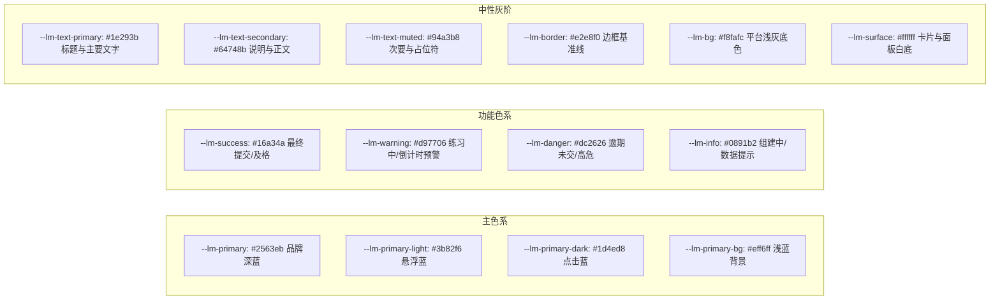

## 设计系统与规范

> 本文档定义 LeetModel 的视觉设计语言、Design Token 体系、响应式栅格布局规范与通用 UI 组件交互约定。

---

### 视觉基调与设计原则

1. **克制、严谨、学术科技感**：主色调选用兼具学术沉稳与现代科技感的皇家深蓝（`#2563eb`），搭配层次分明的冷灰基底（`#f8fafc`），杜绝单调刺眼的单一色块和浮夸的渐变光斑。
2. **高保真排版与数学公式原生感**：字体栈优先选用兼顾英文字符和数学变量辨识度的西文字体（Inter / SF Pro），中文字体保证清晰笔画（PingFang SC / 微软雅黑）。数学公式行内渲染严禁文字基线跳跃，行间公式居中且左右预留呼吸空间。
3. **单一事实来源的 Token 驱动**：全局设计变量统一在 `src/style.css` 中以 `--lm-` 前缀维护，Element Plus 的主题变量由 `--lm-` 衍生覆盖。禁止在单个组件中硬编码十六进制色值与魔数间距。

---

### Design Token 色盘体系



#### Token 映射对照表

| Token 命名 | 默认色值 | 语义说明与应用场景 |
|------------|---------|-------------------|
| `--lm-primary` | `#2563eb` | 平台核心主色、主要操作按钮、激活态导航、重要数字 |
| `--lm-primary-light` | `#3b82f6` | 按钮悬停状态（Hover）、辅助高亮描边 |
| `--lm-primary-dark` | `#1d4ed8` | 按钮按下状态（Active）、重要选中背景 |
| `--lm-primary-bg` | `#eff6ff` | 标签浅色背景、版本号标记胶囊背景、激活项底色 |
| `--lm-success` | `#16a34a` | 练习已结束、最终版提交标记、评分优秀徽章 |
| `--lm-warning` | `#d97706` | 限时练习中状态、倒计时告警（剩余时间<20%） |
| `--lm-danger` | `#dc2626` | 提交超时、网络中断、删除或解散队伍等高危操作 |
| `--lm-info` | `#0891b2` | 队伍组建中、公开招募标记、通用提示信息 |
| `--lm-bg` | `#f8fafc` | 全局页面背景底色，避免纯白背景造成的视觉疲劳 |
| `--lm-surface` | `#ffffff` | 内容卡片、对话框、浮层面板的纯白承载背景 |
| `--lm-border` | `#e2e8f0` | 通用卡片与输入框边框色，柔和且轮廓清晰 |
| `--lm-text-primary` | `#1e293b` | 一级标题、主要正文，高对比度保障阅读舒适 |
| `--lm-text-secondary` | `#64748b` | 二级文本、表单标签、题面说明、卡片元信息 |
| `--lm-text-muted` | `#94a3b8` | 占位文字、禁用文本、时间戳、页脚版权文字 |

---

### 字体层次与排版体系

#### 字体栈
```css
--lm-font-family: "Inter", -apple-system, BlinkMacSystemFont, "Segoe UI",
  "PingFang SC", "Hiragino Sans GB", "Microsoft YaHei", sans-serif;
--lm-font-mono: ui-monospace, SFMono-Regular, "SF Mono", Menlo, Consolas,
  "Liberation Mono", monospace;
```

#### 字号与行高阶梯

| 层级 | 字号 | 行高 | 字重 | 适用场景 |
|------|------|------|------|---------|
| Display | 32px ~ 40px | 1.2 | 700 (Bold) | 官网主标题、荣誉榜前三甲数字 |
| H1 | 24px ~ 28px | 1.3 | 700 (Bold) | 页面大标题（题目名、队伍名、概览欢迎） |
| H2 | 20px | 1.4 | 600 (SemiBold) | 模块分区标题（进行中队伍、练习流程、评审维度） |
| H3 | 16px | 1.5 | 600 (SemiBold) | 卡片标题、子模块小标、步骤条名称 |
| Body-Large | 16px | 1.7 | 400 (Regular) | 题面正文、论文评审详细建议长文本 |
| Body | 14px | 1.6 | 400 (Regular) | 平台通用正文、表格内容、表单输入框、按钮文字 |
| Caption | 12px | 1.5 | 400 / 500 | 标签徽章（Tag）、时间戳、元数据说明、辅助提示 |

#### 数学公式与代码高亮规范
- **数学公式**：行内公式（`$E=mc^2$`）字体大小与正文字体保持 1.05:1，基线垂直居中对齐；块级公式（`$$...$$`）必须自带横向滚动容器（`overflow-x: auto`），禁止在移动端或窄容器内折行被截断。
- **代码块**：背景采用 `#f8fafc` 搭配 `#e2e8f0` 边框，顶部配有微型工具栏，左侧显示语言标签，右侧提供带动画的“一键复制”操作。

---

### 容器与栅格间距规范

#### 圆角（Radius）
- `--lm-radius-sm`: `6px`（按钮、标签、输入框、下拉菜单项）
- `--lm-radius`: `10px`（标准卡片、小部件、弹出浮层）
- `--lm-radius-lg`: `14px`（模态对话框、主要信息看板、英雄区域）
- `--lm-radius-xl`: `20px`（大面板外层圆角、浮动客服外壳）
> 规约：卡片内部组件圆角必须严格小于外层卡片圆角，保持视觉嵌套层次自然。

#### 阴影（Shadow）
- `--lm-shadow-sm`: `0 1px 3px rgba(0, 0, 0, 0.05), 0 1px 2px rgba(0, 0, 0, 0.04)`（卡片静止态、微弱立体轮廓）
- `--lm-shadow`: `0 4px 16px rgba(0, 0, 0, 0.06)`（卡片悬停 Hover、通用下拉菜单）
- `--lm-shadow-lg`: `0 10px 40px rgba(0, 0, 0, 0.08)`（模态对话框、悬浮 AI 客服面板）

#### 页面最大宽度与断点体系
- 全局页面容器最大宽度锁定在 **1200px**（居中），管理端与特殊宽表视图允许自适应拉伸。

| 断点标识 | 屏幕宽度 | 布局特征与适配策略 |
|---------|---------|-------------------|
| **Wide Desktop** | $\ge 1200px$ | 标准多栏视图（主内容 8 栏 + 侧边 4 栏），最大内容宽度 1200px |
| **Desktop / Laptop** | $992px \sim 1199px$ | 保持桌面布局，两栏比例微调，缩小水平外边距 |
| **Tablet** | $768px \sim 991px$ | 侧边栏折叠至主内容下方，栅格卡片由 4 列自适应折为 2 列 |
| **Mobile** | $< 768px$ | 顶栏主导航收缩至左侧抽屉，卡片流单列呈现，操作按钮全宽化 |
