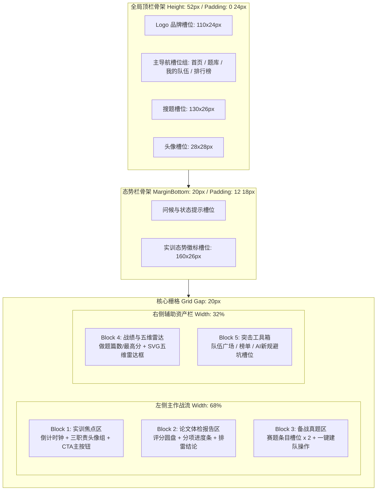

## 首页骨架设计

> 本文档依照 Product Design 设计方法论，对平台首页（`/home`）进行纯骨架级线框架构定义（Wireframe / Skeleton Layout），不填充具体业务内容，重点固化页面区块的栅格比例、空间对齐与自适应折叠规则。

---

### 一、骨架设计原则

1. **结构先于内容**：在确定文本、颜色、图表之前，优先冻结页面各功能块的物理尺寸、对齐方式、栅格配比与视觉动线。
2. **68% : 32% 主辅栅格**：左侧主作战流承载高频动态内容（实战倒计时、体检诊断、快速开题），右侧辅助栏承载相对稳定的资产（技能雷达、个人档案、快捷工具）。
3. **刚性容器与弹性槽位**：整体页面受限于 `max-width: 1200px` 居中容器；各 Block 内部使用弹性 Flex/Grid 布局，杜绝在窄屏下发生横向穿透。

---

### 二、骨架区块拓扑与空间规范



---

### 三、核心区块骨架详细规约（Block Specs）

#### Block 1：实训焦点区（Hero Active Card）
- **空间与层级**：高居左侧第一屏黄金视域，外层带浅蓝微光轮廓与微弱投影，强调第一优先级。
- **内部槽位分解**：
  - 标题行：左侧标示“当前进行中的小队实训”，右侧预留赛题代码与年份标签槽。
  - 倒计时主展示盒：内嵌浅灰底框，左侧突出大字号倒计时时钟位（`140x32px`，等宽数字字体预留），右侧预留已交版本进度标识（`90x14px`）。
  - 三人职责槽位组：横向排列 3 个平分列的职责胶囊槽（建模手 / 编程手 / 论文手）。
  - 底部操作条：全宽主行动按钮槽位（`height: 34px`，深蓝强调底色），直达队伍详情工作台。

#### Block 2：论文 AI 体检诊断区（Diagnostic Report Card）
- **空间与层级**：紧随焦点区下方，承载交卷后的确定性反馈。
- **内部槽位分解**：
  - 左侧预评分圆盘槽：圆形徽章（`86x86px`，带虚线边框），用于承载未来渲染的综合得分大数字与预估奖项。
  - 右侧双阶段分项槽：上下两根带进度的水平条形槽（阶段一规范分槽位 + 阶段二推演分槽位）。
  - 底部排雷结论区：点状分割线，预留 2 条横向排雷文本槽位（预置格式合规性检查标识）。

#### Block 3：备战真题快速开题区（Curated Problem Card）
- **空间与层级**：承载非实训期或练习结束后的敏捷再开赛。
- **内部槽位分解**：
  - 垂直堆叠 2 个轻量赛题槽位条目；
  - 每个条目内包含左侧双行标题与标签槽、右侧紧凑型“一键建队”按钮槽（`70x24px`）。

#### Block 4：个人实训战绩与五维雷达区（Profile & Radar Card）
- **空间与层级**：右侧顶端，强化个人学术资产感。
- **内部槽位分解**：
  - 双列小指标格：历史最高分槽位 + 已完成模拟论文篇数槽位（突出低频、小总量特征）。
  - 正方形雷达图预留框（`140px` 高度），专用于挂载五维学术技能雷达图。

#### Block 5：突击工具箱区（Utility Toolkit Card）
- **空间与层级**：右侧底端，承载高价值快捷外链。
- **内部槽位分解**：
  - 垂直排列 3 个固定高度（`32px`）的工具条槽位：队伍广场缺口直达、赛题榜单直达、2026 国赛 AI 使用格式避坑指南。

---

### 四、响应式自适应折叠规则

| 视口断点 | 宽度区间 | 栅格调整行为与对齐规则 |
|---------|---------|---------------------|
| **Wide Desktop** | $\ge 1200px$ | 保持 68% : 32% 双栏布局，页面最大宽度约束在 1200px 居中对齐，左右外边距自动留白。 |
| **Tablet / Laptop** | $768px \sim 1199px$ | 栅格断开，右侧辅助栏（Block 4、Block 5）顺延折叠至左侧主作战流下方，宽度拉伸为 100%。 |
| **Mobile** | $< 768px$ | 彻底退化为纯单列紧凑流。Topbar 导航折叠至侧边抽屉；倒计时时钟居中放大；雷达图隐藏或微缩为纯文本指标。 |

---

### 五、页面结构树状拓扑与参数映射

```text
Container: LeetModel_Home_Desktop_1200 [W: 1200, AutoLayout: Vertical, Gap: 20]
├── Frame: Topbar [W: 1200, H: 56, AutoLayout: Horizontal, Padding: 0 32px, Fill: #FFF]
│   ├── Frame: Logo_Slot [W: 120, H: 28, Fill: #EFF6FF, Stroke: #3B82F6]
│   ├── Frame: Nav_Links_Group [AutoLayout: Horizontal, Gap: 24] (首页/题库/我的队伍/排行榜)
│   └── Frame: Right_Utilities [AutoLayout: Horizontal, Gap: 12] (搜索框: 140x28, 头像: 28x28)
├── Frame: Header_Status_Banner [W: 1152, H: 60, AutoLayout: Horizontal, Padding: 12 20px, Fill: #F8FAFC]
│   ├── Frame: Welcome_Text_Group [AutoLayout: Vertical, Gap: 4]
│   └── Frame: Status_Pill [W: 192, H: 28, Fill: #EFF6FF, Stroke: #3B82F6]
└── Frame: 2_Column_Grid [W: 1152, AutoLayout: Horizontal, Gap: 20]
    ├── Frame: Left_Main_Column [W: 768 (68%), AutoLayout: Vertical, Gap: 20]
    │   ├── Frame: Block1_Hero_Active_Practice [W: 768, H: 220, AutoLayout: Vertical, Padding: 20, Fill: #EFF6FF, Stroke: #3B82F6]
    │   │   ├── Frame: HeaderRow [Title + Badge: 108x20]
    │   │   ├── Frame: Countdown_Box_Slot [W: 728, H: 64, AutoLayout: Horizontal, Padding: 12, Fill: #FFF]
    │   │   ├── Frame: Roles_Row_Slot [W: 728, AutoLayout: Horizontal, Gap: 16] (3 个角色胶囊: 232x28)
    │   │   └── Frame: CTA_Button_Slot [W: 728, H: 38, Fill: #2563EB, Radius: 6]
    │   ├── Frame: Block2_Diagnostic_Report [W: 768, H: 200, AutoLayout: Vertical, Padding: 20, Fill: #FFF, Stroke: #E2E8F0]
    │   │   ├── Frame: HeaderRow [Title + Badge: 108x20]
    │   │   ├── Frame: Diagnostic_Layout [AutoLayout: Horizontal, Gap: 20] (预评分圆盘: 86x86, 双条形槽: 590x8)
    │   │   └── Frame: Action_Link_Slot [AutoLayout: Horizontal, Space-Between]
    │   └── Frame: Block3_Curated_Problems [W: 768, H: 200, AutoLayout: Vertical, Padding: 20, Fill: #FFF, Stroke: #E2E8F0]
    │       ├── Frame: HeaderRow [Title + Link: 全部题库]
    │       ├── Frame: Problem_Row_1 [W: 728, H: 58, AutoLayout: Horizontal, Padding: 16, Fill: #F8FAFC]
    │       └── Frame: Problem_Row_2 [W: 728, H: 58, AutoLayout: Horizontal, Padding: 16, Fill: #F8FAFC]
    └── Frame: Right_Sidebar_Column [W: 364 (32%), AutoLayout: Vertical, Gap: 20]
        ├── Frame: Block4_Profile_Radar [W: 364, H: 380, AutoLayout: Vertical, Padding: 16, Fill: #FFF, Stroke: #E2E8F0]
        │   ├── Frame: Fast_Stats_Grid [AutoLayout: Horizontal, Gap: 12] (双卡片: 160x56)
        │   └── Frame: Radar_Placeholder [W: 332, H: 210, Stroke-Dashed: #94A3B8, Mini SVG Radar]
        └── Frame: Block5_Utility_Toolkit [W: 364, H: 260, AutoLayout: Vertical, Padding: 16, Fill: #FFF, Stroke: #E2E8F0]
            ├── Frame: Tool_Item_1 [W: 332, H: 42, Fill: #F8FAFC, 队伍广场找队友]
            ├── Frame: Tool_Item_2 [W: 332, H: 42, Fill: #F8FAFC, 赛题排行榜]
            └── Frame: Tool_Item_3 [W: 332, H: 42, Fill: #FFFBEB, Stroke: #FDE68A, AI新规避坑指南]
```
