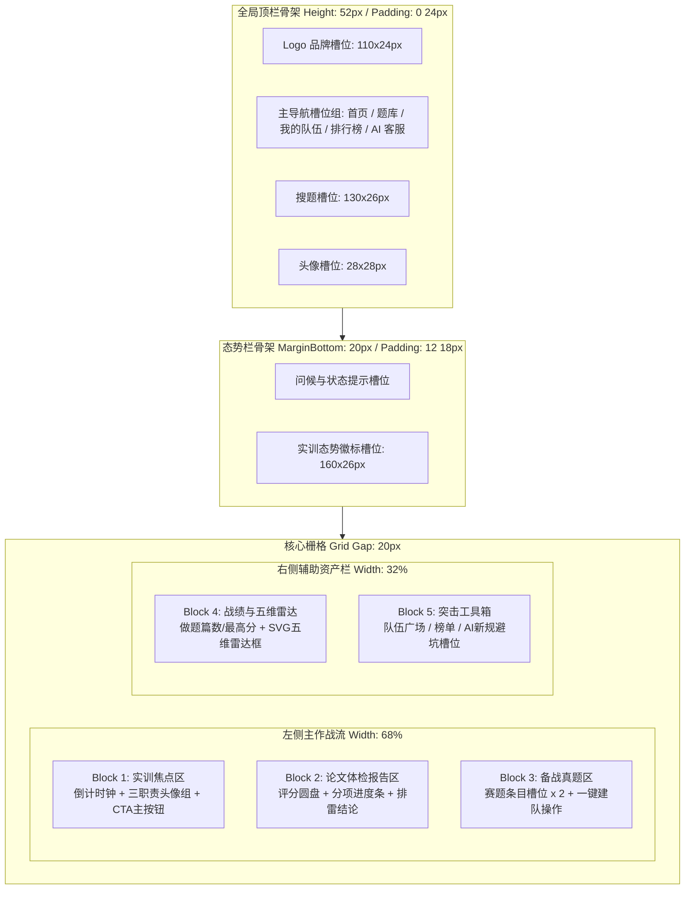

## 首页骨架设计

> 本文档定义平台首页（`/home`）的骨架、视觉动线与真实数据映射。首页是数学建模实训作战中枢，不是产品宣传落地页。

---

### 一、骨架设计原则

1. **结构先于内容**：在确定文本、颜色、图表之前，优先冻结页面各功能块的物理尺寸、对齐方式、栅格配比与视觉动线。
2. **68% : 32% 主辅栅格**：左侧主作战流承载高频动态内容（实战倒计时、体检诊断、快速开题），右侧辅助栏承载相对稳定的资产（技能雷达、个人档案、快捷工具）。
3. **刚性容器与弹性槽位**：整体页面受限于 `max-width: 1200px` 居中容器；各 Block 内部使用弹性 Flex/Grid 布局，杜绝在窄屏下发生横向穿透。

---

### 二、骨架区块拓扑与空间规范

---

### 三、核心区块骨架详细规约（Block Specs）

#### Block 1：实训焦点区（Hero Active Card）
- **空间与层级**：高居左侧第一屏黄金视域，外层带浅蓝微光轮廓与微弱投影，强调第一优先级。
- **内部槽位分解**：
  - 标题行：左侧标示“当前进行中的小队实训”，右侧预留赛题代码与年份标签槽。
  - 倒计时主展示盒：内嵌浅灰底框，左侧突出大字号倒计时时钟位（`140x32px`，等宽数字字体预留），右侧预留已交版本进度标识（`90x14px`）。
  - 三人职责槽位组：横向排列 3 个平分列的职责胶囊槽（建模手 / 编程手 / 论文手）。
  - 底部操作条：全宽主行动按钮槽位（`height: 34px`，深蓝强调底色），直达队伍详情工作台。

#### Block 2：论文 AI 体检诊断区（Diagnostic Report Card）
- **空间与层级**：紧随焦点区下方，承载交卷后的确定性反馈。
- **内部槽位分解**：
  - 左侧预评分圆盘槽：圆形徽章（`86x86px`，带虚线边框），用于承载未来渲染的综合得分大数字与预估奖项。
  - 右侧双阶段分项槽：上下两根带进度的水平条形槽（阶段一规范分槽位 + 阶段二推演分槽位）。
  - 底部排雷结论区：点状分割线，预留 2 条横向排雷文本槽位（预置格式合规性检查标识）。

#### Block 3：备战真题快速开题区（Curated Problem Card）
- **空间与层级**：承载非实训期或练习结束后的敏捷再开赛。
- **内部槽位分解**：
  - 垂直堆叠 2 个轻量赛题槽位条目；
  - 每个条目内包含左侧双行标题与标签槽、右侧紧凑型“一键建队”按钮槽（`70x24px`）。

#### Block 4：个人实训战绩与五维雷达区（Profile & Radar Card）
- **空间与层级**：右侧顶端，强化个人学术资产感。
- **内部槽位分解**：
  - 双列小指标格：历史最高分槽位 + 已完成模拟论文篇数槽位（突出低频、小总量特征）。
  - 正方形雷达图预留框（`140px` 高度），专用于挂载五维学术技能雷达图。

#### Block 5：突击工具箱区（Utility Toolkit Card）
- **空间与层级**：右侧底端，承载高价值快捷外链。
- **内部槽位分解**：
  - 垂直排列 3 个固定高度（`32px`）的工具条槽位：队伍广场缺口直达、赛题榜单直达、2026 国赛 AI 使用格式避坑指南。

---

### 四、响应式自适应折叠规则

| 视口断点 | 宽度区间 | 栅格调整行为与对齐规则 |
|---------|---------|---------------------|
| **Wide Desktop** | $\ge 1200px$ | 保持 68% : 32% 双栏布局，页面最大宽度约束在 1200px 居中对齐，左右外边距自动留白。 |
| **Tablet / Laptop** | $768px \sim 1199px$ | 栅格断开，右侧辅助栏（Block 4、Block 5）顺延折叠至左侧主作战流下方，宽度拉伸为 100%。 |
| **Mobile** | $< 768px$ | 彻底退化为纯单列紧凑流。Topbar 导航折叠至侧边抽屉；倒计时时钟居中放大；雷达图隐藏或微缩为纯文本指标。 |

---

### 五、当前实现与数据映射

#### 5.1 首页优先级

1. 登录用户优先展示截止时间最近的 `IN_PROGRESS` 队伍；没有进行中队伍时展示第一个 `PREPARING` 队伍。
2. 焦点卡使用“职责就绪 → 论文版本 → AI 体检”赛程刻度带，同时呈现实时倒计时、三项职责覆盖和当前主操作。
3. 最近体检从本人非准备态队伍的已完成评审中按完成时间选取，历史最高分从同一批真实评审结果聚合。
4. 备战真题始终读取公开热门练习题，访客也可查看；已完成实训数、评分和能力轮廓不使用伪造数据。

#### 5.2 评审版本兼容

- `BASIC_REVIEW_V1` 的四项维度为对象结构，每项得分是 `0–100` 百分制；首页使用 100 作为维度满分。
- `EVIDENCE_REVIEW_V2` 与 `DEEP_EVIDENCE_REVIEW_V3` 的维度为数组结构，按各项 `score / maxScore` 计算进度与雷达图比例。
- 解析失败时保留评审总分与详情入口，不伪造分项；雷达图无真实维度时显示空态。

#### 5.3 页面状态与容错

| 状态 | 页面表达 | 可继续操作 |
|------|----------|------------|
| 未登录 | 访客态势栏、实训引导、公开真题、评审与资产空态 | 登录、浏览题库与榜单 |
| 无实训 | “建立下一场全真演练”焦点卡 | 选题或寻找队伍 |
| 准备中 | 展示赛题、人数与职责缺口 | 进入准备态工作台 |
| 进行中 | 展示实时倒计时、提交版本数与评审状态 | 进入实训工作台 |
| 已有评审 | 展示总分、分项、结论、风险数和能力雷达 | 进入结束态队伍查看完整记录 |
| 部分请求失败 | 已成功区块继续展示，顶部聚合告警 | 重新同步 |
| 加载中 | 与主辅栅格等高的骨架屏 | 无，不发生大幅布局跳动 |

#### 5.4 布局与交互边界

- 视觉保持项目已确认的黑白灰与行动蓝，使用细坐标纸纹理和赛程刻度带强化“学术作战台”识别度。
- 宽屏在 `1200px` 容器内保持 68% : 32% 主辅栅格；容器宽度不足 `64rem` 时改为单列，不出现横向滚动。
- 主行动、文本行动和工具条均具备键盘焦点反馈；倒计时只更新文本，不使用高频装饰动画，并支持 `prefers-reduced-motion`。
