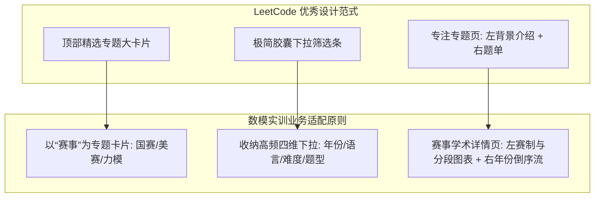
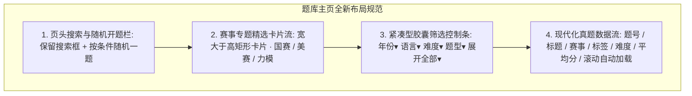

## 题库重构设计

> 本文档系统阐述题库中心（`/problem`）的全新 UI/UX 重构方案，全面复盘传统平铺筛选与硬分页的弊端，融合 LeetCode 专题化设计范式与数学建模真实赛制特征，提出“赛事专题卡片流 + 紧凑下拉筛选条 + 流式滚动加载 + 赛事专属详情页”的现代化设计方案。
> **全局视觉标准**：全站确立**黑白灰（Monochrome Grayscale）**极简专业学术工作台基调，左侧采用无边框全高垂直细线常驻 Bar（支持宽度自由拖拽、一键完全隐藏折叠为 0 宽），中区筛选控制条无外边框左右齐平，营造严谨沉浸的专业建模实训体验。

---

### 一、现状反思与重构动机：为什么抛弃“平铺筛选”与“传统分页”？

#### 1. 传统全量平铺筛选的弊端
- **首屏被“选项墙”霸占**：8 行筛选维度（赛事、年份、语言、难度、背景领域、题目类型、模型算法、平均分）生硬地全量平铺展开，不仅占用超过 360px 的垂直高度，且在视觉上产生强烈的“后台管理系统”压抑感，使得最重要的交付物——**题目本身**被严重挤压至首屏下方。
- **视觉死板枯燥**：缺乏学术赛事的品牌感与吸引力，界面停留于原始的数据检索形态，无法激发参赛者的训练探索欲望。

#### 2. 传统分页栏（Pagination）在数模场景下的水土不服
- **数模赛题的客观规律**：全国大学生数模（CUMCM）每年仅命制 A~E 共 5 道题；美赛（MCM/ICM）每年仅 6 道题。一个赛事 10 年积累下来也仅有 50~60 道真题。
- **极低数量 vs 繁重组件的矛盾**：全站题目总盘子极其精简（几十到一百余道题），在如此轻量级的数据量下，放置一个包含“每页条数下拉框、总条数、上一页、下一页、跳页输入框”的传统企业级分页栏，属于典型的**过度设计（Over-engineering）**，割裂了阅读心流，徒增布局碎片化。

---

### 二、设计理念与 LeetCode 范式适配

参考 [LeetCode 题库主页](https://leetcode.cn/problemset/) 与 [LeetCode 专题详情页](https://leetcode.cn/problem-list/hash-table/) 的设计精髓，针对数学建模垂直领域进行深度适配：



1. **以“赛事品牌”为第一视觉吸引点**：
   - 参赛大学生选题时，心智模型具有极强的“赛事针对性”（如“今年备战 9 月国赛，我就只刷国赛真题”；“寒假打 2 月美赛，我就看美赛试卷”）。
   - 将赛事以**宽大于高的视觉矩形卡片**置于首屏，提供强烈的品牌归属感与探索欲望。
2. **高频收纳下拉，低频抽屉展开**：
   - 将最常调用的筛选（年份、语言、难度、题型）精简为一行紧凑的下拉选择框（Select Dropdowns），首屏占用空间缩减 70% 以上；
   - 提供一个精致的“展开全部高级筛选”按钮，按需平滑展开模型算法与领域细项。
3. **无缝流式加载（Infinite Scroll / Virtual Lazy Load）**：
   - 摒弃传统硬分页卡片，用户向下滑动时流式平滑追加题目，保持沉浸式阅读连续性。
4. **现代极简黑白灰（Monochrome Grayscale）学术基调**：
   - 摒弃高饱和度彩色与繁复的装饰渐变，全站主体采用纯白（`#ffffff`）、炭黑（`#18181b`）、中性冷灰（`#52525b` / `#71717a` / `#e4e4e7`）；
   - 以文字字重、细微灰阶对比和克制的高亮状态表达层级，还原专业学术报告与顶尖工程工作台的严谨静谧气质。

---

### 三、工作台复合骨架与左侧常驻 Bar 规范

代码物理骨架为左右双栏，视觉呈现“左常驻 Bar - 中间正文流 - 右侧火热专区”三重视角：
1. **左侧常驻 Bar（ProblemSidebar）**：
   - **无外边框设计**：移除外卡片四周边框、圆角与阴影，仅在最右侧保留一条贯穿上下的 1px 垂直分割细线；
   - **高度占满与不随界面滚动**：高度固定为 `calc(100vh - 56px)`，采用 Sticky 粘性吸顶，当右侧长内容流向下滚动时，左侧始终静止吸附；
   - **双临界值拖拽物理阻尼交互机制**：支持鼠标在右侧细线上左右拖拽调整宽度，默认宽度为 240px，最大宽度 280px；引入两个明确的物理交互临界值：
     1. **第一临界值（140px，文字刚好不被截断的最小可用宽度）**：用户向左拖拽使宽度减小到 140px 时，侧边栏视觉宽度停顿不再继续变小，锁定保持在 140px。这一阻尼停滞阶段给用户明确心理暗示：“此状态为所有栏目文字与徽标刚好完整呈现的极限，再缩小也不能再小了”；
     2. **第二临界值（70px，所有文字刚好隐藏、仅剩图标的折叠触发点）**：当鼠标越过阻尼区继续向左移动突破 70px 阈值时，表明用户具有明确的完全折叠意图，侧边栏宽度直接减少到 0 完全折叠收起，绝不在界面上遗留仅显示半个图标等残缺不适态；若鼠标从 70px 左侧向右回拖，自动回弹至 140px 可读态，越过 140px 后继续平滑放大；
   - **点击折叠与展开的平滑过渡动效**：点击悬浮小圆钮时，侧边栏宽度伸缩、内部导航透明度（`opacity: 0.18s`）与位移（`translateX(-12px)`）、悬浮小圆钮横向平滑滑动以及右侧工作区留白（`padding`）均享受统一的 `0.24s cubic-bezier(0.4, 0, 0.2, 1)` 缓动过渡，消除瞬变跳跃；
   - **五大精炼栏目**：
     1. `题目`：默认全部真题大厅入口；
     2. `赛事`：默认折叠，展开列出所有赛事，点击跳转对应赛事专属双栏专页；
     3. `题型`：默认折叠，展开列出题型分类，点击跳转对应题型专属双栏专页；
     4. `正在练习 / 已完成练习`：免鉴权打扰保护，登录后无缝联动队伍练习赛题；
     5. `收藏`：带收藏总数徽标，点击即时过滤查看用户收藏的个性化题单。
2. **单行无边框胶囊筛选栏（ProblemHeader）**：
   - `.filter-control-panel` 彻底移除外层边框与阴影，清除左右内边距（`padding: 4px 0`），与下方题目表格左对齐、右对齐齐平；
   - 首项为搜索胶囊，后续排列年份、语言、难度、题型、背景领域、模型算法等全圆角下拉胶囊，末尾为随机抽题与清空重置圆形按钮。

---

### 四、题库中心主页（`/problem`）架构与区域划分



#### 1. 区域一：页头功能栏（保留现有的 `.filter-heading`）
- **左侧**：大标题“题库” + 辅助说明文案“选择条件，快速找到适合的建模题目”。
- **右侧**：题目关键词搜索框（支持实时清除与回车检索）+ “按当前条件随机一题”行动按钮。

#### 2. 区域二：赛事专题卡片流（Contest Feature Cards）—— 核心视觉抓手
- **卡片规格**：横向并排的 3 张矩形卡片（宽远大于高，例如 `370px × 140px`，桌面端 3 列平铺，移动端可横向滚动滑动）。
- **卡片阵列**：
  1. **全国大学生数学建模竞赛（CUMCM）**：国赛专属深蓝渐变微光，标注收录年份跨度、已收录篇数、近三年核心趋势。
  2. **美国大学生数学建模竞赛（MCM/ICM）**：美赛专属紫蓝微光，标注美赛 6 大题型覆盖、全英文试卷特征。
  3. **LeetModel 力模杯数学建模实训赛**：平台自有仿真赛事，高仿真训练推荐。
- **交互与路由流转**：
  - 鼠标悬停具备平滑上浮（TranslateY -3px）与边框微光动效；
  - **点击卡片，直接进入独立的“赛事专属题库详情页”（如 `/problem/contest/:id`）**。

#### 3. 区域三：紧凑型下拉筛选控制条（Compact Dropdown Filter Bar）
- **布局**：高度收敛为 `42px` 的单行水平操作条，白底微投影，与下方列表浑然一体。
- **组成控件**：
  - **`[ 排序 ▾ ]`**：支持“题号”、“年份”、“难度”、“平均分”白名单选项；题号排序支持“从小到大升序 → 从大到小降序 → 重置”三态循环，题库默认无显式排序时按题号从小到大升序排列。
  - **`[ 年份 ▾ ]`**：下拉单选/全部（2026, 2025, 2024, 2023, 2022...）。
  - **`[ 语言 ▾ ]`**：全部 / 中文 / 英文。
  - **`[ 难度 ▾ ]`**：全部 / 简单 / 中等 / 困难。
  - **`[ 题目类型 ▾ ]`**：全部 / 优化 / 评价 / 预测 / 机理分析。
  - **右侧展开控制**：**`高级筛选 ▾`** 按钮（点击平滑下拉展开模型算法：回归分析、层次分析法、线性规划、蒙特卡洛等更多深层标签）+ 一键 `清空`。
- **已选条件收敛**：如果有选中的筛选值，在下拉框旁边以优雅的微型圆角标签（Chip）展示，带一键 `×` 移除。

#### 4. 区域四：真题列表与平滑滚动加载（Streamlined Problem Feed）
- **列表样式**：使用无表头斑马行结构，整行划分为左侧内容实体组、中央弹性留白和右侧紧凑元数据组。
- **间距基准**：局部网格单位 `G = 16px`；左侧组内间距为 `1G`，右侧组内微间距为 `0.6G = 9.6px`，行左右内边距为 `1.5G = 24px`。
- **左侧内容实体组**：依次排列真实题号、题目、赛事缩写和题目类型。首列展示题目的真实业务题号（`code`），使用 `28px` 固定列并居中，严格区分内部雪花主键（标识 `id`）与用户可见题号；题目使用 `200px` 限宽列并左对齐；赛事使用 `80px` 固定列并居中，使题目与赛事保持 `2.5:1`；题目类型采用 `minmax(56px, max-content)` 自适应列，左对齐并向右侧空白间距弹性扩展。赛事文字在固定列中的左右留白保持对称，使题目到赛事、赛事到题型的可见间距在长题目行中保持一致。所有长文本保持单行截断，完整内容由既有 Tooltip 展示。
- **题目类型数据理解与 1:n 结构演进**：数学建模真实赛题由 3~5 个具体小题组成，各小问通常涉及不同题型（例如第一问做“预测”、第二问做“评价”、第三问做“优化”）。题目虽在总体上有侧重风格，但单一题型标签难以严谨概括，因此数据模型将题目与题目类型（`PROBLEM_TYPE`）从 1:1 放开为 1:n 多标签关联，仅背景领域（`BACKGROUND_DOMAIN`）保持单选归属。
- **题目类型椭圆胶囊视觉与两端分布布局**：题目类型的标签采用椭圆胶囊样式（pill badge，灰色背景 `#f4f4f5`、精致细边框 `#e4e4e7`、中性文字 `#52525b`、圆角 `9999px`，内边距 `2px 8px`，字体 `11px`）。整行呈现“靠左信息实体区”与“靠右核心指标区”两端分布，题目类型作为靠左组的最右列，允许占用中间弹性空白间距展示多个题型胶囊；同时设置安全最大宽度 `max-width: 220px;` 作为保险，严格保留中间视觉留白，既容纳多胶囊并列，又绝不侵占靠右元数据列。
- **中央弹性留白**：右侧元数据组使用自动左外边距推至行尾，不以弹性列强行拉宽左侧内容，从而让中间剩余空间成为稳定缓冲区。
- **右侧紧凑元数据组**：年份、难度、平均分和收藏严格使用四个 `52px` 等宽 Grid 单元，三段间距均为 `9.6px`；文字和收藏图标分别在所属单元内居中。
- **响应式收敛**：中等宽度隐藏题目类型、年份和难度，仅保留题目、赛事、平均分和收藏；移动端进一步隐藏赛事，保持题目入口和关键操作可用。
- **彻底废弃 `.pagination-wrap` 分页栏**：
  - 初始渲染展示前 10~15 条真题；
  - 当用户滚动接近表格底部时，自动静默拉取下一批真题无缝追加到列表末尾；
  - 列表底端提供一条极轻量的状态提示：`已加载全部 XX 道真题` 或 微型旋转 Loading，彻底告别繁琐翻页打断。

#### 5. 右侧辅助信息区

- 辅助卡片宽度与左侧 Bar 保持对称：右栏辅助卡片宽度固定为 240px，与左侧常驻 Bar 的默认宽度（240px）保持一致，形成左右平衡的视觉结构，中间核心区域承载主题目流。
- 右栏不承担主体阅读，卡片标题、题目标题、题号、次数与标签文字统一使用中性灰阶，交互悬停仅轻微加深，不能与中间题目列表的黑色主标题竞争视觉焦点。
- “热门练习题”不使用静态题单或伪造热度。页面调用 team-service 的公开热门练习接口，展示按有效队伍练习次数倒序排列的前三道已发布题目；每项首列展示题目的真实业务题号（`problemCode`），并包含题目标题与练习次数，点击直接进入题目详情。
- 题号与标识生成规则：内部实体标识采用雪花算法（`id`，`BIGINT`），面向用户的展示题号采用短顺序编号（`code`，`INT`）；新增题目按 `MAX(code) + 1` 从 1 开始依次增加，不使用随机数或大数值起始。
- 热门区域在加载、成功和空数据状态下保持相同的最小高度，接口失败静默降级为空态，不阻断题库主体，也不引起吸顶右栏高度跳变。

---

### 四、新增“赛事专属题库详情页”（Contest Problemset Detail Page）

这是本次架构重构的核心亮点——为各大赛事打造类似 LeetCode 标签专题（如 `hash-table`）的沉浸式专页：

```text
+-------------------------------------------------------------------------------+
| Topbar (统一全局顶栏)                                                          |
+-------------------------------------------------------------------------------+
| Breadcrumb: 题库  /  全国大学生数学建模竞赛 (CUMCM) 专题                         |
+-------------------------------------------------------------------------------+
| +------------------------------------+  +-----------------------------------+ |
| | 左侧：赛事档案与数据大屏 (占 32%)   |  | 右侧：历年真题列表流 (占 68%)     | |
| |                                    |  |                                   | |
| | [赛事官方徽标与中英文全称]          |  | [顶部: 排序(年份最新倒序) | 筛选按钮] | |
| |                                    |  | --------------------------------- | |
| | [赛事背景与赛制规则介绍]            |  | 2026 年 (今年最新真题)            | |
| | - 每年 9 月初举行，为期 3 天 3 夜   |  | - 2026 A 题: 物理机理推导 (困难)  | |
| | - 三人组队，提交 PDF 学术论文      |  | - 2026 B 题: 生产决策问题 (中等)  | |
| |                                    |  | 2025 年                           | |
| | [核心实训数据统计看板]              |  | - 2025 A 题: 楼梯磨损模拟 (困难)  | |
| | - 已收录题目: 45 篇 (近10年完整真题)|  | - 2025 B 题: 可持续旅游管理 (困难)| |
| | - 全站实训练习小队: 1,280 支       |  | 2024 年                           | |
| | - 历史平均预评分: 81.2 分          |  | - 2024 A 题: 零件抽样检验 (中等)  | |
| |                                    |  | (年份过久如 2018 年以前默认收折)  | |
| | [历史得分分数段分布图表]            |  |                                   | |
| | (可视化条形/扇形分布图)            |  | [滚动自动加载更多真题...]         | |
| +------------------------------------+  +-----------------------------------+ |
+-------------------------------------------------------------------------------+
```

#### 1. 左侧（32% 宽度）：赛事学术档案与统计大屏
- **赛事档案与背景**：清晰展示赛事全称、创办背景、每年开赛时间节点（如国赛每年 9 月上旬）、考察能力侧重。
- **核心数据指标卡**：收录题目总量、全站累计演练小队数、全真平均得分。
- **分数段分布可视化图表**：展示该赛事历史论文的预评分分布（如 90 分以上国一区、80~89 分国二/省一区、60~79 分合格区），给备赛学生提供明确的对标锚点。

#### 2. 右侧（68% 宽度）：按最新年份倒序排布的赛题流
- **核心心智**：越近的年份参考价值与命题趋势越强，久远的题目很少有人点开。
- **年份分组折叠**：
  - 突出呈现最近 3 年（2026、2025、2024）的全部真题；
  - 5 年以上的较早真题聚合收纳在“早期真题归档”展开抽屉中，不抢占宝贵的黄金版面。
- **紧凑工具栏**：右上角仅放置两个轻量按钮：`[ 排序: 最新年份 ▾ ]` 与 `[ 过滤题型 ▾ ]`，极致省空间。

---

### 五、实施路径与架构演进

1. **第 1 步**：在 `ProblemHeader.vue` 中引入横向“赛事专题卡片”区块，将下方平铺的多行筛选改造为单行紧凑型下拉框（带高级展开）。
2. **第 2 步**：在 `ProblemList.vue` 中移除分页器代码，集成轻量级“滚动触底监听与追加拉取”（或平滑加载更多按钮）。
3. **第 3 步**：新增赛事专属题库路由 `/problem/contest/:id` 与对应页面组件，实现左侧统计图表 + 右侧年份分组题单。
