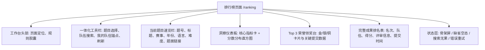

## 排行榜模块 UI/UX 设计

> 设计状态：已确立设计基线，正进入工程实施。
>
> 适用入口：用户端主导航栏「排行榜」(`/ranking`) 以及带题目参数的定向跳转入口 (`/ranking?problemId={id}`)。前端通过 `ranking-service` 提供的公开与租户接口读取题目榜单快照、分数分布直方图及队伍排名上下文。

---

### 一、设计目标与产品理解

数学建模实训的核心成果是各参赛队伍针对赛题撰写的学术论文及算法模型。平台的 AI 评审流水线（如 `BASIC_REVIEW_V1`）基于多维度评价指标，对作品的最终稿件进行结构化打分（0–100 分）。

排行榜不仅是“荣誉展示墙”，更是**参赛队伍自我能力诊断、梯队定位与学术竞技结果的权威观测窗口**。

本设计遵循以下核心原则：

1. **冷静克制的专业学术风格**：彻底移除早期色彩浓重的大面积蓝色渐变、发光球体与游戏化悬浮物，回归 LeetModel 统一的黑白灰 Monochrome 结构色与精细留白。彩色仅用于金银铜荣誉徽标、得分强调和关键行动反馈。
2. **总览与细览双模式分离**：
   - **默认总览页（Global Overview）**：未选择具体题目时，呈现全平台各赛题的天梯列表（队伍量、均分、最高分）、全平台横向对比条形图与得分梯队区间图，支持点击直达细览；
   - **单题细览页（Problem Detail）**：呈现赛题指标摘要、Top 3 荣誉领奖台、核心排名明细表，以及后置的多维可视化分析（分数直方图 + 实力层级环形图 + 水位线）。
3. **主次清晰与不过度设计**：
   - 核心优先级永远是“**先看名次与榜单**”，将排名表格与 Top 3 荣誉台置于首屏核心位置，将深度统计分析作为后置支撑；
   - 坚决剔除假大空标题与冗长规则文字（如“面向同一建模赛题……”、“仅统计最终提交”等），用界面组件与数据本身传递专业感。
4. **紧凑交互与免跳转体验**：
   - **赛题可视化筛选中心 (Visual Problem Selector)**：针对赛题数量众多的场景，设计 Spotlight 级弹窗面板，支持关键词即搜、赛事体系多维胶囊、年份筛选、难度梯度过滤与卡片网格流分页；
   - **赛题速览抽屉**：点击“赛题速览”直接右侧滑出抽屉展示 Markdown 题面与建模要求，严禁强制跳出排行榜页面，保证看榜心流不中断。
5. **全链路数据分页 (Pagination Coverage)**：
   - **细览榜单分页**：细览排名表格默认每页 10/20/50 条，并实现“定位我的队伍”自动计算目标页码并跨页平滑定位高亮；
   - **总览天梯分页**：全平台赛题天梯榜支持多维排序与标准分页器，从容承载海量赛题。
6. **多样化可视化图表**：纯 CSS/SVG 极速渲染，包含分数分布梯队直方图、竞赛实力层级 Donut 环形构成图、赛题参赛规模横向对比柱状图与均分峰值区间图。

---

### 二、原有界面痛点复盘

| 维度 | 旧版现状 | 问题与痛点 | 本次重构解法 |
|------|----------|------------|--------------|
| **视觉风格** | 蓝色大渐变 Hero、发光 Orb、旋转徽章 | 带有浓烈游戏化或运营推广感，与平台的冷静学术工作台定位严重割裂 | 改为中性专业工作台头部，沉稳 Typography 与清晰规则胶囊，去除视觉噪音 |
| **数据挖掘** | 仅展示表格列表，未调用分布接口 | 用户无法看清题目难易度、整体分数集中段及自身排位百分位 | 接入 `getProblemScoreDistribution` 接口，渲染轻量现代的纯 SVG/CSS 分数分布直方图 |
| **队伍联动** | 队伍无法识别是否属于“我自己” | 参赛者需在长列表中手动翻找自己队伍，体验割裂 | 自动识别当前登录用户在该题目下的队伍，在头部透出并支持一键滚动定位 |
| **状态体验** | 仅依赖粗糙的 `v-loading` 遮罩 | 加载前后页面跳动严重，断网或接口异常时仅显示简单的错误条 | 引入与真实布局 1:1 像素级占位的骨架屏，细化三类空状态与错误重试卡片 |
| **移动响应** | 媒体查询规则生硬，小屏布局割裂 | 小屏下 Hero 与领奖台占用多屏高度，真正核心数据被深埋 | 弹性流式折叠，小屏优先保留核心名次、队伍与得分，次要信息降级展示 |

---

### 三、信息架构与页面布局

排行榜页面遵循纵向从“宏观概览”到“微观明细”的渐进展开模型：



#### 布局线框示意

```text
┌────────────────────────────────────────────────────────────────────────┐
│ 成果榜单 LEADERBOARD                                                   │
│ 同题竞争，客观呈现最终提交的 AI 评审学术成果                           │
│ [仅统计最终提交]  [仅纳入已完成评审]  [相同得分并列排名]               │
├────────────────────────────────────────────────────────────────────────┤
│ [ 题目选择 (题号·标题)  ▼ ]  [ 🔍 搜索队伍名称... ]   [我的队伍 #2] [刷新] │
├────────────────────────────────────────────────────────────────────────┤
│ 题号 101 · 2026年美赛 A题 · 连续型建模 [英文题面] [困难]    [查看题目详情 →] │
├──────────────────────────┬─────────────────────────────────────────────┤
│ 核心指标 (上榜队伍/最高分/更新时间) │ 分数分布梯队 (0-100分直方图与分段占比)        │
├──────────────────────────┴─────────────────────────────────────────────┤
│ 🏆 Top 3 领奖台 (若存在前三名且未激活关键字过滤)                           │
│  [ 🥈 #2 亚军队伍 ]       [ 🥇 #1 冠军队伍 ]       [ 🥉 #3 季军队伍 ]     │
├────────────────────────────────────────────────────────────────────────┤
│ 完整排名明细                                                           │
│ 排名   队伍名称           最终得分     评审流水线版本     最终稿提交时间 │
│ 01    AlphaModellers      96.5 分     基础评审 V1       2026-09-10 14:00│
│ 02    MatrixSolver (我)   94.0 分     基础评审 V1       2026-09-10 15:20│
│ ...                                                                    │
└────────────────────────────────────────────────────────────────────────┘
```

---

### 四、组件级设计规范 (UI Components)

#### 1. 工作台头部与规则胶囊 (Page Header & Badges)
- **主标题**：`font-size: 24px`，`font-weight: 700`，`color: var(--lm-text-primary)`。
- **副文本**：`font-size: 13px`，`color: var(--lm-text-secondary)`。
- **规则标签**：中性灰圆角微胶囊 (`padding: 3px 8px`，`border: 1px solid var(--lm-border)`，`background: var(--lm-bg-secondary)`)，带有微小的前置绿点，传达客观中立的学术规则。

#### 2. 一体化工具栏 (Filter & Context Bar)
- **背景与边框**：白色卡片表面 (`var(--lm-surface)`)，细边框 (`var(--lm-border)`)，轻微投影 (`var(--lm-shadow-xs)`)。
- **题目选择器 (`el-select`)**：支持即时拼音/文字搜索，选项清晰展示“题号 + 标题”。
- **队伍搜索框 (`el-input`)**：前置放大镜图标，带清除按钮 (`clearable`)，输入后支持防抖/回车过滤。
- **“我的队伍”锚点胶囊**：
  - 若用户未登录或未参与该题：不显示或显示“未参与该题”；
  - 若用户已上榜：高亮胶囊，显示“我的队伍：[队伍名] · #排名 (XX.X分)”，点击平滑滚动至对应行并触发高亮动画；
  - 若用户在练习但未提交最终稿/未评审：显示“进行中 · 未完成评审”，点击提示引导。
- **刷新按钮**：轻量操作图标，点击时提供旋转微动效，防止连击防抖。

#### 3. 洞察仪表板 (Metrics & Score Distribution)
- **指标卡片**：
  - 上榜队伍总量（单位：支）；
  - 当前最高得分（突出大号等宽字体）；
  - 榜单计算快照时间（格式化为可读的时间文本）。
- **分数分布直方图 (Score Distribution Histogram)**：
  - 数据来源于 `getProblemScoreDistribution`；
  - 统计分为 10 个区间（例如 0–59, 60–69, 70–79, 80–84, 85–89, 90–94, 95–100 等）；
  - 柱状条高度按该分段最大队伍数等比缩放；
  - 柱状条悬停时显示 Tooltip：“得分段：85–89 分 / 队伍数：12 支 (占比 32%)”；
  - 高亮柱体：若当前登录队伍的得分落入该区间，该柱体使用强调色区分。

#### 4. Top 3 荣誉领奖台 (Podium Cards)
- 仅在非搜索过滤状态且上榜队伍 ≥ 1 支时渲染；
- 排布次序：经典竞技台结构 —— 左(亚军 #2) - 中(冠军 #1 高度略高) - 右(季军 #3)；
- **金属微质感色系**：
  - 冠军（Gold）：边框微金淡黄、徽标深金沉稳、柔和淡金色环境光；
  - 亚军（Silver）：高级冷灰银色微质感；
  - 季军（Bronze）：稳重红铜淡暖灰；
- 绝不使用刺眼高饱和纯黄纯橙，保持学术严谨性。

#### 5. 榜单数据明细表 (Ranking Data Table)
- **表头 (Table Header)**：大写弱化次级文本 (`font-size: 11px`，`font-weight: 600`，`color: var(--lm-text-muted)`)，高扫描度。
- **表体行 (Table Row)**：
  - **名次列**：前 3 名显示微金属徽章；第 4 名及以后显示居中等宽中性序号；
  - **队伍信息列**：队伍首字圆形 Avatar、队伍全名（超出省略，Hover 完整提示）、一键复制队伍名称按钮；若是当前用户队伍，打上 `我的队伍` Badge；
  - **得分列**：核心数值大字号 (`font-size: 18px`，`font-weight: 800`)，带单位“分”；
  - **评审信息列**：评审流水线版本胶囊（如 `基础评审 V1`）+ 评审完成时间；
  - **最终稿提交时间列**：格式化时间 + 区分提示；
  - **行交互**：悬停微微提亮 (`var(--lm-bg-secondary)`)；当作为定位目标时，触发 2 秒的呼吸高亮（Pulse Glow）。

---

### 五、状态型界面设计 (States & Edge Cases)

| 状态 | 触发条件 | 界面表现与用户引导 |
|------|----------|-------------------|
| **加载骨架态 (Loading Skeleton)** | 首次进入、切换题目或手动刷新时 | 对应头部、指标卡、领奖台与 5 行表格的动态波纹骨架屏，保持布局完全一致，消除 CLS |
| **未选题目态 (No Selection)** | 题目列表加载为空或尚未选中题目 | 引导性中性插画 + 提示“请在上方选择题目以查看成果榜单” |
| **无上榜队伍态 (Empty Ranking)** | 当前题目暂无完成最终评审的队伍 | 展示奖杯占位插画 + “暂无上榜队伍” + 说明“队伍完成最终稿提交并通过 AI 评审后将自动上榜” + “查看题目详情”按钮 |
| **搜索无匹配态 (Search Empty)** | 队伍名筛选关键字无任何匹配行 | 搜索无果插画 + 提示“未找到包含‘xxx’的队伍” + “清空搜索条件”按钮 |
| **接口/网络异常态 (Error State)** | 网络中断、服务 500、超时 | 优雅的警示框 + 明确的错误文案 + “重新加载”主按钮 |

---

### 六、响应式断点与工程交付规范 (Auto Layout & Design Tokens)

#### 1. 响应式断点系统
- **Desktop (≥ 992px)**：
  - 最大宽度 `1180px` 居中；
  - 工具栏四列横向排布；
  - 概览区双列（左侧指标网格，右侧直方图）；
  - 领奖台三列横向排列；
  - 表格五列全展。
- **Tablet (768px – 991px)**：
  - 工具栏自动折行，题目选择占主宽；
  - 概览区纵向堆叠（指标卡横排，直方图独占一行）；
  - 表格适当压缩时间列。
- **Mobile (< 768px)**：
  - 头部规则胶囊横向可滑动；
  - 工具栏单列垂直堆叠；
  - 领奖台按 1 -> 2 -> 3 纵向平铺或紧凑卡片展现；
  - 表格降级为移动端卡片流，优先强化“名次 + 队伍名 + 得分”。

#### 2. Design Tokens 映射基准

```css
/* 容器与边框 */
--lm-ranking-card-bg: var(--lm-surface);
--lm-ranking-border: var(--lm-border);
--lm-ranking-radius: var(--lm-radius);

/* 荣誉微质感 */
--lm-rank-gold-bg: rgba(234, 179, 8, 0.08);
--lm-rank-gold-border: rgba(234, 179, 8, 0.35);
--lm-rank-gold-text: #a16207;

--lm-rank-silver-bg: rgba(148, 163, 184, 0.1);
--lm-rank-silver-border: rgba(148, 163, 184, 0.4);
--lm-rank-silver-text: #475569;

--lm-rank-bronze-bg: rgba(217, 119, 6, 0.08);
--lm-rank-bronze-border: rgba(217, 119, 6, 0.35);
--lm-rank-bronze-text: #9a3412;
```

---

### 七、文档与开发落地清单

- [x] 确立 UI/UX 模块详细设计
- [x] 建立阶段分支 `phase/leaderboard-redesign`
- [ ] 扩展前端 API 层支持分数分布查询与类型定义
- [ ] 编码实现 `RankingPage.vue` 重构（头部、工具栏、指标图表、领奖台、数据表、骨架屏、状态异常）
- [ ] 本地构建与静态检查验证
- [ ] 验收与文档索引归档
