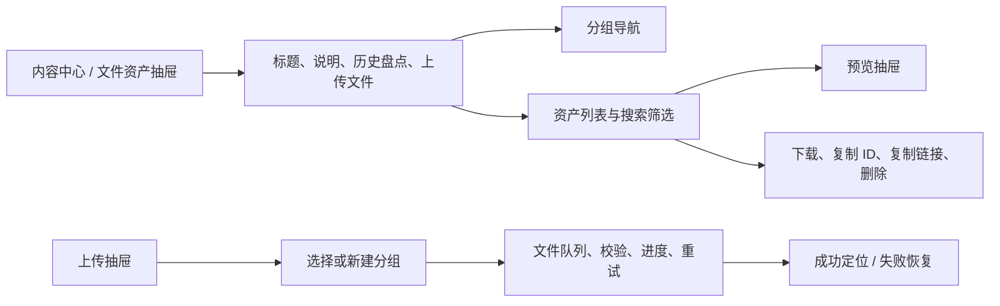

## 文件资产管理工作台 UI/UX 设计

> 设计状态：P0 已实现；P1/P2 和业务文件迁移相关体验待后续推进。
>
> 适用入口：管理端内容中心的“文件资产管理”抽屉。当前入口由 `ContentHubPage.vue` 打开，前端通过 `admin-service` 访问 file-service；本文只定义管理端体验，不改变文件资产的数据所有权和 MinIO 存储边界。

### 一、设计目标

文件资产页应让管理员能够快速回答四个问题：这是什么文件、它属于哪个分组、能否直接查看、当前可以执行什么操作。页面优先服务于查找、确认和处理文件，不把 MinIO 技术细节当成日常管理信息。

本设计遵循以下原则：

1. 文件名、文件 ID 和 Object Key 三层信息严格分离。
2. 能在线预览的文件优先预览，不能预览的文件明确说明原因并提供下载。
3. 上传过程可预期、可恢复，用户能看到目标分组、校验结果、进度和最终落点。
4. 分组选择使用用户熟悉的目录或层级选择，不要求用户手写完整技术路径。
5. 历史盘点文件的只读边界必须在视觉和操作上都清晰可见。

### 二、当前体验问题

当前页面存在以下可用性问题：

- 文件行把 `objectKey` 作为文件名下方的主要信息展示。UUID 和物理路径对管理员没有识别价值，反而遮蔽真正的原始文件名。
- 列表只有下载、复制临时链接和删除，没有预览入口。管理员必须下载文件才能判断内容。
- 搜索提示引导用户搜索 Object Key，而不是文件名、文件 ID 或扩展名。
- 上传采用原生文件选择框和手写 `groupPath`，没有拖拽、现有分组选择、进度、失败重试和同名提示。
- `fileId` 只在请求参数中存在，界面没有把它作为可复制、可引用的稳定标识展示。
- `DISCOVERED` 历史对象虽然有状态标签，但与手动上传资产在行结构和操作反馈上差异不足。

### 三、文件身份与命名规范

前端必须按下表表达三种身份：

| 概念 | 示例 | 展示位置 | 交互规则 |
|------|------|----------|----------|
| 文件名 `originalName` | `logo-main.png` | 列表主标题、预览标题 | 保留原始名称，不拼接 UUID，不静默改名 |
| 文件 ID `fileId` | `1024` | 列表次级信息、详情面板 | 始终可复制，用于业务引用和人工沟通 |
| MinIO `objectKey` | `manual/icons/uuid.png` | 技术详情折叠区 | 默认隐藏，仅供排障和存储治理使用 |

同名文件允许共存，通过文件 ID 区分：

```text
logo.png
文件 ID：1024

logo.png
文件 ID：1088
```

如果未来需要管理员自定义展示名称，应新增独立的 `displayName`，不能覆盖或重用 `originalName`。

### 四、工作台信息架构

文件资产抽屉采用“左侧分组 + 右侧资产列表 + 预览抽屉”的结构：



页面骨架：

```text
┌──────────────────────────────────────────────────────────────┐
│ 文件资产                              [盘点历史] [上传文件]   │
│ 管理已登记文件，文件名用于识别，文件 ID 用于引用             │
├───────────────┬──────────────────────────────────────────────┤
│ 分组           │ 搜索文件名、文件 ID、扩展名       [筛选]       │
│ 全部文件       ├──────────────────────────────────────────────┤
│ 未分组         │ 文件   类型   分组   大小   状态       操作    │
│ icons          │ logo.png 图片   icons 245KB 可用       预览    │
│ campaign/2026  │ report.pdf PDF  papers 2.1MB 可用      下载    │
└───────────────┴──────────────────────────────────────────────┘
```

统计卡片可以保留，但应退居页面辅助层，不得挤压文件列表首屏。管理员最常用的查找、预览和处理操作必须优先可见。

### 五、资产列表设计

#### 5.1 文件行

文件列采用明确的视觉层级：

```text
┌─────────────────────────────────────────────┐
│ 🖼  logo-main.png                            │
│    PNG 图片 · 245 KB                         │
│    文件 ID：1024  [复制]                     │
└─────────────────────────────────────────────┘
```

推荐列：

| 列 | 内容 |
|---|---|
| 文件 | 文件图标、原始文件名、扩展名、文件大小 |
| 文件 ID | 稳定标识，可复制 |
| 分组 | `icons`、`campaign/2026` 或未分组 |
| 来源 | 手动上传 / 历史盘点 |
| 状态 | 可用 / 只读 / 等待清理 / 清理失败 |
| 更新时间 | 登记或状态变更时间 |
| 操作 | 预览、下载、复制 ID、更多 |

Object Key 不出现在默认表格列中。

#### 5.2 来源与生命周期

- `MANUAL` 使用主要色标签，可执行预览、下载、复制和符合条件的删除。
- `DISCOVERED` 使用信息色标签，并在行内显示“历史盘点，只读”；删除按钮不只禁用，还要能说明不可删除原因。
- `PENDING_DELETE` 显示预计清理时间和“等待清理”，避免管理员误以为文件已经消失。
- `DELETE_FAILED` 显示“清理失败，将自动重试”，并允许查看错误状态，不提供重复提交删除的假动作。

### 六、预览抽屉

点击“预览”打开右侧抽屉，不离开当前列表。抽屉固定展示文件名、文件 ID、分组、类型和大小，底部固定放置复制 ID、复制链接、下载和删除操作。

| 文件类型 | 默认体验 | 降级体验 |
|----------|----------|----------|
| JPG、PNG、GIF、WebP | 图片适应窗口预览，可切换原始尺寸 | 预览失败时显示错误原因和下载 |
| PDF | 内嵌 PDF 预览，支持新窗口打开 | 显示下载按钮 |
| TXT、CSV | 原文等宽文本预览 | 显示下载按钮 |
| Markdown | 原文 / 安全渲染预览切换 | 渲染失败回退原文 |
| ZIP、RAR、7Z、TAR、GZ 等 | 显示压缩包信息卡 | 明确提示当前不支持在线查看内容，提供下载 |
| 其他类型 | 显示类型、大小和文件 ID | “此文件暂不支持在线预览” |

Markdown 渲染必须进行 HTML 清理，不能把上传内容直接当作可信 HTML 插入管理端页面。预览和下载均使用短时临时 URL，前端不把 URL 当作长期文件标识保存。

技术详情默认折叠：

```text
文件 ID：1024
文件名：logo-main.png
来源：手动上传
分组：icons
Bucket：leetmodel
Object Key：manual/icons/uuid.png
生命周期：ACTIVE
创建时间：2026-09-09 12:30
```

### 七、上传抽屉

上传流程从“弹窗 + 手写路径”改为三段式上传抽屉。

#### 7.1 选择目标分组

```text
保存到分组
[全部分组                         ▼]

当前路径：manual / icons
[＋新建分组]
```

新建分组只输入当前层级名称，路径由界面生成并即时展示。前端仍应遵守服务端的分组字符限制，但错误应在输入时给出，而不是提交后才发现。

#### 7.2 选择和校验文件

使用拖拽区域，同时保留点击选择：

```text
┌───────────────────────────────────────┐
│             ↑                          │
│      拖拽文件到这里                    │
│      或点击选择文件                    │
│                                       │
│ 支持图片、PDF、文档、表格、压缩包等     │
│ 单文件最大 50 MB                       │
└───────────────────────────────────────┘
```

选择后立即显示文件卡片：文件名、类型、大小、目标分组和校验状态。格式或大小不合法时，应在上传前标红并解释原因。

#### 7.3 上传队列与结果

每个文件显示独立进度、状态和操作：

```text
logo.png
icons
██████████████░░░░ 72%
正在上传
```

失败状态必须提供“重试”和“移除”，不能只显示一个全局失败 Toast。上传完成后：

1. 显示成功和失败数量。
2. 保留当前分组上下文。
3. 自动定位并高亮新上传文件。
4. 提供“继续上传”和“查看文件”。
5. 不自动打开临时链接，避免打断连续上传。

同组同名文件上传前提示但不强制阻止：

```text
检测到当前分组已有 logo.png。
文件仍可上传，系统将通过不同文件 ID 区分。
```

### 八、搜索、筛选与操作

搜索框文案改为：

```text
搜索文件名、文件 ID 或扩展名
```

默认搜索范围：文件名、文件 ID、扩展名和分组路径。高级筛选包括文件类型、来源、生命周期状态、大小范围和上传时间。Object Key 仅作为技术详情或排障场景的额外筛选项。

操作按频率排列：

```text
[预览] [下载] [复制 ID] [更多 ▾]
```

“更多”菜单包含复制临时链接、查看技术详情和申请删除。删除确认必须同时展示文件名、文件 ID、分组和大小，并说明逻辑删除、宽限期和物理清理的关系。

### 九、前端实现依赖

以下是实现该体验时需要与后端契约对齐的字段或能力，属于接口依赖，不代表本轮已经实现：

```text
fileId
originalName
fileExtension
contentType
previewType
previewable
fileSize
groupPath
sourceType
lifecycleStatus
cleanupAfter
```

建议区分预览和下载的临时地址语义：

```text
POST /{id}/preview-url
POST /{id}/download-url
```

如果第一阶段继续复用同一个访问地址接口，前端仍应根据 `contentType` 和扩展名选择预览组件，并在不支持预览时提供明确降级。

上传接口后续可增加幂等键、上传进度所需的分片或会话能力；在单文件代理上传阶段，前端至少应使用请求进度事件实现可见进度和失败重试。

### 十、实施优先级与验收标准

#### P0：必须完成

- 主列表隐藏 Object Key，明确显示文件名和文件 ID。
- 增加文件类型、扩展名、图标和预览入口。
- 完成图片、PDF、文本和 Markdown 的预览及不可预览降级。
- 上传抽屉支持分组选择、拖拽选择、前置校验、进度和失败重试。
- 搜索支持文件名、文件 ID、扩展名，分组不再依赖手写完整路径。
- 历史盘点、等待清理和清理失败状态具有明确的视觉和操作反馈。

#### P1：随后完善

- 高级筛选。
- 预览抽屉技术详情。
- 同名文件提示。
- 表格 / 卡片视图切换。
- 批量上传和批量移动分组。

#### P2：后续能力

- 自定义显示名称。
- 文件标签、收藏和最近使用。
- 引用来源展示。
- 文件版本管理。
- 业务文件迁移后的引用关系展示。

### 十一、非目标

- 不在本设计中改变 file-service 的数据所有权和 MinIO 存储方式。
- 不在第一阶段实现压缩包在线解压、文件内容索引或在线编辑。
- 不把 Object Key 变成公开业务标识。
- 不提供永久公开链接。
- 不将题目附件、头像和正式论文的业务关系提前迁移到本页面。
