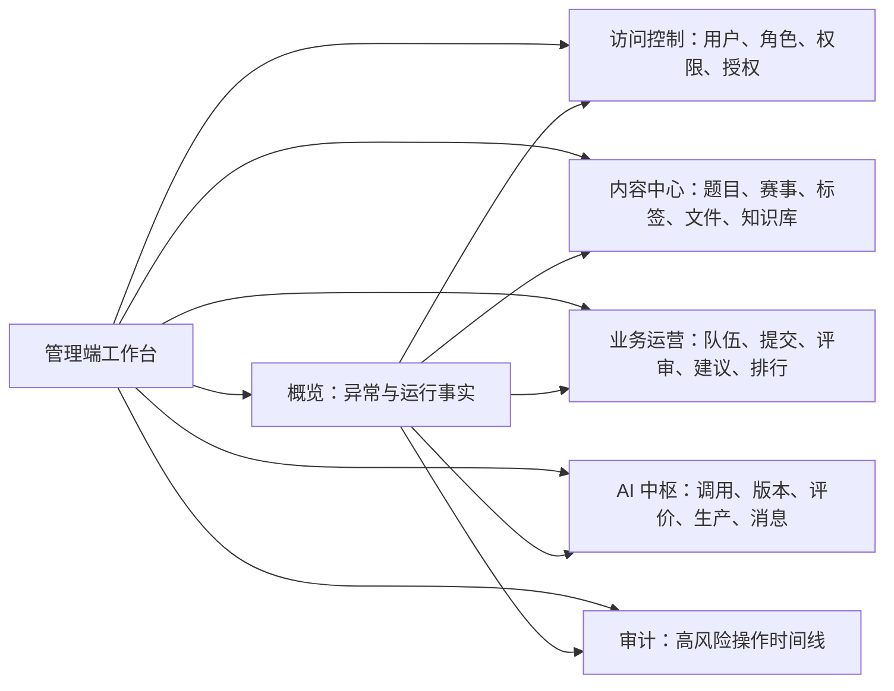

## 管理端工作台 UIUX 设计

> 设计状态：已确认。本文档是本轮管理端重构的目标依据；具体实施状态以当前代码和 `TODO.md` 为准，不应把尚未实施的页面描述误认为已实现。

### 一、设计目标

管理端不是产品宣传页，而是管理员持续观察、定位和处理平台资产的工作台。设计优先级固定为：异常与风险、待处理工作、核心业务事实、分析对比、低频配置。

本轮解决五类问题：

1. 页面级视觉设计。减少首屏装饰，把有效数据和操作前移。
2. 组件级设计。统一高密度表格、筛选、详情、状态和危险操作。
3. 交互反馈与微动效。让点击、加载、保存和失败都有明确响应。
4. 系统与状态界面。区分无数据、筛选无结果、服务不可用、断网和鉴权失败。
5. 工程交付。给出可映射到 CSS Grid、Flex 和 Element Plus 的布局、令牌与资产规则。

设计只保留对管理员判断和操作有价值的信息。能够由标题、字段名、状态或按钮直接表达的内容，不再追加小字解释。


### 二、现状证据与取舍

当前六个工作域的业务划分是合理的，继续保留概览、访问控制、内容中心、业务运营、AI 中枢和审计。问题主要在页面组织与契约能力：

- 应用壳层标题、页面 Hero、分区标题重复表达同一主题。
- 访问控制、内容中心、业务运营和 AI 中枢使用大面积渐变 Hero，约占常见桌面首屏四分之一。
- 角色、权限、文件和知识库等复杂任务放在抽屉内，横向工作空间不足。
- 概览把所有累计总数等权排列，无法优先回答“现在有什么需要处理”。
- 业务运营的队伍、提交、评审和建议接口只返回最近若干条，不具备完整分页管理能力。
- 侧栏底部固定显示“已连接”，不能代表真实服务状态。
- 知识库页面在接口失败时可能继续显示默认健康值；任何目标方案都不得用默认值伪装成功。
- 审计页引用了未定义的 Hero 色彩类，真实页面出现白字落在浅色背景上的可读性问题。

因此本轮不推翻已有功能，也不增加可配置大屏。保留可靠的 CRUD、预览、评价、生产版本和消息运维闭环，重新组织工作面，并只为缺失的分页、聚合和异常查询补充最小接口。


### 三、管理员真正需要知道的内容

| 判断顺序 | 管理员的问题 | 页面应提供的答案 |
|------|------|------|
| 1 | 系统现在是否有异常 | 不可用服务、失败任务、消息积压、失败高风险操作 |
| 2 | 哪些事情需要立即处理 | 可点击的异常条目、对象、发生时间和处理入口 |
| 3 | 主业务是否正常流转 | 队伍、提交、评审、建议、排行的量级和转化事实 |
| 4 | 资产是否完整可用 | 用户、题目、文件、知识库、版本与权限的状态 |
| 5 | 变化是否值得关注 | 在固定时间范围和明确口径下的趋势、分布和对比 |
| 6 | 操作是否可追溯 | 操作者、目标、原因、结果、业务 Trace 和审计事件 |

累计总数用于理解规模，不应被包装成实时健康度。没有时间窗口或历史快照时不展示增长率；没有服务事实时不展示“在线”“健康”或绿色状态。


### 四、信息架构



一级导航只显示六个稳定工作域。工作域内部使用紧凑的二级标签或侧向资源导航，不再用大 Hero、入口卡片和大抽屉代替正常页面导航。旧地址继续重定向，保证书签与文档链接可用。

| 工作域 | 默认工作面 | 二级工作面 | 主要动作 |
|------|------|------|------|
| 概览 | 异常与待办 | 业务、AI、资产摘要 | 刷新、进入异常对象 |
| 访问控制 | 用户 | 角色、权限、角色授权 | 查询、启停账号、分配角色、维护策略 |
| 内容中心 | 题目 | 赛事、标签、文件、知识库 | 新增、编辑、预览、上传、删除、重建 |
| 业务运营 | 提交 | 队伍、评审、建议、排行 | 查询、预览 PDF、查看任务、重建排行 |
| AI 中枢 | 调用 | 版本、质量评价、生产版本、消息运维 | 筛选、对比、启动、暂停、恢复、切换 |
| 审计 | 操作事件 | 无额外层级 | 查询、查看差异、复制 Trace |


### 五、全局工作台骨架

```text
┌──────────────┬────────────────────────────────────────────┐
│ 品牌与一级导航 │ 当前工作域 / 全局状态 / 站点入口 / 管理员       │ 52
├──────────────┼────────────────────────────────────────────┤
│              │ 页面标题             关键动作 / 刷新时点       │ 48–56
│ 可折叠侧栏     ├────────────────────────────────────────────┤
│              │ 二级导航 / 状态条 / 筛选工具                  │ Auto
│              ├────────────────────────────────────────────┤
│              │ 数据、图表、表格与详情工作面                   │ Fill
└──────────────┴────────────────────────────────────────────┘
```

#### 5.1 壳层

- 展开侧栏宽 `224px`，收起宽 `56px`；顶栏高 `52px`。
- 顶栏只保留当前工作域标题、全局异常入口、返回站点和管理员菜单。
- 页面不再重复路由说明。只有状态变化、风险或统计口径需要解释时才显示正文。
- 管理端禁止使用宣讲式 Hero；内容区直接从有效入口、指标、筛选或数据工作面开始。
- 删除侧栏静态“管理端已连接”；真实局部故障显示在全局状态入口和相关工作面。
- 主内容宽度不设舒适阅读上限，数据表可使用全部可用宽度；最大左右内边距 `24px`。
- `router-view` 保留页面状态时，仅缓存列表查询条件和滚动位置；新增、编辑和危险操作表单不跨路由静默保留。

#### 5.2 Auto Layout 映射

| 设计意图 | 工程实现 |
|------|------|
| 横向工具栏自适应 | `display:flex; flex-wrap:wrap; gap:8px` |
| 指标条等宽伸缩 | `grid-template-columns:repeat(auto-fit,minmax(148px,1fr))` |
| 主次分析区 | `grid-template-columns:minmax(0,2fr) minmax(300px,1fr)` |
| 表格填满剩余高度 | 页面纵向 Flex，表格容器 `min-height:0; flex:1` |
| 详情面板 | PC 右侧 `480–640px`，避免遮挡对象主识别与关键上下文 |
| 长标签与操作组 | 内容省略，操作禁止压缩，完整值通过 Tooltip 查看 |

当前交付仅面向 PC Web，验收基线为 `≥ 1024px`。断点规则：

- `≥ 1440px`：展开侧栏，分析区双列，筛选单行优先。
- `1024–1439px`：侧栏可收起，分析区按内容决定双列或单列。
- `< 1024px`：不作为当前产品与验收范围，不为手机端另造导航、数据或编辑流程。


### 六、页面级设计

#### 6.1 运行概览

概览首屏回答“现在要处理什么”，不再重复导航入口。

从上到下为：

1. 紧凑状态条：数据时点、可用领域数、刷新按钮。局部失败时变为可展开警告条。
2. 五项核心事实：用户、题目、进行中队伍、提交、AI 调用。其他累计量收进资产摘要。
3. 异常待办：失败 AI 调用、未完成评价、消息积压或死信、失败高风险操作、不可用服务。每一项可点击进入带筛选条件的目标工作面。
4. 主业务流转：队伍到提交、评审、建议和排行的同口径量级。只在后端提供固定时间范围后展示转化率。
5. AI 与资产摘要：成功率、耗时、Token、生产版本，以及题目、文件、知识文档和权限规模。

删除“管理入口”卡片。柱状图不再把量级差异巨大的用户、提交、建议放在同一坐标轴上；规模事实用数字条，趋势和分布必须带明确时间范围。

当统一概览聚合契约尚未补齐时，工作台可并行读取现有的有界管理接口，但必须把“最近 24 小时”、“当前快照”、“累计”与“最近 100 项检查”直接标在数值附近。各数据源独立降级，不得因一个请求失败清空已取得的数据，也不得把有界列表统计称为全量。

#### 6.2 访问控制

- 页面标题右侧放“角色”“权限”“授权”二级入口，默认直接进入用户表。
- 用户表顶部为关键字、账号状态、角色和查询；已选条件显示可清除筛选标签。
- 用户名与昵称为主识别，邮箱次级；内部 ID 只在详情中展示并支持复制。
- 行尾只保留“详情”和一个更多操作菜单。启停账号、变更角色在侧边详情面板内完成。
- 角色授权使用全宽策略工作面，不再嵌套在抽屉中；未保存变更显示固定操作条，离开前提示。
- 删除角色或权限前展示受影响对象数量；后端无法提供影响范围时明确显示“影响范围未取得”，不能省略风险。

实施状态（2026-09-14）：`/admin/access` 已以 `view=users|roles|permissions|authorization` 承载四个可恢复工作面，不再使用 Hero、原则说明卡或工具抽屉。用户列表已覆盖关键字、状态和角色组合筛选，内部 ID 只在详情面板展示；角色、权限和授权均使用完整工作区，系统角色保护、关系影响数、权限业务域分组及未保存修改离开拦截已落地。

#### 6.3 内容中心

- 二级入口固定为题目、赛事、标签、文件、知识库，复杂资产使用完整路由工作面。
- 题目列表以业务 `code` 为首列，标题、赛事、年份、题面、难度、状态和更新时间组成扫描主线。
- 新增与编辑使用右侧面板；Markdown 预览可在编辑和列表直接进入，预览与表单不同时挤占主工作面。
- 赛事与标签采用紧凑表格，不单独放宣传式摘要卡。
- 文件资产保持分页、分组、搜索、预览、批量上传和延迟删除；上传队列固定在可见区域，不因关闭面板丢失进行中反馈。
- 知识库把目录、文档和索引状态放在同一工作面。索引接口失败显示未知，不沿用默认别名、版本或健康值。

#### 6.4 业务运营

- 二级入口为提交、队伍、评审、建议、排行；当前视图通过 URL 查询参数恢复。
- 删除五步大卡片链路，改为一行紧凑 KPI 与状态筛选，给表格腾出首屏空间。
- 提交表以队伍、题号、版本、文件、最终版、状态和时间为主；内部提交 ID 进入详情。PDF 预览继续按需获取临时地址。
- 队伍表必须显示真实成员数；字段缺失显示 `—`，禁止默认写成 1。题目显示业务题号，不显示内部题目 ID。
- 评审和建议默认把失败、运行中和未知结果排到更容易发现的位置，详情串联 submissionId、taskId、workflowVersion、model 和失败依据。
- 排行默认展示全局题目热度、平均分和上榜队伍；选择题目后展示分数分布、梯队和明细。重建排行属于高风险动作，需确认目标题目和影响。

完整数据管理依赖服务端分页与筛选。在接口补齐前，页面必须标明“最近 N 条”，不得把有限样本称为全量管理。

#### 6.5 AI 中枢与系统运维

- 二级入口为调用、版本、质量评价、生产版本和消息运维。
- 页首只保留成功率、失败数、平均耗时、Token 和当前生产版本五项状态，不再使用紫色宣传 Hero。
- AI 调用表使用服务端分页，筛选项保留功能、操作、评价任务、供应商、模型和状态；统计图与表格使用同一筛选口径。
- 版本目录只展示 owner 服务发布的真实契约。未接入目录的功能显示未知，不硬编码版本。
- 质量评价把创建实验、运行状态、版本对比和调用追踪分成明确步骤；危险操作在对象详情中完成，不在表格堆按钮。
- 生产版本变更采用“预检 → 差异确认 → 应用 → 审计结果”四步流程，任何一步失败都保留已输入内容和可重试入口。
- 消息运维优先显示告警服务、积压、死信和暂停消费者；重放必须填写原因，结果进入审计。

#### 6.6 操作审计

- 删除 Hero，页面直接从时间范围和关键筛选开始。
- 常用筛选为时间、服务、操作、风险和结果；操作者、目标、operationId 与 traceId 渐进展开。
- 结果表突出发生时间、操作、结果、目标和操作者；点击行打开详情面板。
- 详情按时间线展示阶段，白名单前后摘要使用结构化差异，不直接堆整段 JSON。
- 中央审计不可用时显示独立故障态，不把空集合解释成“无审计事件”。


### 七、组件级规范

| 组件 | 职责 | 必备状态 |
|------|------|------|
| `AdminShell` | 侧栏、顶栏、内容布局和 PC 响应式导航 | 展开、收起 |
| `AdminPageHeader` | 唯一页面标题、数据时点与主操作 | 默认、刷新中、局部故障 |
| `AdminSubnav` | 工作域内部资源切换并同步 URL | 默认、激活、禁用 |
| `MetricStrip` | 少量同口径数字事实 | 加载、可用、不可用、可点击 |
| `DataToolbar` | 搜索、筛选、已选条件和批量动作 | 折叠、展开、固定 |
| `AdminDataTable` | 高密度数据浏览 | 骨架、数据、空、筛选空、错误 |
| `StatusBadge` | 统一领域状态语义 | 中性、运行、成功、警告、失败、未知 |
| `DetailPanel` | 查看详情和单对象编辑 | 查看、编辑、保存中、失败、脏数据 |
| `RiskConfirm` | 删除、重建、切换、暂停和重放确认 | 影响确认、原因校验、提交中、结果 |
| `StatePanel` | 页面级异常与恢复入口 | 离线、403、404、500、局部不可用 |

表格默认行高 `40px`，表头 `36px`，单元格水平间距 `12px`。主识别字段最多两行，普通字段单行省略。数字使用等宽数字；数据库 ID 不作为默认主识别。

按钮层级固定为：每个工作面一个实心主操作，普通操作使用次按钮，行内查看使用文字按钮，危险操作只在更多菜单或确认流程中出现。


### 八、交互反馈与微动效

- 点击：按钮按下缩放不超过 `0.98`，持续 `80ms`；禁用时不播放动效。
- 悬停：表格行只改变浅背景，操作入口淡入；不让整行位移。
- 页面切换：内容透明度和纵向位移 `4px`，持续 `160ms`。
- 详情面板：从右侧进入 `220ms`。
- 数字和图表刷新：保留旧值并显示局部加载，不让整个页面白屏；新数据以 `180ms` 过渡。
- 保存成功：表单原位显示已保存状态，同时给出简短 Toast；失败时错误贴近字段或操作区。
- 尊重 `prefers-reduced-motion`，关闭位移、缩放和图表补间，只保留必要的状态变化。

不使用循环脉冲、装饰粒子、大面积渐变和无业务含义的数字滚动。


### 九、系统状态与极限数据

| 状态 | 界面行为 | 恢复方式 |
|------|------|------|
| 首次加载 | 表头与布局稳定，内容使用骨架 | 自动完成 |
| 局部刷新 | 保留旧数据，刷新区域显示进度 | 自动完成或重试 |
| 断网 | 顶部固定离线条，禁止写操作，已填表单保留 | 网络恢复后手动重试 |
| 401 | 清理会话并跳转登录，记录原目标地址 | 登录后返回原工作面 |
| 403 | 不跳回普通首页；显示无权限状态与返回入口 | 返回有权限工作域 |
| 404 对象 | 关闭编辑态，显示对象已不存在 | 刷新列表 |
| 500 或服务不可用 | 显示真实服务名与错误，不清空成“暂无数据” | 重试或进入相关运维面 |
| 真正空数据 | 说明缺少的对象并提供可用主动作 | 新增或导入 |
| 筛选无结果 | 保留筛选条件，提供一键清除 | 清除筛选 |
| 局部字段缺失 | 显示 `—` 或未知状态 | 不推断、不补假值 |
| 并发修改 | 阻止静默覆盖，展示版本冲突 | 刷新详情后重新提交 |

极限数据规则：

- 大数使用千分位；卡片内超过七位时可使用紧凑单位，但 Tooltip 必须显示精确值。
- 19 位 Long 标识继续按字符串处理。
- 超长中文、英文、文件名和模型名使用省略与 Tooltip，不能撑破操作列。
- 表格数据达到大规模时只使用服务端分页；不一次性渲染全量数据。
- 图表类别超过可读上限时展示 Top N 与“其他”，明细仍可筛选查看。
- 日期统一显示到分钟；详情或审计显示秒和时区。


### 十、提示与通知机制

| 层级 | 适用内容 | 载体 |
|------|------|------|
| 字段级 | 校验失败、格式错误、必填缺失 | 表单项下方错误 |
| 操作级 | 保存失败、预检失败、上传部分失败 | 操作区内联提示 |
| 页面级 | 服务不可用、数据口径变化、只读状态 | 可持续 Banner |
| 全局级 | 离线、会话失效、多个领域异常 | 顶栏状态入口与固定条 |
| 瞬时反馈 | 保存成功、复制成功、开始执行 | 2–4 秒 Toast |
| 高风险确认 | 删除、重建、生产切换、暂停、重放 | 模态确认与原因输入 |

同一事件不重复弹 Toast、Banner 和对话框。Toast 不承载长错误详情；用户需要采取行动的错误必须留在页面内。当前阶段不建设持久化消息中心，也不新增后端通知表。


### 十一、Design Tokens 与资产

管理端继承字体和品牌识别，使用独立的 `--lm-admin-*` 令牌，避免用户端语义色被全局黑白主题覆盖。

| 类型 | 令牌与目标值 |
|------|------|
| 背景 | `canvas #f6f7f9`、`surface #ffffff`、`subtle #f1f3f5` |
| 文本 | `strong #111827`、`default #374151`、`muted #6b7280` |
| 边界 | `border #e5e7eb`、`border-strong #d1d5db` |
| 品牌动作 | `primary #2563eb`、`primary-hover #1d4ed8` |
| 状态 | `success #15803d`、`warning #b45309`、`danger #b91c1c`、`info #475569` |
| 圆角 | 控件 `6px`、面板 `8px`、浮层 `10px` |
| 间距 | `4 / 8 / 12 / 16 / 24 / 32px` |
| 阴影 | 仅浮层与粘性区域使用低对比阴影 |
| 字号 | 数据 `20–24px`、标题 `18px`、正文 `13px`、表格 `12–13px` |

资产交付采用零新增切图原则：复用现有 Logo，图标只使用 Element Plus SVG 图标，图表由 ECharts 绘制。管理端没有需要导出的装饰位图；这能减少模糊、主题不一致和维护成本。


### 十二、后端接口调整边界

#### 12.1 可直接复用

- 用户、角色、权限、角色授权的查询与写操作。
- 题目、标签、赛事、附件和文件资产 CRUD。
- 提交 PDF 临时预览。
- AI 调用服务端分页、筛选与聚合统计。
- 质量评价、生产版本预检与应用、消息运维和审计查询。
- 全局排行统计和单题排行。

#### 12.2 实现到对应页面时补齐

| 缺口 | 最小调整 | 原因 |
|------|------|------|
| 概览缺少统一异常聚合 | 后续增加带固定时间窗的管理概览聚合契约；当前使用有界管理接口并标注范围 | 工作台成为高频页面后避免前端长期并发多源请求 |
| 队伍、提交、评审、建议仅有最近记录 | 增加统一分页、状态、关键字和时间筛选 | 支持完整数据管理而非最近样本 |
| 运营列表缺少业务识别字段 | 返回队伍名、题目 `problemCode`、准确成员数等展示快照 | 避免内部 ID 成为主信息 |
| 内容资产删除与授权缺少影响范围 | 对应工作面实现时增加依赖数量或预检结果；访问控制已返回角色用户数、角色权限数和权限角色数 | 支撑可靠风险确认 |
| 跨服务对象详情分散 | 由 admin-service 聚合只读详情，不复制领域数据 | 支撑详情面板与链路定位 |

admin-service 继续作为无数据库聚合层。领域写操作仍由数据 owner 服务校验和执行；本轮不建设数据仓库，不复制领域表，也不把 Grafana 指标包装成业务事实。


### 十三、串行实施与提交边界

| 顺序 | 实施点 | 独立验收 |
|------|------|------|
| 0 | 任务规划 | TODO 有唯一任务、范围、非目标和阶段顺序 |
| 1 | 本设计 | 六个工作域、组件、状态、通知、令牌和接口边界完成确认 |
| 2 | 壳层与基础组件 | 无重复标题、无静态假状态、导航与基础状态可用 |
| 3 | 运行概览 | 异常优先、统计口径真实、图表和跳转闭环 |
| 4 | 访问控制 | 用户到授权的查看、编辑、失败与脏数据闭环 |
| 5 | 内容中心 | 五类内容资产均有完整工作面和 CRUD 反馈 |
| 6 | 业务运营 | 分页、筛选、业务标识、PDF 与排行闭环 |
| 7 | AI 与系统运维 | 调用、评价、生产变更和消息恢复闭环 |
| 8 | 审计与全局终验 | 断网、401、403、404、500、空态和极限数据通过 |

每个实施点完成后立即形成可识别的原子提交。后端、前端和文档仍按 Git 规范分开提交；不把多个页面攒成一次提交。整个阶段在连续视觉验收期间保留当前分支，不提前合回 `dev`。


### 十四、视觉与工程验收

1. `1440×900` 与常见短屏中，标题和工具栏后立即出现有效数据，宣传 Hero 占用为零。
2. 同一页面只保留一个页面级标题；能够由标题或字段表达的内容不重复写辅助说明。
3. 表格列、按钮、状态和数字像素对齐，交互目标不小于 `32px`。
4. 六个工作域、旧路由重定向、详情面板和刷新返回位置可恢复。
5. 成功路径与至少一个失败路径在真实接口中验证；构建成功不代替浏览器验收。
6. 服务不可用、断网、401、403、404、500、真空数据和筛选无结果可被明确区分。
7. 长标识、长文件名、大数字和大数据页不挤压主操作，超宽表格只在局部容器内滚动。
8. 浏览器控制台无新增错误；关键请求无意外重复和静默失败。
9. 不新增 Emoji、装饰性位图、大面积渐变、无口径趋势和硬编码健康状态。
