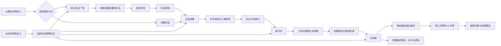
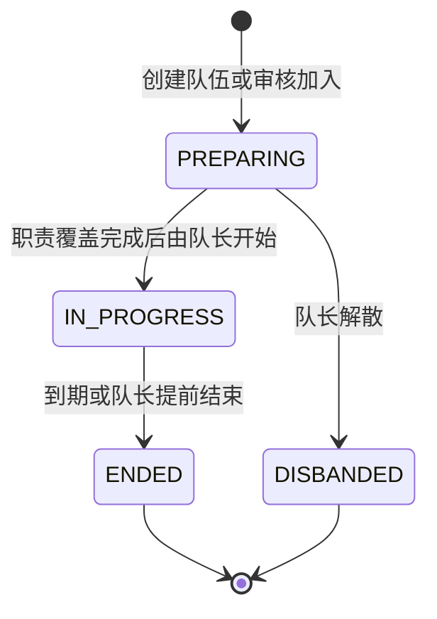
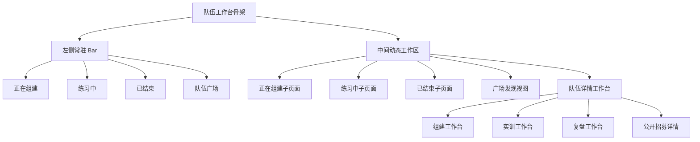

## 队伍模块 UIUX 设计

> 本文档定义 LeetModel 用户端队伍模块的目标体验。设计以产品定位、用户特征、队伍生命周期、真实页面表现和当前领域数据为依据。文档描述目标信息架构与交互契约，不代表相关前后端能力已经实现。

### 设计状态

- 当前状态：队伍工作台核心页面已按已确认信息架构实现，处于连续 UI 验收阶段。
- 当前实现：左侧以“正在组建、练习中、已结束”作为三个独立下拉组并展示各组全部队伍，三个状态分别拥有独立子页面路由；中间只展示当前选中队伍，组建态已经集成原私有详情页的资料编辑、成员职责、提交权限、招募、申请审核和开赛管理，练习中和已结束使用“题目、论文评审、排行”页内导航切换单一内容区；论文评审面板打通草稿上传、队长结束练习、最终版锁定、队列状态、PDF 预览、评审结果与改进建议；右侧持续展示队伍简介统计，队伍广场保持独立入口。
- 已确认骨架：参考题库工作台，左侧常驻 Bar 由三个生命周期下拉组和队伍广场组成，不设置“我的队伍”父级。
- 设计范围：队伍分区列表、队伍广场、队伍详情、创建与申请入口，以及组建到评审结果回顾的衔接体验。
- 当前实现边界：本轮复用现有题目、队伍、提交、评审和排行接口，不新增公共契约或数据库迁移；私有详情管理能力收敛进生命周期子页面，队伍广场的公开详情和内部发现视图保持独立。


### 一、产品理解与设计目标

LeetModel 的队伍不是社交群组，而是一次数学建模全真训练的执行载体。用户进入队伍模块时，最关心的不是浏览成员动态，而是迅速判断当前处于哪个阶段、还缺什么、下一步应该做什么。

产品和用户文档给出的关键事实如下：

1. 用户通常在赛前一到两周集中训练，使用频率不高，但时间压力和不确定感很强。
2. 用户希望在约十分钟内完成创建或加入队伍，不愿填写复杂履历，也不需要社交关系链。
3. 一支队伍最多三人，需要覆盖建模、编程和论文三类职责；同一成员可以承担多类职责。
4. 队伍进入练习后，核心任务从招募转为倒计时、论文版本、提交权限、AI 评审和改进建议。
5. 练习结束后，用户需要回看最终版本、评分依据、问题清单和相对排名，而不是只看到一个“已结束”标签。

因此，队伍模块的设计目标是：

> 让用户进入模块后在一个视口内找到所属阶段、识别当前阻塞，并通过一个明确主行动继续实训。

视觉上继承[设计系统与规范](../06-设计系统与规范.md)的中性学术工作台语言，结构上借鉴题库左侧常驻导航与右侧内容局部替换机制，但队伍内容必须围绕生命周期、职责、期限和下一步行动重新组织。

#### 当前体验诊断

本轮通过真实浏览器核对了当前“我的队伍、队伍广场、队伍详情”页面。现状与目标之间的主要差距如下：

| 当前表现 | 用户影响 | 设计调整 |
|----------|----------|----------|
| 我的队伍把练习中、组建中、练习结束纵向铺在同一页 | 空分区仍占据大块高度，用户需要持续向下滚动才能找到有内容的状态 | 三个状态改为左栏独立分区，右侧只显示当前状态 |
| 队伍广场使用独立页面和顶部页签 | 用户需要先理解“我的队伍”和“广场”的页面关系 | 广场进入同一个队伍工作台，成为第四个左栏标签 |
| 队伍卡突出名称、简介、头像和成立时间 | 看不出当前阻塞、职责缺口和下一步行动 | 改为任务行，优先展示阶段事实和推荐行动 |
| 详情首屏使用大面积蓝色渐变 Hero | 装饰区域占据首屏，组建检查、倒计时和提交状态被推到下方 | 使用紧凑详情头，把阶段任务提到首屏 |
| 详情顶部展示内部队伍 ID | 内部技术标识对用户没有决策价值，也容易与业务标识混淆 | 移除内部 ID，需要分享时另设业务分享码 |
| 多类管理动作散布在长页面中 | 队长难以判断此刻最应处理哪件事 | 每个阶段只保留一个主行动，其余进入次级区域 |

当前队伍广场的“按职位找”主从视图已经符合快速扫描与局部查看的需求，目标设计保留这一基础，只统一外层导航、信息密度、申请状态和移动端表现。


### 二、参与者、触发条件与结果

| 参与者 | 进入原因 | 首要问题 | 期望结果 |
|------|----------|----------|----------|
| 队长 | 创建队伍、审核申请、准备开赛 | 还缺谁、职责是否齐全、能否开始 | 快速补齐队伍并安全启动练习 |
| 普通成员 | 查看分工、等待开赛、上传论文 | 我负责什么、能否提交、下一步做什么 | 明确职责并完成获授权的任务 |
| 申请者 | 从广场寻找合适队伍 | 题目是否合适、缺什么角色、申请状态如何 | 用最少信息完成申请并获得明确反馈 |
| 单人训练者 | 自己承担全部职责 | 能否不等待其他人直接训练 | 创建队伍、覆盖三类职责并立即开赛 |
| 已完成训练者 | 回顾结果和继续改稿 | 最终版本表现如何、问题在哪里 | 查看评分、证据、建议和相对位置 |

触发入口包括全局导航的“队伍”、题目详情的“开始实训”与“寻找队伍”、首页的继续实训卡，以及分享后的队伍详情链接。

成功结果不是“进入详情页”，而是完成以下任一业务推进：

- 创建队伍并看到明确的组建缺口。
- 找到匹配的招募位置并提交申请。
- 队长完成审核与职责覆盖后开始练习。
- 有权限的成员上传并确认论文版本。
- 队伍获取评审结果并知道下一项改进动作。


### 三、业务流程与状态模型

#### 3.1 端到端主流程



#### 3.2 队伍状态与页面主任务



| 领域状态 | 导航文案 | 页面首要任务 | 主要信息 | 主行动 |
|----------|----------|--------------|----------|--------|
| `PREPARING` | 正在组建 | 消除开赛阻塞 | 成员、职责覆盖、招募、待审申请 | 完成组建或开始练习 |
| `IN_PROGRESS` | 练习中 | 在截止前完成有效论文版本 | 倒计时、提交权限、草稿版本、结束条件 | 上传论文或结束练习并评审 |
| `ENDED` | 已结束 | 回顾结果并形成下一次训练依据 | 最终版本、总分、分项、排名、建议 | 查看完整报告 |
| 公开招募集合 | 队伍广场 | 找到适合自己的题目、队伍或职位 | 空位、职责、题目、成员、申请关系 | 申请加入 |

`DISBANDED` 不进入左栏和常规历史列表。解散是终止事实，不应与成功完成的训练混在一起。


### 四、信息架构与路由

#### 4.1 单一队伍工作台



队伍模块不再先要求用户理解“我的队伍”和“广场”是两套页面。三个生命周期直接成为同级下拉组，每组展开后显示所属队伍；同时，三个生命周期分别对应独立子页面，能够直接访问、刷新和保留当前选择。队伍广场与三个状态组同级。左栏常驻，中间工作区只呈现当前选中队伍，不再重复队伍列表。

#### 4.2 建议路由

| 路由 | 左栏焦点 | 说明 |
|------|----------|------|
| `/team/preparing/:teamId?` | 正在组建 | 当前用户参与的组建中队伍，直接承载完整组建管理能力 |
| `/team/practicing/:teamId?` | 练习中 | 当前用户参与的练习中队伍，使用题目、提交、排行页内导航 |
| `/team/ended/:teamId?` | 已结束 | 当前用户参与的已结束队伍，使用题目、成果、排行页内导航 |
| `/team/square` | 队伍广场 | 公开招募，使用 `mode`、搜索和筛选参数恢复状态 |
| `/team/:id?fromStatus=...` | 对应生命周期 | 旧私有详情兼容入口，根据 `fromStatus` 归一到生命周期子页面 |

三个子页面使用可选路径参数 `teamId` 保存当前队伍选择；未指定时自动选择该生命周期下的第一支队伍。私有队伍不再使用独立详情页承载管理；旧地址携带 `fromStatus` 时直接替换为对应子页面地址。非成员公开招募详情继续使用 `/team/square/:id`，不会被并入私有工作台。


### 五、页面总骨架

#### 5.1 桌面端

```text
+----------------------------------------------------------------------------------+
| 全局导航 56px                                                                    |
+----------------------+--------------------------------------+---------------------+
| [成员] 正在组建 2  v | 当前分区标题                         | 当前选择            |
|   · 数值建模训练队   | 一句话说明 · 结果数量                | 队伍名称 · 状态     |
|   · 图优化实训组     |--------------------------------------| 简介与练习题目      |
| [计时] 练习中   1  > | 当前所选队伍的阶段工作区             | 成员与职责统计      |
| [完成] 已结束   3  > | 组建态：职责、成员、招募、开赛       | 职责分工与成员      |
|----------------------| 练习/结束：页内导航 + 单一内容区      | 当前队伍快捷入口    |
| [罗盘] 队伍广场  33  |                                      |                     |
|                      |                                      |                     |
| [ + 创建队伍 ]       |                                      |                     |
+----------------------+--------------------------------------+---------------------+
```

左栏沿用题库 Bar 的视觉结构和粘性行为：白底、无四周卡片边框，仅用右侧 `1px` 细线分隔。默认宽度与题库保持一致，允许拖拽到最小可读宽度，也允许完全折叠。折叠状态在队伍模块内持久化。

左栏不展示复杂统计。三个生命周期徽标表示当前用户的队伍数；展开后以紧凑文字子项列出该状态的全部队伍，点击子项进入对应生命周期子页面，并同步中间工作区、右侧摘要和 URL。队伍广场徽标表示开放招募位置数，并通过 Tooltip 说明统计口径。计数为零时显示 `0`，不隐藏分组。

#### 5.2 中间工作区页头

右侧页头控制在紧凑的两行内：

- 第一行显示当前队伍名称、生命周期状态和阶段主信息；练习中显示截止时间，已结束显示结束时间。
- 第二行用一句话解释当前阶段的工作目标，不重复队伍简介和统计。
- 不使用大面积渐变 Hero，不重复展示“我的队伍”总标题。
- 队伍内部数据库 ID 不对用户展示。未来如需分享标识，应新增独立、短小、可撤销的业务分享码。


### 六、正在组建

#### 6.1 页面目标

让队长和成员立即看到开赛前还缺什么，并把招募、审核、职责配置和开始练习串成一个明确任务链。

#### 6.2 独立组建工作台

正在组建不套用练习阶段的页内导航结构，而是围绕“能否开赛”组织：

1. 顶部准备度区域显示三类职责覆盖率、阻塞说明和唯一主行动；只有职责齐备时才能开始练习。
2. 四项事实指标显示成员容量、职责覆盖、开放招募和待审核申请。
3. 职责配置区逐项展示建模、编程、论文的工作目标和当前承担者。
4. 成员协作区展示身份、当前职责与提交协作关系。
5. 招募与申请区直接展示开放职位和申请记录；队长在当前子页面完成资料编辑、职责与提交权限分配、成员移除、招募发布或关闭、申请审核和队伍解散，不再跳转到另一套私有详情结构。

每项职责同时使用图标、文字和状态，不只依赖颜色。一个成员覆盖多种职责时允许重复出现成员名称，因为这里表达的是职责归属，不是人数统计。


### 七、练习中

#### 7.1 页面目标

让用户在最短时间内回答三个问题：还剩多久、现在是否有可用论文、下一步应该上传还是查看结果。

#### 7.2 页内导航练习工作区

- 顶部导航固定提供“题目、论文评审、排行”三个选项，当前项使用文字、图标和底部指示线共同表达。“论文评审”使用业务结果命名，避免用户误以为这里只能上传文件。
- 题目内容：显示业务题号、标题、难度、时长、原始 Markdown 题面和附件，并提供打开完整题目的入口。
- 论文评审内容：按“提交论文 → 锁定最终版 → AI 论文评审”展示生命周期；提交权限可用时直接选择 20MB 以内 PDF、预览本地文件、查看上传进度和保存下一版草稿。队长在已有成功草稿时可确认“结束练习并开始 AI 评审”，普通成员明确看到需等待队长操作。
- 最终版锁定后每四秒刷新派发与评审状态，区分等待派发、队列中、评审中、已完成、失败和结果待核查。失败可重试；结果待核查不会自动重复执行，但队员可明确确认后手动重新评审。
- 每个版本都提供成员权限内的 PDF 预览；完成任务直接打开五维评分、问题证据概括与题目要求覆盖情况，并提供生成改进建议入口。URL 参数 `?panel=review` 允许首页行动直接进入该面板。
- 排行内容：显示当前队伍是否上榜、同题领先队伍和完整榜单入口。练习尚未形成最终有效成绩时明确说明上榜条件。

导航下方一次只渲染当前选项，内容使用完整的中间区域宽度；切换队伍时默认回到题目内容。倒计时必须同时保留具体截止时间，不能只给相对时间。


### 八、已结束

#### 8.1 页面目标

把结束的队伍从“历史卡片”升级为可复用的训练档案，让用户能够比较版本、理解评分并决定是否再次训练。

#### 8.2 页内导航复盘工作区

已结束子页面保持与练习中一致的题目、论文评审、排行导航关系，降低生命周期切换成本，但内容目标改为复盘：题目内容回看原始要求，论文评审内容突出最终版本、队列与执行状态、原 PDF、结构化结果、改进建议和全部版本历史，排行内容突出当前队伍名次与同题参照。没有最终版本、成功评审或有效排名时使用明确空状态，不绘制伪趋势或伪百分位；已结束但锁定失败时展示恢复操作，定时补偿与页面重试共用同一幂等锁定逻辑。


### 九、队伍广场

#### 9.1 页面目标

队伍广场服务三种不同寻找意图：我能做什么、我想加入哪支队伍、我想练哪道题。三种方式仍放在广场内容区内部，不提升为左栏一级标签。

顶部使用分段控件：

```text
[ 按职位找 ] [ 按队伍找 ] [ 按题目找 ]
```

建议将现有“按职组队、按队组队、按题组队”调整为动作更清楚的文案。当前模式、搜索词、职责和题目条件同步到 URL。

#### 9.2 按职位找

这是默认模式，继续采用主从结构：

```text
+-------------------------------+----------------------------------------------+
| 搜索队伍或招募说明            | 招募职位：论文职责          [申请加入]       |
| [建模] [编程] [论文]          | 队伍名 · 题号 · 剩余名额                     |
|-------------------------------|----------------------------------------------|
| 招募结果列表                  | 招募说明                                     |
| 职责 · 队伍 · 题目 · 发布时间 | 三职责覆盖条                                 |
| 职责 · 队伍 · 题目 · 发布时间 | 当前成员与公开简介                           |
| 职责 · 队伍 · 题目 · 发布时间 | 练习题目摘要                                 |
+-------------------------------+----------------------------------------------+
```

左侧列表宽度固定，右侧详情弹性占满并在桌面端粘性停留。选择新条目只替换右侧内容，不跳页。申请按钮附近必须显示当前关系：已申请、已是成员、队伍已满或招募已关闭。

#### 9.3 按队伍找

使用紧凑队伍行而非大卡片网格。每行突出队伍名、题目、成员数量、缺失职责、最近更新时间和一个主行动。用户不需要先读长简介才能判断匹配度，简介最多两行并放在次级层。

#### 9.4 按题目找

先展示与题库一致的题目识别信息，再展示该题下正在招募的队伍：

- 题号、赛事、年份、难度和标题。
- 当前开放队伍数和开放职位数。
- 缺少职责分布，以三段水平条表示真实数量。
- 展开后列出队伍，不再跳转到第二套列表页面。

题目聚合数据不足时只显示队伍数，不生成假分布图。

#### 9.5 广场申请体验

点击“申请加入”后使用轻量弹窗或抽屉：

- 顶部再次确认队伍、题目和申请职责。
- 留言为可选短文本，不要求简历。
- 提交后按钮原位变为“已申请”，并提供“撤回申请”轻操作。
- 容量已满、练习已开始或招募已关闭时，在原位置解释原因，不只弹出错误 Toast。
- 用户已经属于该队伍时主行动变为“进入队伍”。

广场空状态提供“清除筛选”和“创建自己的队伍”两条路径，其中当前上下文最可能的恢复动作使用主按钮。


### 十、队伍详情工作台

同一个详情路由根据生命周期和用户关系调整信息优先级。页面不是把所有模块固定纵向堆叠，而是让当前阶段的任务占据首屏。

#### 10.1 通用详情头

```text
[返回所属分区]  队伍名称   [状态]   题号 · 题目标题             [阶段主行动]
                 一行简介 · 2/3 人 · 创建时间                   [更多]
```

- 使用白底、细分隔和紧凑高度，移除当前大面积蓝色渐变 Hero。
- 不显示内部队伍 ID。
- 阶段主行动只有一个。编辑、退出、解散和权限设置收纳到明确命名的次级区域或更多菜单。
- 返回文案应为“返回正在组建”“返回练习中”或“返回队伍广场”，不使用含义不确定的“返回上一页”。

#### 10.2 正在组建详情

```text
+------------------------------------------------+----------------------------+
| 组建进度                                       | 开赛检查                   |
| [成员 2/3] [职责 2/3] [待审 2]                | 成员容量        已满足     |
|------------------------------------------------| 三类职责        待补论文   |
| 成员与职责矩阵                                 | 开放申请        2 条       |
| 成员       身份     建模   编程   论文          |                            |
|------------------------------------------------| [审核申请 / 开始练习]      |
| 招募位置与申请列表                             |                            |
+------------------------------------------------+----------------------------+
```

桌面端采用主区与 `320px` 辅助栏。左侧处理成员、职责、招募和申请；右侧粘性显示开赛检查与唯一主行动。队长看到管理控件，普通成员看到只读分工和等待说明，非成员只看到公开信息和开放招募。

职责矩阵比头像叠放更适合管理：行表示成员，列表示建模、编程、论文和提交权限。勾选状态必须有文字或可访问名称。队长身份使用盾牌图标和“队长”文字，不只依靠头像边框颜色。

#### 10.3 练习中详情

```text
+------------------------------------------------+----------------------------+
| 距离截止 42:18:07                              | 实训状态                   |
| 截止于 09-15 11:32                             | 已开始                     |
|------------------------------------------------| 最新版本 V3                |
| 论文提交管线                                   | AI 评审中                  |
| 未上传 —— 已上传 —— 评审中 —— 已出结果         | 我的提交权限：可提交       |
|------------------------------------------------|                            |
| 版本记录                                       | [上传新版本]               |
| V3 评审中 · V2 78.4 · V1 64.0                 |                            |
|------------------------------------------------|                            |
| 最新评审摘要与高优先级问题                     |                            |
+------------------------------------------------+----------------------------+
```

倒计时、提交和评审构成首屏。成员管理降为次级折叠区，因为练习开始后不能增减成员。版本记录采用时间轴或紧凑表格，不把每个版本做成独立大卡片。

上传区按状态呈现：

| 状态 | 页面反馈 | 允许操作 |
|------|----------|----------|
| 无权限 | 显示授权成员和权限说明 | 联系队长，无上传按钮 |
| 可上传 | 显示 PDF 限制和当前最终版本 | 选择并上传 PDF |
| 上传中 | 文件名、大小、进度、取消条件 | 禁止重复提交 |
| 上传失败 | 原因、是否已保留文件、恢复方式 | 重试或重新选择 |
| 已上传 | 版本号、时间、上传者、是否最终版 | 查看、设为最终版或上传新版本 |
| 评审中 | 当前步骤、最近更新时间、预计说明 | 刷新状态，不伪造百分比 |
| 评审失败 | 错误摘要和可恢复条件 | 有权限时重试 |
| 已出结果 | 总分、规则版本、主要问题 | 查看完整评审或生成建议 |

#### 10.4 已结束详情

```text
+------------------------------------------------+----------------------------+
| 训练复盘                                       | 平台训练评分               |
| 最终版本 V4 · 结束于 09-16 11:32               | 82.6                       |
|------------------------------------------------| 当前题目第 7 / 42          |
| 版本得分趋势                                   |                            |
| 64 ── 73 ── 78 ── 82                           | [查看完整报告]             |
|------------------------------------------------|                            |
| 五维评分与主要证据                             |                            |
| 高优先级问题和改进建议                         |                            |
|------------------------------------------------|                            |
| 最终论文、历史版本与队伍成员                   |                            |
+------------------------------------------------+----------------------------+
```

复盘页先回答“结果如何”和“为什么”，再展示成员和历史操作。总分必须标注“平台训练评分”及对应规则版本，不能暗示赛事官方成绩。

#### 10.5 公开详情

非成员从广场进入时，只展示可公开信息：队伍简介、题目、成员公开摘要、职责覆盖、开放招募位置和申请关系。论文文件、提交历史、评审结果、内部权限和申请人列表全部隐藏。


### 十一、图表与数据可视化

图表只用于帮助判断，不用于填充页面。

| 图表 | 使用位置 | 展示条件 | 形式 |
|------|----------|----------|------|
| 三职责覆盖条 | 组建工作台、广场、组建详情 | 始终可用 | 三个等宽状态单元 |
| 生命周期步骤条 | 详情页头下方 | 成员详情 | 组建、练习、结束三步，解散单独显示 |
| 提交评审管线 | 练习中子页面与详情 | 练习中 | 四阶段水平步骤条 |
| 版本分数趋势 | 已结束子页面与详情 | 至少两个成功评分版本 | 折线图，标记最终版本 |
| 五维评分图 | 已结束详情 | 当前评审版本提供统一五维数据 | 小型雷达图与精确分项条并列 |
| 职责需求分布 | 按题目找队伍 | 存在真实开放职位聚合 | 三段水平条 |

五维雷达图只用于快速识别能力形状，旁边必须同步展示精确分值、满分和规则版本。只有一个数据点的场景不使用折线图；没有真实统计样本时不绘制空壳图表。


### 十二、视觉语言、图标与文案

#### 12.1 视觉语言

- 页面主结构使用白色、炭黑和中性灰，依靠对齐、字重和细分隔建立层级。
- 主行动使用受控蓝色。状态色只标识成功、警告、失败和当前进度。
- 列表默认扁平，不使用大面积阴影、厚描边和强烈悬浮抬升。
- 队伍状态使用图标、文字和轻色块共同表达，不把整个队伍卡染成状态色。
- 题目标题最多一行，完整内容通过 Tooltip 展示；题号使用业务 `problemCode`，不使用内部 `problemId`。
- 时间、比分、人数和版本号使用等宽数字，便于纵向比较。

#### 12.2 图标映射

统一使用 Element Plus 或 Lucide 线性图标，不使用 Emoji。

| 语义 | 建议图标 | 使用位置 |
|------|----------|----------|
| 正在组建 | `UsersRound` | 左栏、状态标签 |
| 练习中 | `Timer` | 左栏、倒计时 |
| 已结束 | `CircleCheck` | 左栏、结束状态 |
| 队伍广场 | `Compass` | 左栏、发现页头 |
| 创建队伍 | `Plus` | 主行动 |
| 建模职责 | `ChartSpline` | 职责单元和筛选 |
| 编程职责 | `Code2` | 职责单元和筛选 |
| 论文职责 | `PenLine` | 职责单元和筛选 |
| 队长 | `ShieldCheck` | 成员身份 |
| 招募 | `Megaphone` | 招募位置 |
| 待审核 | `Inbox` | 申请数量和入口 |
| 上传论文 | `UploadCloud` | 提交主行动 |
| 最终版本 | `FileCheck2` | 版本记录 |
| 评审报告 | `ClipboardCheck` | 评审入口 |
| 排名趋势 | `ChartNoAxesColumnIncreasing` | 复盘摘要 |
| 风险与失败 | `TriangleAlert` | 阻塞说明 |
| 更多操作 | `Ellipsis` | 低频操作菜单 |

图标尺寸以 `14px` 到 `18px` 为主。无文字图标按钮必须提供 `aria-label` 和 Tooltip。

#### 12.3 标题和文案

页面文案使用任务导向的短句，不写运营口号。

| 场景 | 标题 | 说明或下一步文案 |
|------|------|------------------|
| 正在组建 | 正在组建 | 补齐成员与职责后即可开始练习 |
| 练习中 | 练习中 | 关注截止时间、论文版本和评审状态 |
| 已结束 | 已结束 | 回看最终论文、平台训练评分与改进建议 |
| 队伍广场 | 队伍广场 | 按职位、队伍或题目寻找合适的训练伙伴 |
| 职责未齐 | 还缺论文职责 | 为现有成员补充分工，或发布招募位置 |
| 可以开赛 | 已满足开始条件 | 三类职责已覆盖，可以开始 72 小时练习 |
| 无提交权限 | 当前不可上传 | 队长尚未授予你作品提交权限 |
| 评审等待 | AI 评审处理中 | 已完成提交，请稍后查看结果 |

避免“赶快加入”“大神队友”等社交化和情绪化文案。平台应通过清晰事实降低焦虑，而不是制造紧迫感。


### 十三、界面组件清单

| 界面组件 | 视觉与体验职责 |
|----------|----------------|
| 队伍工作台骨架 | 承载常驻左栏与右侧当前内容，切换分区时骨架不闪烁 |
| 队伍分区 Bar | 展示三个生命周期下拉组、组内全部队伍、队伍广场、数量、创建入口和折叠控制 |
| 分区页头 | 统一展示标题、说明、数量、排序和唯一主行动 |
| 队伍任务行 | 用稳定横向结构表达队伍身份、状态、下一步和行动 |
| 三职责覆盖条 | 展示建模、编程、论文职责的覆盖状态与负责人 |
| 下一步提示 | 用一句话解释当前阻塞或最推荐动作 |
| 练习倒计时 | 同时展示校准后的剩余时间和具体截止时间 |
| 提交评审管线 | 展示论文从未上传到评审出结果的连续状态 |
| 广场意图工具栏 | 承载按职位、按队伍、按题目三种寻找方式与筛选 |
| 招募主从视图 | 左侧扫描招募结果，右侧查看当前招募详情 |
| 成员职责矩阵 | 同屏表达成员身份、三类职责和提交权限 |
| 生命周期步骤条 | 展示组建、练习、结束三个阶段与关键时间 |
| 论文版本时间轴 | 展示版本顺序、最终版本和各自评审状态 |
| 评审摘要 | 展示总分、规则版本、分项与最高优先级问题 |
| 分区空状态 | 针对当前分区解释原因并提供可执行恢复路径 |


### 十四、空状态、加载、错误与权限

#### 14.1 空状态

| 分区 | 标题 | 辅助说明 | 推荐行动 |
|------|------|----------|----------|
| 正在组建 | 暂无正在组建的队伍 | 从题目详情创建队伍，或加入一支正在招募的队伍 | 去队伍广场 |
| 练习中 | 暂无练习中的队伍 | 队伍完成职责配置并开始后会出现在这里 | 查看正在组建 |
| 已结束 | 还没有完成的实训 | 完成一次实训后，最终版本和评审结果会保留在这里 | 浏览题库 |
| 队伍广场 | 没有符合条件的开放招募 | 尝试减少筛选条件，或创建自己的队伍 | 清除筛选 |

空状态保持紧凑，不占据半屏高度。插图只作为弱辅助，不使用大尺寸通用空盒图片。

#### 14.2 加载与错误

- 列表首次加载使用与真实行等高的骨架屏，避免布局跳动。
- 局部筛选只刷新结果区，左栏和页头不闪烁。
- 某个跨服务摘要失败时显示“暂不可用”，不让整个队伍事实页失败。
- 详情主数据失败时提供明确重试；权限拒绝区分未登录、非成员和操作无权限。
- 申请审核、开始练习和结束练习等不可逆操作必须二次确认，并在确认文案中说明影响。
- 操作成功后就地更新相关数量和状态，不依赖成功 Toast 作为唯一反馈。


### 十五、响应式布局

#### 15.1 桌面端

- 大于等于 `1100px` 时保持左栏与右侧工作区双栏。
- 详情页内部使用主区与约 `320px` 辅助栏，辅助栏可粘性定位。
- 广场按职位找保持主从布局，左侧结果列表约占三分之一。

#### 15.2 平板端

- `860px` 到 `1099px` 时左栏允许收窄或完全折叠。
- 详情页辅助栏进入主区上方，优先展示倒计时、阻塞和主行动。
- 广场主从布局改为左侧列表与右侧抽屉，选择条目后打开详情抽屉。

#### 15.3 移动端

```text
+------------------------------------+
| 全局移动导航                       |
| 队伍                    [ + ]      |
| [正在组建][练习中][已结束][广场] → |
|------------------------------------|
| 当前分区说明 · 2 支                |
|------------------------------------|
| 队伍任务卡                         |
| 名称 · 题号 · 状态                 |
| 三职责覆盖条                       |
| 下一步说明                         |
| [主行动]                           |
+------------------------------------+
```

- 小于 `860px` 时左栏转换为页头下方的横向滚动分段导航，不放入全局汉堡菜单。
- 当前标签进入视口时自动滚动到可见位置，保留数量徽标。
- 横向任务行转为单列紧凑卡，信息顺序保持“身份、状态、下一步、行动”。
- 倒计时、主行动和失败恢复不能因折叠而隐藏。
- 表格改为分组列表，成员职责矩阵按成员拆成三格职责条。
- 页面最小支持宽度为 `320px`，不允许水平溢出。


### 十六、当前能力与目标数据契约

#### 16.1 当前已有数据

当前队伍接口已经能够提供：队伍名称与简介、题目 ID 与题号、题目标题、成员上限与人数、生命周期状态、开始和截止时间、招募位置、成员昵称与头像、三类职责、提交权限、当前用户关系和管理能力。

当前提交与评审接口能够提供：论文版本、文件名与大小、最终版本标记、提交和评审状态、评分、工作流版本、失败信息和完成时间。

这些数据足以支撑当前职责矩阵、倒计时、题面、版本记录、评审状态和同题榜单，但不足以高效支撑跨状态聚合计数、服务端校准倒计时和结构化复盘摘要。

#### 16.2 建议扩展

| 目标数据 | 需要表达的内容 | 数据归属 | 页面用途 |
|----------|----------------|----------|----------|
| 左栏计数 | 三个生命周期数量和开放招募数量 | team-service | 让用户进入模块后立即判断各分区是否有内容 |
| 组建摘要 | 职责覆盖、待审核申请和开放招募数量 | team-service | 组建排序、职责条和待审提示 |
| 校准时间 | 服务端当前时间 | team-service | 校准倒计时，降低客户端时钟偏差 |
| 最新提交 | 最新版本、最终版本和版本总数 | submission-service | 提交区摘要 |
| 最新评审 | 评审状态、总分、规则版本和最高优先级问题 | ai-review-service | 提交区状态与结束复盘 |
| 评审进度 | 当前真实阶段和最近更新时间 | ai-review-service | 展示真实阶段，不伪造百分比 |
| 排名上下文 | 名次、有效队伍数、百分位和样本是否充分 | ranking-service | 结束复盘中的相对位置 |
| 版本趋势 | 版本号、评分、提交时间和最终版标记 | submission-service 与 ai-review-service 按标识关联 | 绘制真实版本折线 |
| 五维评分 | 维度名称、得分、满分和规则版本 | ai-review-service | 雷达图和精确分项条 |
| 队伍事件 | 事件类型、发生时间、操作者公开摘要和结果 | 对应领域服务 | 详情中的关键活动时间线 |

服务边界保持不变：team-service 只拥有队伍、成员、职责、招募和申请事实；submission-service 拥有论文版本；ai-review-service 拥有评审；ranking-service 拥有排名。上述数据只定义目标界面的信息需求，不规定接口形态、请求编排或技术实现；任何后续方案都不能通过跨库查询复制领域事实。

不在本设计中新增队长转让、主动邀请和按用户标识直接添加成员。这些能力会改变已确认的招募与审核流程，需要另行完成业务设计，而不是仅为页面方便附带实现。


### 十七、设计验收标准

- 用户从全局“队伍”入口进入后，可以通过左栏直接切换正在组建、练习中、已结束和队伍广场。
- 左栏、右侧标题、URL 和详情返回位置始终一致，刷新与浏览器前进后可以恢复。
- 三个生命周期使用独立子页面路由，刷新后能够恢复所属生命周期和当前队伍。
- 每个生命周期子页面首屏都能回答“这是什么队伍、当前状态、下一步做什么”。
- 正在组建页面能够明确显示成员容量、三职责覆盖、待审申请和开赛阻塞。
- 练习中页面能够明确显示具体截止时间、剩余时间、提交权限、最新版本和评审状态。
- 已结束页面不伪造评分、趋势或百分位，无有效数据时使用明确空值语义。
- 队伍广场支持按职位、队伍和题目三种意图，申请关系变化在原位置反馈。
- 详情页按生命周期重排首屏，不再固定堆叠全部模块，也不展示内部队伍 ID。
- 页面遵守单一主行动、受控色彩、低阴影、统一图标和业务题号展示规则。
- 桌面、平板和移动端均无水平溢出，关键状态与恢复动作不因折叠而丢失。
- 当前能力、目标体验和待扩展数据契约在实现与验收中保持明确区分。


### 十八、设计依据

- [产品定位](../01-产品定位.md)
- [用户群体定位](../02-用户群体定位.md)
- [前端架构设计](../03-前端架构设计.md)
- [题库重构设计](../05-题库重构设计.md)
- [设计系统与规范](../06-设计系统与规范.md)
- [团队服务](../../03-微服务设计/team-service/README.md)
- [队伍生命周期](../../03-微服务设计/team-service/队伍生命周期/README.md)
- [队伍查询](../../03-微服务设计/team-service/队伍查询/README.md)
- [成员管理](../../03-微服务设计/team-service/成员管理/README.md)
- [招募与入队](../../03-微服务设计/team-service/招募与入队/README.md)
