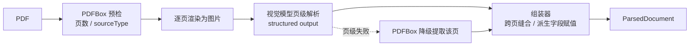

# pdf-parsing-design

## pdf-parsing-design

> 状态：已确认。产物 schema 与解析路线定稿，更详细的设计与实现另起任务推进。
>
> 对应问题域：`docs/project/analysis/paper-review-problem-space.md` 域 2 的 2-1 解析目标定义、2-6 解析产物数据结构，以及解析路线选型。版面识别、公式识别的实现方式（2-2、2-3、2-4 实现侧）、执行归属与存储位置（2-8、域 5）不在本文档范围。
>
> 样本依据：以一篇真实国赛论文（26 页正文 + 15 页附录 MATLAB 代码）完成结构盘点，本文档的元素类型与元数据均经样本校验。

---

### 一、设计目标

解析产物是评审链路的输入契约，一份契约约束一个生产者和四个消费者：

- 生产者：解析器。多模态路线下，本 schema 同时是视觉模型 structured output 的定义。
- 消费者一：评审服务。按语义区块与章节渲染 Markdown 作为 LLM 评审输入。
- 消费者二：RAG。按章节分组切分向量化。
- 消费者三：前端回显。评审结果按页码定位。
- 消费者四：合规检查。总页数与不含附录的正文页数是比赛硬约束，不同赛事要求不一，两个数都必须能从产物直接得出。

---

### 二、解析路线选型

三条候选路线的对比：

| 路线 | 对数模论文的表现 | 成本 |
|------|----------------|------|
| 程序化提取，PDFBox | 正文段落可用；公式提取为乱序字形碎片；图文环绕区域文字交错；表格结构丢失；扫描版完全失效 | 近乎为零 |
| 传统 OCR 加版面分析 | 解决扫描版的文字识别，但结构还原仍需额外拼装版面分析、公式识别、表格识别多个模型 | 部署维护多模型，开发成本高 |
| 多模态 LLM | 页面渲染为图片交视觉模型，文本型与扫描型统一处理，公式直接转 LaTeX，表格可还原，图文环绕的阅读顺序由模型理解，图表可产出文字描述 | 每次解析产生 API 费用 |

**选型结论**：主路线为多模态 LLM，PDFBox 做辅助与兜底，不采纳传统 OCR。理由见决策记录 1、2。

PDFBox 承担三件事：

1. 提取物理页数，回填 submission 表的 page_count。
2. 检测文本层，判定 sourceType。
3. 多模态调用失败时的降级文本提取。

处理管道分为两阶段，页级解析与文档级组装：

页级解析只要求模型产出本页可见的事实，跨页信息由组装器统一处理，职责边界见第五节。

---

### 三、产物结构总览

产物 ParsedDocument 由文档级元数据与扁平有序的元素序列构成。JSON 是唯一事实来源，评审输入的 Markdown、RAG 的切分、前端的定位均为派生视图。

#### 文档级元数据

| 字段 | 说明 |
|------|------|
| parseId | 本次解析产物的唯一标识 |
| schemaVersion | 产物结构版本号，演进规则为只增不改不删 |
| submissionId | 关联的提交记录 |
| totalPageCount | 物理总页数，来自 PDFBox 预检 |
| sourceType | TEXT_PDF、SCANNED_PDF、MIXED，来自 PDFBox 文本层检测 |
| parseOutcome | SUCCESS、PARTIAL、FAILED。PARTIAL 表示部分页降级，FAILED 表示产物不足以支撑评审 |
| failedPages | 多模态解析失败、走降级或彻底失败的页码列表 |
| zoneRanges | 各语义区块的元素索引范围，事实源。区块的页码范围由索引范围内元素的页码派生，不单独存储 |
| parserVersion | 解析器实现版本 |
| parsedAt | 解析完成时间 |

页数合规检查的取数方式：总页数取 totalPageCount；不含附录的正文页数取 APPENDIX 区块首元素的 pageStart 减一，论文无 APPENDIX 区块时正文页数即 totalPageCount。骑缝页归属规则：附录起始页若同时含正文内容，该页计入正文页数。APPENDIX 边界页出现在 failedPages 中时，正文页数视为不可信，合规检查消费方须先检查区块边界页与 failedPages 的交集。

**产物不可变性**：一次解析产出一份以 parseId 标识的不可变产物。重新解析（解析器升级、PARTIAL 重试）产出新 parseId 的新产物，不覆盖旧产物。elementId 与 zoneRanges 索引仅在同一 parseId 内稳定，下游引用元素时必须绑定 parseId。存储与保留策略留域 5。

不设"降级元素占比"冗余字段，需要时由元素 parseStatus 实时统计。

#### 元素序列

扁平有序列表，列表顺序即阅读顺序，不设独立的 order 字段。不采用嵌套树，层级由 sectionPath 表达，理由见决策记录 3。

每个元素的通用元数据：

| 字段 | 说明 |
|------|------|
| elementId | 文档内自增序号 |
| type | 物理类型,见第四节 |
| semanticZone | 语义区块，组装器赋值的派生字段 |
| sectionPath | 章节路径数组，如 ["五、模型的建立与求解", "5.1 问题一", "5.1.1 模型的建立"]。组装器由 HEADING 序列确定性推导的派生缓存字段，HEADING 自身的 sectionPath 不含自己 |
| pageStart / pageEnd | 起止页码，多数元素两值相等，跨页合并的元素两值不同 |
| parseStatus | OK、DEGRADED、SUSPECT。DEGRADED 为降级产出，SUSPECT 为校验存疑，见第六节 |

事实源声明：HEADING 元素序列是章节层级的唯一事实源，zoneRanges 是语义区块的唯一事实源。sectionPath 与 semanticZone 均为组装器推导的派生字段，页级模型不产出这两个字段，避免双写打架。

---

### 四、元素物理类型

共 8 个类型。物理类型回答内容是什么形状，语义区块回答内容属于论文哪个部分，两个维度正交,见决策记录 4。

| 类型 | 内容体 | 专有字段 |
|------|--------|---------|
| HEADING | 标题文本 | level，取值 1 到 4 |
| PARAGRAPH | 带内联标记的文本 | 无 |
| FORMULA | LaTeX 字符串，行间公式 | equationNo 可空，如 "(3)" |
| TABLE | HTML 片段，原生表达合并单元格 | refNo 可空，caption 可空 |
| FIGURE | 无二进制内容 | refNo 可空，caption 可空，description 必填，objectKey 预留 |
| LIST | 列表项文本数组，保留原始标记如 ①、Step 1 | ordered 布尔 |
| CODE | 原始代码文本 | language 可空 |
| REFERENCE_ITEM | 单条参考文献原始文本 | 无 |

内容体的补充约定：

- **TABLE 用 HTML 片段**。样本中的计算结果表存在合并表头，Markdown 表格无法表达 rowspan 与 colspan，HTML 是 LLM 与前端都能直接消费的最低成本选择。
- **FIGURE.description 有内容规格**：必须覆盖图的类型、坐标轴或关键构成元素、图呈现的趋势或结论。规格写入 structured output 的字段描述，约束模型不产出"这是一张图"式的空话。图表是数模论文模型合理性论证的主要载体，description 是图表信息进入文本评审的唯一通道。
- **行内格式内联保留**：段落文本中加粗用双星号、行内公式用美元符定界、引用角标如 [3] 原样保留。加粗是作者自标的得分点信号，必须保留；行内公式不独立成元素，避免打碎段落语义。
- **类型判定优先级**：APPENDIX 区块内，内容为代码时优先判定为 CODE，即使物理上嵌在表格中，剥离表格外壳。样本附录 15 页 MATLAB 代码全部嵌在表格单元格内，无此规则会导致同类内容类型漂移。
- **类型不变式**：REFERENCE_ITEM 仅允许出现在 REFERENCES 区块，冲突时以 semanticZone 为准，降级为 PARAGRAPH。

语义区块枚举：TITLE、ABSTRACT、KEYWORDS、TOC、BODY、REFERENCES、APPENDIX。TOC 在渲染评审输入时默认排除。问题重述、模型假设等数模特有章节不进枚举，由 sectionPath 表达，理由见决策记录 5。

---

### 五、跨页缝合

多模态按页解析，页级模型只能看到单页图像，跨页信息是组装器的职责。契约为缝合定义两个支撑点：

1. 页级输出中，模型对本页首元素标注 continuesFromPrevious 布尔——本页开头是否为上一页末尾元素的延续。该标记仅存在于页级中间结果，组装器据此合并跨页段落与表格，合并后元素的 pageStart 取首段所在页、pageEnd 取末段所在页。最终产物中不保留该标记。
2. 页级输出中模型产出本页出现的 HEADING。组装器扫描全文 HEADING 序列，为每个元素推导 sectionPath；再按标题文本与位置识别区块边界，写入 zoneRanges 并为元素赋 semanticZone。推导以标题编号模式为主、字体 level 为辅——数模论文标题普遍带编号，编号文本是跨页更稳定的层级信号。

缝合与降级的组合规则：

- 合并不跨 parseStatus 边界。前一页为降级页时，忽略后一页的 continuesFromPrevious 标记，元素独立保留不合并。
- 降级页的 PDFBox 文本提取不产出 HEADING。若失败页可能含章节标题，则失败页之后、下一个可信 HEADING 出现之前的元素，sectionPath 可靠性存疑，这些元素标记 SUSPECT，防止章节错挂静默扩散到 RAG 分组与评审渲染。
- 页眉、页脚、页码不进入元素序列，作为排除指令写入页级 structured output 的提示，避免每页重复噪声污染产物并干扰续接判定。

页级模型不猜测它看不到的信息，组装器不重解析页面内容,两者职责以此为界。

---

### 六、质量与失败表达

失败按发生层级分别表达：

- **页级失败**：涵盖两类——多模态调用失败，以及调用成功但输出被截断或未通过 structured output 校验。密集代码页容易触发输出截断,截断的半页产物一律视为该页失败，不得当作成功保留。失败页走 PDFBox 降级文本提取（按该页有无文本层判定，见下），产出元素标 DEGRADED，页码进 failedPages，文档级 parseOutcome 为 PARTIAL。
- **文档级失败**：SCANNED_PDF 且多模态失败时，PDFBox 无文本层可提取，降级产物为空,此时 parseOutcome 为 FAILED，评审链路终止并向用户反馈，不产出貌似可用实则空洞的产物。PDFBox 预检本身失败（加密、损坏的 PDF）同样视为文档级 FAILED，page_count 保持空。
- **粒度约定**：降级与字符量校验均按"该页有无文本层"逐页判定。文档级 sourceType 仅作统计信息，MIXED 文档中的扫描页不做字符量校验，避免必然超阈值的误标。
- **幻觉防线**：多模态最危险的失败不是调用出错而是自信地编错。对有文本层的页，组装器用 PDFBox 文本层做逐页字符量粗校验，偏差超阈值的页，其元素标 SUSPECT。SUSPECT 不阻断评审，但评审侧可感知。公式转写错误、表格数字幻觉在字符量校验下不可检测，记为已知取舍，见决策记录 8。
- **质量信号的兑现通道**：渲染评审输入的 Markdown 视图时，DEGRADED 与 SUSPECT 元素携带内联标注，评审 Prompt 据此对相关论断降低置信权重；failedPages 非空时在渲染视图头部声明缺页情况。标注的具体格式留实现。质量标记只在事实源 JSON 与派生视图中传递，检测到而传不出去等于没检测。

与上游状态机的衔接语义：parseOutcome 为 SUCCESS 或 PARTIAL 时，submission 状态推进到待评审——PARTIAL 放行评审，缺页信息随质量通道传递；FAILED 时推进到解析失败终态，释放队伍互斥占用。触发方式与失败重试策略留 2-8。

---

### 七、API 契约

按跨切面原则 C-1，契约先于实现。解析的执行归属服务尚未决策（2-8），以下路径以 parsing 为资源前缀定义能力接口，宿主服务确定后挂载，路径语义不变。

解析不是用户直接发起的操作——由提交完成事件触发，属于系统内部链路；对外只暴露查询。

| 方法 | 路径 | 说明 | 关键响应 |
|------|------|------|---------|
| POST | `/internal/parsing/submissions/{submissionId}/parses` | 内部接口，提交链路触发解析，幂等——同一 submissionId 存在进行中的解析时返回已有 parseId，不重复发起 | parseId |
| GET | `/api/parsing/submissions/{submissionId}/parses/latest` | 查询该提交最新一次解析的状态与文档级元数据，进行中返回进度阶段 | parseId、parseOutcome、failedPages、totalPageCount、zoneRanges |
| GET | `/internal/parsing/parses/{parseId}/elements` | 内部接口，评审与 RAG 拉取元素序列，支持按 semanticZone、type 过滤与分页 | 元素列表 |
| GET | `/internal/parsing/parses/{parseId}/markdown` | 内部接口，按渲染规则产出评审输入的 Markdown 派生视图，含质量内联标注 | Markdown 文本 |

契约要点：

- 触发接口幂等以 submissionId 加"进行中"状态判定，对应跨切面 C-3 防重。
- 元素与 Markdown 接口均以 parseId 定位，与产物不可变性一致——评审过程中上游重新解析不影响本次评审读取的产物。
- 解析进度与 submission 状态的主从关系归属跨切面 C-5，本契约的 latest 查询只暴露解析侧自身状态。

错误场景草案，错误码号段待 2-8 确定宿主服务后按 C-2 规范分配：

| 场景 | 语义 |
|------|------|
| 提交不存在或文件缺失 | 触发时校验 |
| 解析进行中重复触发 | 幂等返回，非错误 |
| parseId 不存在 | 查询类接口 |
| 产物为 FAILED 状态时拉取元素 | 拒绝并提示查看 outcome |

---

### 八、决策记录

按项目规范，所有设计决策记录结论与原因，面试可讲解取舍。

#### 1. 解析主路线采用多模态 LLM

**结论**：采纳。页面渲染为图片，视觉模型按页产出 structured output。

**原因**：数模论文是公式、表格、图文环绕密度最高的文档类型之一，样本 26 页正文约三分之一版面命中程序化提取的弱项，PDFBox 直接提取的产物不可用。解析质量是评审链路的地基，且解析是每次提交仅一次的低频操作，API 费用可控；文本型与扫描型统一链路，无需为扫描版单独建设 OCR。

**面试点**：技术选型的四维权衡——准确性、开发成本、运行成本、降级链路；schema 同时是解析产出契约与 LLM structured output 定义，选型与数据结构互相咬合。

#### 2. 不采纳传统 OCR 路线，PDFBox 降为辅助

**结论**：舍弃传统 OCR；PDFBox 保留做预检与兜底。

**原因**：OCR 仅在扫描版场景优于程序化提取，该场景已被多模态覆盖，OCR 无独立价值，且自行拼装版面分析、公式识别、表格识别多套模型的维护成本远超个人项目承受范围。PDFBox 成本近零，承担页数提取、文本层检测、降级兜底三件事，是多模态的安全网而非竞争者。

#### 3. 元素组织采用扁平有序列表，不用嵌套树

**结论**：采纳扁平列表加 sectionPath。

**原因**：下游消费方均偏好扁平结构——RAG 切分是顺序遍历加章节聚合，评审渲染是按区块过滤，嵌套树在序列化与遍历上更复杂。PDF 本身没有可靠的语义树，强行建树会放大版面识别误差；扁平结构把识别错误隔离在单个元素内。

**面试点**：数据结构服务于消费方，先看谁用怎么用，再定形状。

#### 4. 物理类型与语义区块双维度正交建模

**结论**：采纳。type 与 semanticZone 两个独立字段。

**原因**：评审维度中的论文学术规范直接依赖语义区块，如摘要完整性、引用规范性；物理类型与所属区块是正交信息，合并成单枚举会组合爆炸，如 ABSTRACT_PARAGRAPH、BODY_PARAGRAPH。符合已有偏好：能字段化就不标签化。

#### 5. 数模特有章节不进语义区块枚举

**结论**：舍弃。问题重述、模型假设、敏感性分析等章节不设枚举值。

**原因**：这些章节的命名与存在性随赛事和作者浮动，枚举无法穷举且识别易错；sectionPath 已能表达任意章节结构。语义区块只保留结构上稳定的部分——摘要、正文、附录三段式是数模论文的普遍共识。

#### 6. sectionPath 与 semanticZone 定义为组装器派生字段

**结论**：采纳。HEADING 序列与 zoneRanges 是事实源，两个元素级字段为派生缓存。

**原因**：页级模型看不到前页标题，无法正确产出跨页层级信息，让它猜必然错；双写则必然打架。事实源唯一化后，同一文档重复解析的派生字段稳定可复现。冗余保留派生字段是为下游消费便利，属可接受的读优化。

**面试点**：单一事实来源原则在 schema 设计中的落地；按页解析与文档级信息的矛盾如何用两阶段管道化解。

#### 7. 失败表达采用文档级三态加元素级三态

**结论**：采纳。parseOutcome 三态区分成功、部分降级、失败；parseStatus 三态区分正常、降级、存疑。

**原因**：失败是页级事件，文档级单一路线标记表达不了 41 页中 1 页失败的现实；扫描版加多模态失败时降级产物为空，必须有 FAILED 终态阻断评审，否则下游基于空产物产出垃圾评审且无人报警。

#### 8. 幻觉检测仅做字符量粗校验

**结论**：部分采纳。TEXT_PDF 做逐页字符量校验标 SUSPECT，不做语义级校验。

**原因**：公式下标转错、表格数字幻觉的检测需要二次模型交叉验证，成本翻倍，70% 原则下不值得；字符量校验近乎零成本，能兜住整页漏译、大段编造这类最有害的情形。语义级幻觉不可检测记为已知取舍。

**面试点**：多模态解析的固有风险认知，以及用最便宜的手段兜住最有害的场景。

#### 9. 不保留坐标信息

**结论**：舍弃。bounding box 不进产物契约。

**原因**：评审、RAG、合规检查均不消费坐标，保留会使产物体积膨胀数倍。代价是前端回显只能定位到页，无法高亮到元素——在图式密集的页面用户需自行寻找，接受页级定位精度是本决策的显式后果。

#### 10. 交叉引用不解析成链接

**结论**：舍弃。"由式（1）可知"、"如图 15 所示"保持原文。

**原因**：评审 LLM 靠 equationNo 与 refNo 自行关联编号，解析引用图谱对三个评审维度无增益，属过度设计。

#### 11. 图像内容仅以 description 转化，不做独立图像理解

**结论**：采纳。FIGURE 不含二进制内容，description 是图表进入评审的唯一通道，objectKey 预留。

**原因**：解析本身就是视觉模型在看页面，顺带产出规格化描述几乎零边际成本；独立的图像理解调用与多模态评审属另一个量级的成本。美观与排版不进本期评审维度，扩维度属域 4 的事，objectKey 预留保证将来升级不改契约。

#### 12. 产物结构带 schemaVersion

**结论**：采纳。版本演进规则为只增不改不删。

**原因**：解析产物会持久化存储，将来启用图像理解或新增字段时，读取历史存量产物需要判断结构版本，一个字段消除全部猜测式兼容。

#### 13. 解析阶段不做内容消毒，Prompt 注入防护下传

**结论**：采纳忠实转录，解析侧不识别不过滤注入文本。

**原因**：论文 PDF 是用户上传的不可信输入，页面可内嵌"忽略以上指令"式注入文本，注入面覆盖解析用的视觉模型与下游评审 LLM。解析器的职责是忠实还原文档内容，在解析侧做内容裁剪会引入误杀且职责越界。该风险显式声明并下传：注入防护统一归属域 4 的 4-6，评审侧设计时须知解析产物含未消毒的用户内容。

**面试点**：不可信输入在多级 LLM 链路中的信任边界划分——每一级只做自己职责内的防护。

#### 14. 解析成本与时延的数量级预估

**结论**：采纳选型前提的量化 sanity check，精确值留实现实测。

**原因**：以 40 页论文估算，每页渲染图像约消耗一千至两千输入 token，全文输入约五到八万 token，输出约两到四万 token，按当前主流视觉模型价格单篇解析成本在一元人民币以内的量级；页间无依赖可并发调用，总时延预期一到三分钟量级，远短于评审环节自身的耗时。该量级支撑"低频操作费用可控"的选型论断；若实测偏离量级，重新评估附录的解析粒度策略。

**面试点**：技术选型的成本论证不能停留在"可控"二字，要有数量级的估算兜底。

---

### 九、非目标

以下问题不在本文档范围，留待域 2 后续问题与相关域：

- 解析引擎的具体实现：模型供应商、单页或多页批量调用、附录的解析粒度与成本策略、structured output 的异构类型兼容方式、公式定界符统一与转义、双栏阅读顺序的验收。
- 产物级尺寸上限与渲染资源控制：超长内容体、异常海量元素的截断阈值，多页 PDF 渲染图片的内存控制。已知需要防线，数值属实现细节。
- 解析产物的存储位置，MySQL 或 MinIO，牵动域 5 的 5-1 与 5-4。
- 解析执行归属 submission 还是 review 服务、同步或异步、失败重试策略、错误码号段分配，对应 2-8 与 C-2。
- RAG 的切分策略。契约已提供 sectionPath 支持按节分组，策略本身留 RAG 实现阶段。
- Prompt 注入的实际防护手段，归属域 4 的 4-6，本文档只声明风险下传。

---

### 十、关联文档

- 问题域全景与状态追踪：`docs/project/analysis/paper-review-problem-space.md`
- 上游提交链路与 submission 表结构：`docs/project/modules/submission-service-design.md`
