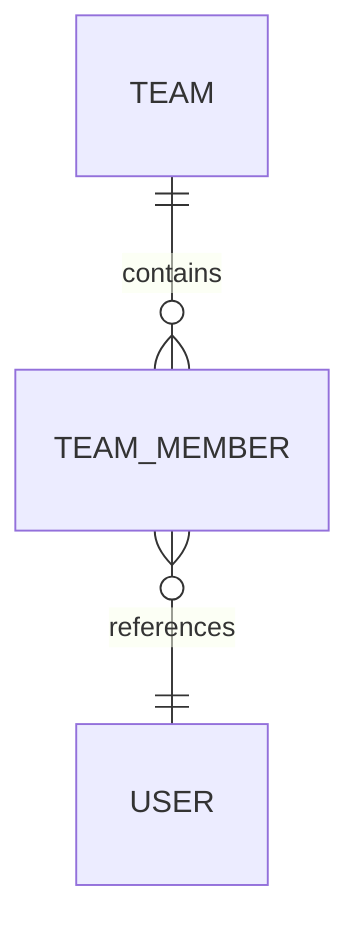

# team 服务设计

> 创建日期：2026-07-30
> 状态：已实现

---

## 一、职责

团队服务运行在 8082 端口，负责创建队伍、查询队伍、成员管理和解散队伍。服务独占 `lm_team` 数据库，并通过 Flyway 管理迁移。

---

## 二、数据所有权

- `team` 是团队核心实体，保存名称、描述、队长、人数上限和状态
- `team_member` 是成员关联实体，保存用户、团队角色和加入时间
- `team_member` 使用三个独立状态保存建模手、编程手和论文手角色
- 用户数据归 user-service 所有，team-service 只保存用户 ID
- 添加成员前通过 Feign 确认目标用户存在且账号可用

---

## 三、API 接口

| 方法 | 路径 | 说明 | 权限 |
|------|------|------|------|
| POST | `/api/teams` | 创建队伍，创建人自动成为队长 | 登录用户 |
| GET | `/api/teams` | 查询我加入的队伍 | 登录用户 |
| GET | `/api/teams/{id}` | 查询队伍详情和成员列表 | 登录用户 |
| PUT | `/api/teams/{id}` | 更新队伍信息 | 队长 |
| DELETE | `/api/teams/{id}` | 解散队伍 | 队长 |
| POST | `/api/teams/{id}/members` | 直接添加成员 | 队长 |
| DELETE | `/api/teams/{id}/members/{memberId}` | 移除成员 | 队长 |
| PUT | `/api/teams/{id}/members/{memberId}/roles` | 设置成员专业角色 | 队长 |
| DELETE | `/api/teams/{id}/leave` | 退出队伍 | 普通成员 |

内部接口由 common-api 中的 Feign 契约统一声明，提供团队信息、成员 ID 列表和活跃团队数量查询。

---

## 四、生命周期规则

- 团队状态使用 `1` 表示活跃，使用 `0` 表示已解散
- 解散只更新状态，不删除团队和成员数据，保证历史提交仍能关联原团队
- 已解散团队允许查询，不允许更新资料或变更成员
- 队长不能退出或被移除
- 团队人数上限不能超过 3 人，创建时可以设置更小的上限
- 同一用户可以加入多个团队，但不能重复加入同一团队
- 每名成员可以同时担任建模手、编程手和论文手，三个状态默认均为否

---

## 五、并发与性能

- 添加成员采用事务和团队行锁串行化容量检查，避免两个并发请求同时越过人数上限
- 数据库联合唯一约束兜底同一用户重复加入同一团队
- 我的团队列表批量查询成员并按团队分组，避免逐队查询产生 N 加一问题
- Feign 调用失败返回服务端错误，不使用空对象或零值伪装正常结果

---

## 六、决策记录

### 直接添加成员

当前采用队长按用户 ID 直接添加的方式，不实现邀请和接受流程。该方案能覆盖基础组队链路，成本更低。

### 状态留存

不采纳解散时逻辑删除团队。逻辑删除会让 MyBatis-Plus 默认查询无法读取历史团队，与解散后历史提交和排名可追溯的目标冲突。当前仅修改团队状态。

### 专业角色

专业角色采用 `modeler`、`programmer` 和 `writer` 三个独立布尔字段。该方案直接表达多选关系，查询和展示简单，且角色集合固定，不需要额外关联表。队长和普通成员身份继续由原有 `role` 字段表达，与专业角色相互独立。
