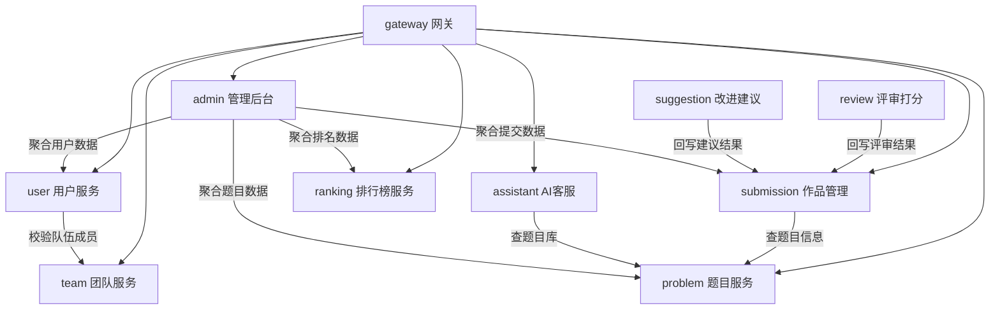
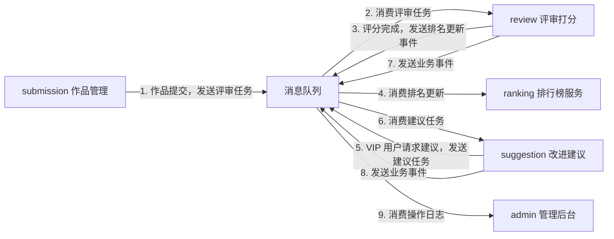
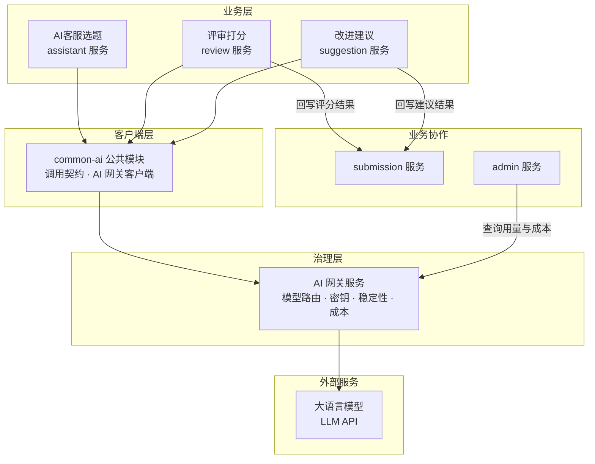

## 微服务架构

> 创建日期：2026-07-23
> 最后更新：2026-07-30

---

### 一、拆分原则

后续任何微服务的新增、合并、拆分，均依据以下原则判断：

1. **单一业务能力**：一个服务只负责一个限界上下文，不把无关的业务逻辑塞进同一个服务
2. **数据主权独立**：每个服务独占自己的数据库，不允许跨服务直连数据库
3. **异步优先**：服务间能通过 MQ 解耦的，不做同步调用；能最终一致性的，不强求强一致性
4. **复用与治理分层**：稳定的客户端契约下沉为公共 Jar，需要统一运行时治理的能力独立部署为服务
5. **拆分可讲**：每次拆分要有明确的面试可讲点（服务间通信、异步解耦、限流熔断等），不为拆而拆

---

### 二、功能与服务映射

基于用例分析结果，各用例对应的服务如下：

| 用例 | 负责服务|
|------|---------|
| UC-01 注册账号 | user|
| UC-02 登录账户 | user|
| UC-03 管理队伍 | team|
| UC-04 浏览题目 | problem|
| UC-05 AI 客服对话 | assistant|
| UC-06 提交作品 | submission|
| UC-07 管理作品 | submission|
| UC-08 评审打分 | review|
| UC-09 请求改进建议 | suggestion|
| UC-10 查看排行榜 | ranking|
| UC-11 管理后台 | admin|

---

### 三、项目结构

```
LeetModel/
├── LeetModel-frontend/          ← 前端
├── LeetModel-backend/           ← 后端微服务（Maven 多模块）
│   ├── pom.xml                  ← 父 POM，统一依赖版本管理
│   ├── common/                  ← 公共 Jar 模块
│   │   ├── common-core/         ← 统一响应体、异常、工具类、分页
│   │   ├── common-api/          ← Feign 接口声明
│   │   ├── common-security/     ← 认证鉴权
│   │   └── common-ai/           ← AI 网关客户端、统一调用契约、测试支持
│   ├── gateway-service/         ← API 网关
│   ├── ai-gateway-service/      ← 模型路由、密钥、稳定性、成本治理
│   ├── user-service/            ← 用户与 RBAC
│   ├── team-service/            ← 组队与成员管理
│   ├── problem-service/         ← 题目管理与查询
│   ├── assistant-service/       ← AI 客服与题目推荐
│   ├── submission-service/      ← 作品提交与管理
│   ├── review-service/          ← 评审打分
│   ├── suggestion-service/      ← 改进建议
│   ├── ranking-service/         ← 排行榜
│   └── admin-service/           ← 管理后台
│
└── docs/                        ← 所有文档
```

---

### 四、服务职责边界

| 服务 | 端口 | 职责 | 对外接口 | 消息队列|
|------|------|------|----------|----------|
| **gateway** | 8080 | 路由转发 + 认证鉴权 | - | -|
| **ai-gateway** | 由部署配置确定 | 模型路由、供应商适配、密钥、稳定性、Token 与成本治理 | AI 调用、用量与成本统计 | -|
| **user** | 8081 | 注册登录、RBAC 权限管理 | 根据ID查用户信息、权限校验 | -|
| **team** | 8082 | 组队、成员管理、解散留存 | 查团队成员列表、队伍是否有效 | -|
| **problem** | 8083 | 题目 CRUD、分类标签、搜索 | 查题目详情 | -|
| **submission** | 8085 | 作品提交（上传+存储）、作品管理（历史+结果查询） | 查提交记录、关联题目信息 | 生产：评审任务|
| **admin** | 8084 | 聚合统计、操作日志 | 无（纯聚合查询方） | -|
| **assistant** | 8086 | 对话式选题推荐、会话管理 | - | -|
| **review** | 8087 | 消费评审任务、多维度评分、结果回写 | 回写评审结果 | 消费：评审任务 · 生产：排名更新事件|
| **suggestion** | 8088 | 改进建议生成（VIP 角色控制） | 接收建议请求 · 回写建议结果 | 生产 + 消费：建议任务|
| **ranking** | 8089 | 每题独立排名、多维度分数展示 | 查排名 TopN、某用户排名 | 消费：排名更新事件|

---

### 五、服务间调用关系

#### 同步调用



#### 异步调用（消息队列）



#### AI 模块依赖关系



- **assistant / review / suggestion** 三个 AI 消费方均依赖 common-ai，各自维护 Prompt、工作流和质量规则
- **common-ai** 作为 Jar 被引用，只提供 AI 网关客户端、统一契约和测试支持
- **ai-gateway** 独立部署，是访问模型供应商的唯一出口，统一管理密钥、路由、稳定性、Token 和成本
- **admin** 通过 AI 网关内部接口查询调用统计，不直接访问 AI 网关数据库
- 评审通过 MQ 由 submission 触发，建议由用户调用 suggestion API 异步处理

---

### 六、关键设计决策

#### 决策 1：团队服务独立 + RBAC 角色分层

团队有独立的生命周期（创建 → 组队 → 提交 → 解散），解散后需保留历史记录。独立后可讲**服务间通信**话题（user 调用 team 校验成员）。

RBAC 角色分为三层：**管理员 > VIP 用户 > 普通用户**。VIP 角色控制改进建议等付费功能的访问权限，增加权限体系的层次感和面试深度。

#### 决策 2：作品管理与 AI 处理分离

submission 管理作品的 CRUD 和文件存储，review 和 suggestion 负责 AI 处理。三者通过 MQ 异步解耦：
- submission 收到作品后发送评审任务到 MQ，不等待结果，立即返回
- review 消费任务执行评分，完成后同步回调结果
- 计算密集型 AI 操作独立部署，便于限流、重试、扩缩容

#### 决策 3：评审与建议分离（VIP 权限）

评审打分是核心功能，每次提交必须执行。改进建议为 VIP 功能，通过 RBAC 角色控制访问。独立部署便于：
- 权限控制：网关层根据用户角色（VIP/普通）拦截建议请求，suggestion 服务无需感知权限逻辑
- 差异化限流：VIP 建议服务可单独配置资源配额
- 独立演进：两种 AI 工作流的 Prompt 和模型可分别迭代
- 面试可讲：RBAC + 服务拆分的实际业务落地

#### 决策 4：AI 客服独立

对话式 AI 客服与题目 CRUD 是两种不同的交互模式。assistant 独立为服务：
- 定位为可拓展的对话式 AI 入口，后续可接入知识库等能力，当前专注选题推荐
- 需要会话状态管理和流式输出，与普通请求-响应模式技术特征不同
- 面试可讲：AI Agent + 工具调用（查题目库、查用户历史）的设计模式

#### 决策 5：排行榜异步更新 + 每题独立榜单

评审完成后通过 MQ 异步通知 ranking 服务更新排名：
- 解耦与削峰：排名重算不阻塞评审流程
- 每题独立榜单：每个题目维护独立的排名，展示多维度小分与总分
- 最终一致性：排名允许短暂延迟，换取系统解耦

#### 决策 6：管理后台为聚合层

admin 服务不拥有核心业务数据，调用各服务聚合统计数据。

#### 决策 7：AI 客户端与运行时治理分层

项目同时建设 `common-ai` 和 `ai-gateway-service`。`common-ai` 是业务服务使用的公共 Jar，负责统一调用契约和 AI 网关客户端。AI 网关是独立服务，集中管理供应商、模型路由、密钥、限流、熔断、Token、成本和调用审计。

业务 Prompt、工作流、RAG 和质量评价规则留在各自业务服务。AI 网关只提供模型调用治理，不吸收业务逻辑。模型质量由业务评测集判断，AI 网关记录实验、用量、成本和稳定性数据，管理后台组合这些维度比较模型性价比。
