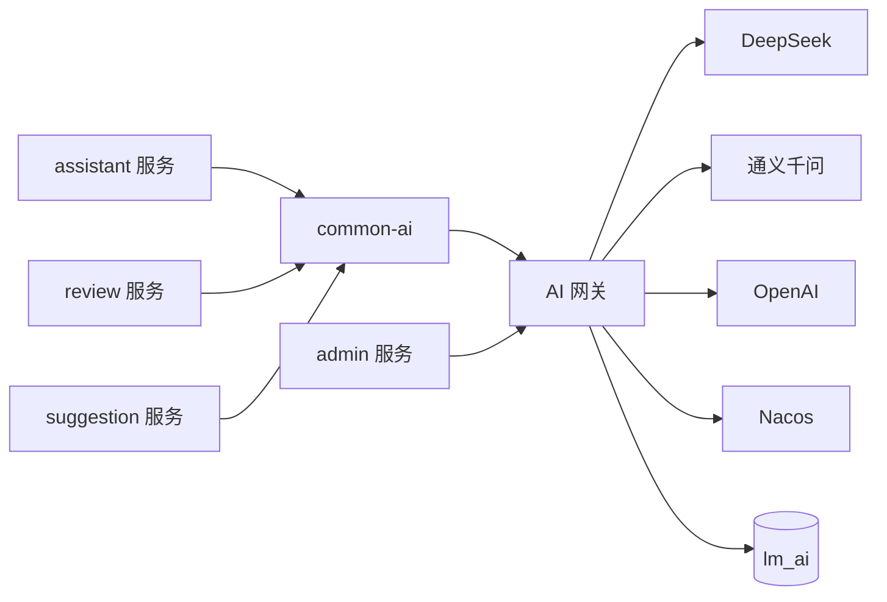

## AI 网关

---

### 一、定位

`ai-gateway-service` 是独立部署的 AI 调用治理服务，是项目访问外部模型供应商的唯一出口。

它集中管理供应商接入、模型路由、密钥、稳定性、Token 用量和成本。业务服务保留 Prompt、工作流、RAG 和质量评价规则，通过 `common-ai` 访问 AI 网关。

---

### 二、职责边界

AI 网关负责：

- 管理供应商、模型和场景路由配置
- 集中读取和使用模型供应商密钥
- 按场景动态选择主模型和备用模型
- 统一执行超时、重试、限流、熔断和故障切换
- 采集 Token、耗时、状态和失败原因
- 按调用时价格快照计算成本
- 记录调用审计和模型实验数据
- 向管理后台提供成本与稳定性统计
- 代理同步调用和流式调用

AI 网关不负责：

- 不定义业务 Prompt
- 不编排论文评审、改进建议或题目推荐流程
- 不判断业务结果是否正确
- 不维护业务知识库
- 不保存论文、评审结果或对话等业务数据

---

### 三、总体架构

Nacos 保存非敏感的动态路由配置和密钥引用。真实密钥通过受控配置或运行环境注入，不能写入仓库和普通日志。

---

### 四、场景路由

业务服务只提交场景编码，不指定必须使用的供应商。AI 网关根据场景路由决定供应商、模型和调用参数。

| 场景示例 | 业务归属 | 路由关注点 |
|---------|---------|-----------|
| 论文评审 | review | 推理质量、结构化输出、长上下文 |
| 改进建议 | suggestion | 建议质量、成本、响应时间 |
| 题目推荐 | assistant | 对话速度、工具调用、流式输出 |
| PDF 解析 | 解析流程所属服务 | 视觉能力、长文档成本、并发能力 |

每个场景配置主模型、备用模型、超时、最大 Token、温度和启用状态。配置通过 Nacos 动态刷新，模型切换不要求业务服务重新发布。

正在执行的请求使用开始调用时的配置快照，避免刷新配置改变执行中的路由。

---

### 五、稳定性治理

| 风险 | 策略 |
|------|------|
| 短暂网络异常 | 有界指数退避重试 |
| 供应商限流 | 全局并发控制、冷却窗口和请求排队 |
| 持续供应商故障 | 熔断后切换备用模型 |
| 流式调用中断 | 终止本次调用并记录已产生用量，不自动换模型续写 |
| 重复请求 | 通过业务幂等键识别，不重复产生费用 |
| AI 网关不可用 | 业务服务获得统一错误，由各自工作流降级或重试 |

模型切换只能发生在调用开始前或一次完整调用失败后。不能把不同模型的半段输出拼接为一个结果。

---

### 六、用量与成本

每次调用记录以下数据：

- 调用服务和业务场景
- 业务标识、Trace ID 和 Prompt 版本
- 供应商、模型和路由版本
- 输入 Token、输出 Token、推理 Token 和缓存 Token
- 请求开始时间、结束时间和总耗时
- 调用状态、错误类型、重试次数和模型切换情况
- 输入单价、输出单价、币种和估算成本

成本必须使用调用发生时的价格快照计算。供应商调价只影响后续调用，不能改变历史成本。

调用记录默认不保存完整 Prompt 和完整模型输出。需要排查或质量评估时保存脱敏内容、摘要或内容哈希，避免论文和用户数据在治理服务中形成第二份业务数据。

---

### 七、质量评估边界

AI 网关提供实验分流和调用数据，但不定义质量标准。

| 能力 | 归属 |
|------|------|
| 模型、参数和流量分组 | AI 网关 |
| Token、成本、延迟和成功率 | AI 网关 |
| 评审准确性与一致性 | review 服务 |
| 推荐命中率与采纳率 | assistant 服务 |
| 改进建议完整性与可执行性 | suggestion 服务 |

业务服务使用自己的评测集产生质量分数，并通过调用记录标识关联模型、参数、成本和延迟。管理后台据此比较不同模型在同一业务场景中的质量与性价比。

---

### 八、数据所有权

AI 网关独占 `lm_ai` 数据库。建议的数据边界如下：

| 数据 | 作用 |
|------|------|
| 供应商配置 | 记录供应商状态和密钥引用 |
| 模型配置 | 记录模型能力、上下文限制和启用状态 |
| 场景路由 | 记录主备模型、参数和路由版本 |
| 调用记录 | 记录用量、耗时、结果状态和业务关联标识 |
| 价格规则 | 保存供应商价格及生效时间 |
| 实验配置 | 保存流量分组和候选模型 |

管理后台通过 AI 网关内部接口查询统计数据，不直接访问 `lm_ai`。

---

### 九、管理监控

管理后台需要展示：

- 今日和指定时间范围内的 Token 与成本
- 按供应商、模型、场景和调用服务聚合的用量
- 成功率、平均耗时和高分位耗时
- 超时、限流、熔断和主备切换次数
- 不同模型在相同场景中的质量、成本和延迟对比
- 异常成本增长和错误率增长告警

成本监控回答资源消耗问题，质量评估回答结果是否值得问题，两者必须通过调用记录标识关联，不能只看价格选择模型。

---

### 十、决策记录

| 决策 | 备选方案 | 结论与原因 |
|------|---------|-----------|
| 独立部署 AI 网关 | 各业务服务直接调用供应商 | 统一密钥、路由、稳定性、成本和审计治理 |
| 按业务场景路由 | 业务服务指定供应商和模型 | 模型切换不影响业务代码，便于统一实验与降级 |
| Prompt 留在业务服务 | AI 网关集中管理 Prompt | Prompt 与业务规则和工作流强相关 |
| 价格使用历史快照 | 查询时使用当前价格 | 避免供应商调价后历史成本失真 |
| 质量规则留在业务服务 | AI 网关统一打质量分 | 不同场景的正确性标准不可通用 |
| 管理后台调用内部接口 | admin 直接读取 `lm_ai` | 保护数据所有权和服务边界 |
