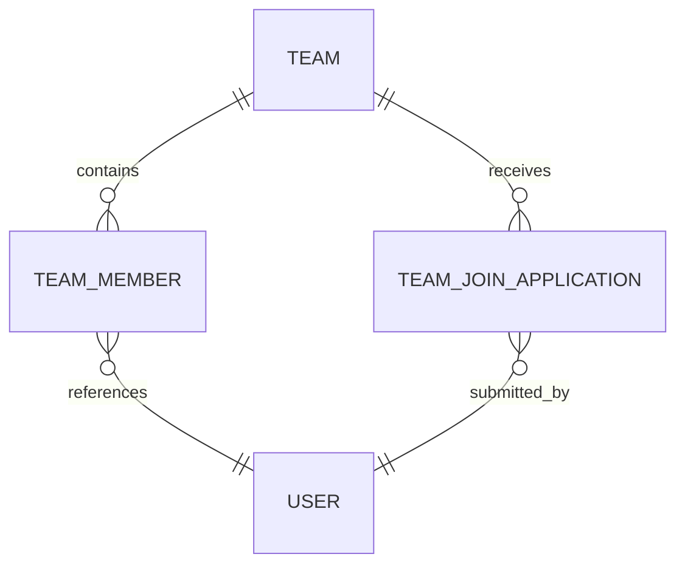

## 团队服务

### 一、目标

团队服务负责公共队伍发现、组队申请、队伍管理、成员角色和队伍生命周期。服务独占 `lm_team` 数据库，用户资料归用户服务所有。

组队功能需要形成完整闭环：

### 二、现状与问题

旧前端的组队广场和详情页完全使用本地模拟数据，没有团队 API 文件，也没有请求旧单体后端。创建队伍只修改页面内存，申请加入只显示成功提示，成员角色和队伍统计也是模拟值。旧单体后端没有团队控制器、团队业务逻辑和团队数据表，因此不存在可以迁移的组队接口。

当前微服务后端已经实现创建队伍、我的队伍、队伍详情、队伍信息修改、直接添加成员、移除成员、专业角色设置、退出和解散，但尚未覆盖完整的公开组队场景：

- 没有分页查询公共队伍的接口
- 没有按未满员和缺失专业角色筛选的能力
- 没有明确的招募开关和招募角色需求
- 没有入队申请与队长审核流程
- 返回成员数据只有用户 ID，无法直接展示昵称和头像
- 前端字段与后端字段不一致，前端使用 `teamId`、`memberCount` 和 `missingRoles`，后端返回 `id` 和成员明细
- 前端允许三至五人，系统规则和后端限制为一至三人
- 前端没有我的队伍和队伍管理界面，也没有针对队长与普通成员的操作区分

### 三、业务边界

#### 团队服务负责

- 队伍资料、状态、人数上限和招募配置
- 公共队伍查询、筛选和排序
- 入队申请的创建、取消、审核和状态流转
- 成员加入、退出、移除和专业角色分配
- 容量、重复申请、重复入队和并发审核约束

#### 用户服务负责

- 用户是否存在且账号可用
- 批量返回公开用户摘要，包括昵称和头像

团队服务只保存用户 ID。公共列表和详情需要展示用户信息时，由团队服务批量调用用户服务并组装响应，避免客户端跨服务拼接，也避免复制用户资料。

### 四、数据模型

#### 队伍

在现有队伍数据上增加招募配置：

| 字段 | 含义 |
|------|------|
| recruiting | 是否接受入队申请 |
| need_modeler | 是否招募建模手 |
| need_programmer | 是否招募编程手 |
| need_writer | 是否招募论文手 |

招募角色是队长表达的实际需求，不根据现有成员角色自动推断。现有成员已经覆盖某个角色时，队长仍可能希望招募同类成员。使用三个固定字段是因为角色集合稳定，查询条件简单，也符合字段化优先原则。

#### 队伍成员

沿用 `team_member` 保存队长身份和三个可多选专业角色。成员退出或被移除后删除当前成员关系，队伍解散时保留成员关系用于历史数据追溯。

#### 入队申请

新增 `team_join_application`：

| 字段 | 含义 |
|------|------|
| id | 申请 ID |
| team_id | 目标队伍 ID |
| applicant_id | 申请人用户 ID |
| desired_modeler | 是否希望担任建模手 |
| desired_programmer | 是否希望担任编程手 |
| desired_writer | 是否希望担任论文手 |
| message | 申请说明 |
| status | pending、approved、rejected、cancelled、closed |
| handled_by | 审核人用户 ID |
| handled_at | 审核时间 |
| create_time | 申请时间 |

同一用户对同一队伍只能存在一条待处理申请。历史申请保留，重新申请创建新记录。审核通过时在同一事务内锁定队伍，重新校验队伍状态、招募状态、人数上限和成员唯一性，再写入成员关系并更新申请状态。队伍解散时，待处理申请转为 `closed`，与队长主动拒绝区分。

### 五、查询设计

#### 公共队伍列表

公共列表只返回活跃队伍，支持以下条件组合：

- 队伍名称和简介关键词
- 只看未满员队伍
- 只看正在招募的队伍
- 缺建模手、编程手或论文手，可多选并按任一条件匹配
- 按创建时间或剩余名额排序
- 分页查询

列表项返回队伍基础信息、当前人数、剩余名额、招募角色、成员公开摘要和当前用户的关系状态。关系状态用于直接判断可以申请、已经申请、已经加入或本人是队长。

#### 队伍详情

活跃队伍详情可以由登录用户查看。已解散队伍只允许历史成员和内部服务查询。详情返回成员公开摘要、专业角色、招募需求、当前用户关系和可执行操作，不返回敏感用户信息。

#### 我的队伍

我的队伍保留独立接口，包含活跃与已解散队伍，并支持按状态筛选。它服务个人中心和管理入口，不与公共组队广场复用查询语义。

### 六、接口契约

| 方法 | 路径 | 说明 | 权限 |
|------|------|------|------|
| POST | `/api/teams` | 创建队伍并成为队长 | 登录用户 |
| GET | `/api/teams/public` | 分页查询公共队伍 | 登录用户 |
| GET | `/api/teams/mine` | 查询我的队伍 | 登录用户 |
| GET | `/api/teams/{id}` | 查询队伍详情 | 登录用户 |
| PUT | `/api/teams/{id}` | 修改队伍资料 | 队长 |
| PUT | `/api/teams/{id}/recruitment` | 修改招募开关和角色需求 | 队长 |
| DELETE | `/api/teams/{id}` | 解散队伍 | 队长 |
| POST | `/api/teams/{id}/applications` | 提交入队申请 | 登录用户 |
| DELETE | `/api/teams/{id}/applications/mine` | 取消本人待处理申请 | 申请人 |
| GET | `/api/teams/{id}/applications` | 查询队伍申请列表 | 队长 |
| PUT | `/api/teams/{id}/applications/{applicationId}` | 通过或拒绝申请 | 队长 |
| DELETE | `/api/teams/{id}/members/{userId}` | 移除成员 | 队长 |
| PUT | `/api/teams/{id}/members/{userId}/roles` | 设置成员专业角色 | 队长 |
| DELETE | `/api/teams/{id}/leave` | 退出队伍 | 普通成员 |

现有队长按用户 ID 直接添加成员的接口不作为普通用户组队主流程。若保留，只能作为管理或测试辅助能力，并应与申请审核共享容量和成员唯一性校验。

### 七、页面设计

#### 组队广场

- 搜索队伍名称和简介
- 筛选未满员、正在招募和所需专业角色
- 展示人数、剩余名额、招募角色和成员摘要
- 进入详情并提交入队申请
- 创建队伍

#### 队伍详情

- 展示队伍资料、成员和专业角色
- 展示明确的招募需求，不使用模拟统计
- 根据当前用户关系展示申请加入、取消申请、进入管理或退出队伍

#### 我的队伍

- 区分我管理的队伍和我加入的队伍
- 展示活跃与已解散状态
- 提供进入详情和管理页的入口

#### 队伍管理

- 编辑队伍名称、简介和招募配置
- 查看并审核待处理申请
- 设置成员专业角色
- 移除成员和解散队伍
- 普通成员不能访问队长操作

### 八、核心规则

- 队伍人数为一至三人，创建后不允许修改人数上限
- 同一用户可以加入多个队伍，但不能重复加入同一队伍
- 队长不能申请自己的队伍，成员不能再次申请已加入的队伍
- 已满员、停止招募或已解散的队伍不能接受新申请
- 队长不能退出或被移除
- 队伍解散后停止招募，并将待处理申请统一关闭
- 申请审核必须防止重复提交和并发超员
- 专业角色允许一人多选，不要求三个角色必须全部覆盖

### 九、验收重点

- 公共列表的分页、关键词和组合筛选结果正确
- 公共列表不出现已解散队伍
- 队伍满员、停止招募和重复申请均被正确拒绝
- 两个申请并发通过时不会超过三人上限
- 用户摘要批量查询失败时有明确降级，不伪造用户数据
- 队长、成员、申请人和无关用户看到的操作权限正确
- 前端所有人数、角色、申请和队伍状态均来自真实接口
