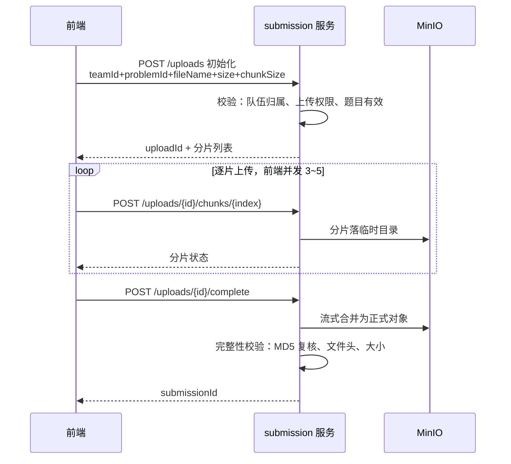
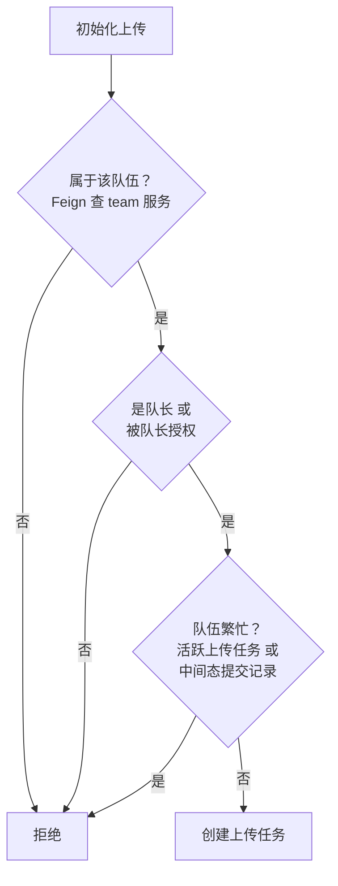

## 提交服务

> 创建日期：2026-08-01
> 最后更新：2026-08-01

---

### 一、服务定位

submission 服务承载论文提交链路，端口 8085，职责：

- PDF 分片上传与对象存储
- 提交记录管理与队伍上传权限管理
- 与 team 服务交互校验队伍归属与成员角色
- 评审任务通过 MQ 触发 review 服务，本服务只负责触发与状态记录，不执行评审

**边界说明**

- 提交记录状态机归属评审流程域，本文档只定义上传阶段的初始状态与错误状态
- 提交历史查询接口归属历史查询域，本文档不展开
- 评审任务的生产与消费链路随 MQ 实装后接入

**关联任务**：D-19 提交服务基础搭建、D-20 提交数据表实现、D-21 PDF 提交功能

---

### 二、上传协议设计

采用分片上传，三接口协议：初始化、传分片、合并完成。

**关键行为**

- 初始化校验题目存在且未下线
- 初始化接口幂等：同一用户对同一队伍重复发起上传，返回已有 uploadId，前端据此断点续传
- 分片对象按序号独立存储，MinIO 对象不可追加，合并是唯一聚合点
- 合并为一次流式处理：按序拼接分片，边拼边计算 MD5，校验与落库不二次读盘
- 合并失败回滚：分片保留，前端可重新发起 complete

**接口幂等与失败语义**

- 重复传同一分片：覆盖写，返回成功
- 合并失败：分片不清理，重试 complete
- 取消上传：删除任务记录与分片对象

---

### 三、提交归属与上传权限

#### 归属模型

- 提交记录归属队伍，记录上传操作者
- 队伍共同编辑一份 PDF 论文，以队伍为单位提交
- 上传者只记录操作事实，不改变归属

#### 权限模型

| 设计点 | 决策 |
|--------|------|
| 默认权限 | 队长默认可上传，无需预写入 |
| 授权机制 | 队长授予或撤销本队队员的上传权限，开关语义 |
| 授权对象 | 仅限本队队员 |
| 授权接口 | 授予、撤销、查看，队长专属 |
| 队长变更 | 授权全部失效，新队长重新授权 |

#### 校验链

校验时点的取舍：权限与互斥在 init 拦截，上传中撤销不中断已开始的上传；complete 只做数据完整性校验，职责分离。

#### 队伍论文互斥

队伍同一时刻只允许一份进行中的论文，上传中或评审链路未结束即拒绝新上传，防止多成员并发上传与重复提交。

**繁忙集合**

上传中、待解析、解析中、待评审、评审中。已完成与失败是终态，允许再次提交，多次提交记录全部保留。

**竞态防护**

两名有权限队员同时 init 可能同时通过查询校验，防竞态用数据库唯一约束：upload_task 表 `active` 字段加唯一索引 `uk_team_active(team_id, active)`，活跃任务 active 为 1，历史任务 active 为 NULL。MySQL 的 NULL 不参与唯一性约束，天然实现每队至多一条活跃上传，并发插入只有一条成功，另一条捕获唯一冲突返回队伍繁忙。

**释放时机**

| 事件 | 动作 |
|------|------|
| complete 成功 | 上传任务释放，提交记录进入待解析接棒繁忙 |
| 取消上传 | 上传任务释放 |
| 任务过期 | 定时清理时释放 |
| 评审失败 | 进入失败终态，可重新提交 |
| 评审完成 | 进入已完成终态，可再次提交 |

上传任务活跃状态与提交记录中间态首尾衔接，覆盖生命周期全时段。

#### 队长变更的清空机制

队长变更事件发生在 team 服务，权限表在 submission 服务，通过跨服务通知实现清空：

- 当前实现：team 服务在队长变更与队伍解散时通过 Feign 调用 submission 内部接口清空授权
- 兜底校验：init 权限校验链包含"授权用户必须仍是本队队员"，同步调用失败窗口期由兜底修正
- 演进路径：RocketMQ 实装后替换为异步事件，team 生产队角色变更事件，submission 消费清空

---

### 四、存储结构

沿用公共模块 MinIO 配置，单 bucket 按 prefix 分层：

| 区域 | 对象 key | 说明 |
|------|---------|------|
| 分片临时区 | `submission/tmp/{uploadId}/chunk-{index}` | 上传中产物，任务过期后清理 |
| 正式文件区 | `submission/{yyyyMM}/{submissionId}.pdf` | 按月份分目录，雪花 id 不可遍历 |

- 临时区清理：定时任务扫描过期 upload_task，删除分片对象
- 正式对象不可变，历史提交与评审回看依赖其保留

---

### 五、数据模型

落 `lm_submission` 库，全部走 BaseEntity 与命名规范。

#### upload_task 上传任务表

| 字段 | 说明 |
|------|------|
| upload_id | 上传凭证，UUID |
| team_id | 归属队伍 |
| uploader_id | 上传操作者 |
| file_name | 文件名 |
| file_size | 文件总大小 |
| chunk_size | 分片大小 |
| chunk_count | 分片总数 |
| status | 上传中、已完成、已过期、已取消 |
| active | 活跃标记，1 或 NULL，配合唯一索引实现队伍互斥 |
| expire_time | 过期时间，超时清理 |

`uk_team_active(team_id, active)`：每队至多一条活跃上传任务。

#### upload_chunk 分片明细表

| 字段 | 说明 |
|------|------|
| upload_id | 关联上传任务 |
| chunk_index | 分片序号 |
| chunk_size | 分片实际大小 |
| status | 已传、未传 |

`uk_upload_chunk(upload_id, chunk_index)`：同片不重复记录。

#### team_upload_permission 上传权限表

| 字段 | 说明 |
|------|------|
| team_id | 队伍 |
| user_id | 被授权队员 |

联合唯一键约束同一队伍不重复授权。

#### submission 提交记录表

| 字段 | 说明 |
|------|------|
| team_id | 归属队伍，必填 |
| uploader_id | 上传操作者 |
| problem_id | 关联题目 |
| file_name | 文件名 |
| file_size | 文件大小 |
| file_md5 | 完整性复核值 |
| object_key | 正式对象 key |
| page_count | 页数，解析阶段补全 |
| status | 待解析、解析中、待评审、评审中、已完成、失败 |
| error_msg | 失败原因 |

---

### 六、API 契约

| 方法 | 路径 | 说明 | 关键响应 |
|------|------|------|---------|
| POST | `/api/submission/uploads` | 初始化上传，幂等，校验队伍归属、上传权限、题目有效 | uploadId、chunkSize、分片列表 |
| POST | `/internal/submission/teams/{teamId}/upload-members` | 内部接口，team 服务在队长变更时调用，授权全部失效，幂等，不走网关 | 无 |
| POST | `/api/submission/uploads/{uploadId}/chunks/{index}` | 上传单分片 | 分片状态 |
| POST | `/api/submission/uploads/{uploadId}/complete` | 合并并创建提交记录，完整性校验 | submissionId |
| GET | `/api/submission/uploads/{uploadId}` | 查询上传进度 | 已传分片列表、状态 |
| DELETE | `/api/submission/uploads/{uploadId}` | 取消上传 | 无 |
| POST | `/api/submission/teams/{teamId}/upload-members` | 队长授予上传权限 | 无 |
| DELETE | `/api/submission/teams/{teamId}/upload-members/{userId}` | 队长撤销权限 | 无 |
| GET | `/api/submission/teams/{teamId}/upload-members` | 查看授权列表，队长专属 | 授权用户列表 |

错误码草案，BB=06 作品提交号段：

| 错误码 | 场景 |
|--------|------|
| 40601 | 文件校验失败 |
| 40602 | 分片越界 |
| 40603 | 上传已过期 |
| 40604 | 哈希不匹配 |
| 40605 | 无上传权限 |
| 40606 | 非队长操作 |
| 40607 | 队伍繁忙，当前有进行中的论文 |

限流复用全局 RATE_LIMITED 40004，不重复定义。

---

### 七、校验与安全

| 校验层 | 内容 |
|--------|------|
| 网关 | Content-Length 粗校验，按用户维度限流 |
| 服务端 | 分片大小、总大小上限 50MB、上传归属 |
| 合并时 | MD5 复核声明值、%PDF- 文件头、拼接大小一致 |

- 全部上传操作校验 uploadId 归属当前用户
- 权限接口校验队长身份，依赖 team 服务 Feign 查询

---

### 八、峰值并发

上传链路是同步 I/O，用户在线等待；评审链路是异步任务，MQ 缓冲。两条链路的洪峰策略不同：上传超限快速失败，评审任务排队不拒绝。

#### 两级限流体系

| 层级 | 维度 | 手段 |
|------|------|------|
| 网关 | 全局：上传路径总 QPS 上限 | RequestRateLimiter 按路径维度令牌桶 |
| 网关 | 单用户 | 每用户上传速率 |
| 服务层 | 单队伍 | 每队伍并发上传数。网关无法从 uploadId 映射队伍，队伍维度限流必须下沉服务层 |
| 服务层 | 全局：并发上传会话数 | 信号量保护线程池，超限快速失败 |
| 服务层 | 合并操作 | 独立限流，合并是流式读 50MB 加哈希计算的重量操作 |

超限语义：快速失败，返回限流错误码，前端指数退避重试。同步链路不排队，避免用户干等与连接占满。

#### 容量模型

- 单文件 50MB、分片 5MB，每文件 10 片，前端并发 3~5
- 500 队伍同时提交约产生 1500~2500 并发请求
- 峰值带宽为硬约束：25GB 集中提交时约 40~70MB/s
- Tomcat 默认线程数不足以承接，必须由并发信号量前置拦截

容量边界参数化，数值按部署环境可调。docker 单机环境不做全链路压测，参数预留。

#### 削峰补充

- 分片上传天然削峰，单请求仅 5MB
- 合并操作设置超时与失败回滚，分片保留可重试

---

### 九、决策记录

按项目规范，所有设计决策记录结论与原因，面试可讲解取舍。

#### 1. 采用分片上传协议

**结论**：采纳。三接口协议，前端并发 3~5 片。

**原因**：断点续传与失败重试成本低，单请求体积小；分片是上传链路扩展能力的基础。

#### 2. 不做文件去重与秒传

**结论**：舍弃。

**原因**：PDF 是二进制文件，任何微小修改都改变文件内容，同一文件重复提交的概率低，去重收益小，不值得为低收益引入指纹表与哈希链路复杂度。

**面试点**：功能取舍的思考过程，不什么功能都做。

#### 3. 文件上限 50MB，分片 5MB

**结论**：采纳。

**原因**：数学建模论文常规小于 20MB，50MB 留足余量；分片 5MB 使单请求体量适中，分片数可控。

#### 4. 提交归属队伍并记录上传者

**结论**：采纳。

**原因**：队伍共同编辑一份论文，归属以队伍为单位；记录上传者是操作事实。配套引入上传权限模型，默认队长可上传，可授权本队队员，防止队伍内恶意上传影响成绩。

#### 5. 权限校验时点：init 拦截，complete 只验数据完整性

**结论**：采纳。

**原因**：权限在传输前拦截最有效，上传中撤销不中断已开始的上传；complete 聚焦数据完整性，职责分离。

#### 6. 队长变更后授权全部失效，采用事件通知而非惰性失效

**结论**：采纳方案 B，Feign 同步通知先行，MQ 事件演进。

**原因**：惰性失效交互上残留旧授权痕迹，事件通知语义直接、用户感知正确；跨服务通知与项目微服务主线一致，面试可讲同步调用局限与异步事件演进。实现成本可控，不做属于低性价比的取舍。

#### 7. 权限表自建在 submission 服务

**结论**：采纳。

**原因**：上传权限只被提交链路消费，自建表使 team 服务零改动；授权数据与提交记录同库，随队伍数据保留，是否有效由校验逻辑判断。

#### 8. 系统总流量两级限流，超限快速失败

**结论**：采纳。

**原因**：题目提交通道常开，但真实比赛场景存在截止前集中提交的洪峰，单用户限流挡不住系统总量。上传是同步链路，用户在线等待，超限选择快速失败加前端退避重试而非排队；评审链路异步，MQ 队列天然缓冲。两条链路削峰哲学不同。

**面试点**：同步链路拒绝与异步链路排队的削峰取舍，容量模型的估算思路。

#### 9. 队伍论文互斥，繁忙拒绝二次上传

**结论**：采纳。队伍同一时刻只允许一份进行中的论文，上传中或评审链路未结束即拒绝新上传。

**原因**：多成员有上传权限时存在并发上传与重复提交风险，真实比赛虽少见但必须防；论文生命周期建模是基础，上传任务活跃状态与提交记录中间态首尾衔接覆盖全时段。互斥粒度为队伍级全局互斥：一个人基本专注一个题目，不存在同时提交多题目的真实场景。

**竞态防护**：数据库唯一约束加 NULL 技巧实现每队至多一条活跃上传，而非 Redis 分布式锁。数据库原子性天然保证并发插入只有一条成功，无锁管理与释放时机问题。

**面试点**：MySQL 部分唯一索引的 NULL 技巧；生命周期状态建模；竞态防护方案选型。

#### 10. 自建分片协议，而非 MinIO 原生 multipart

**结论**：采纳自建协议。

**原因**：MinIO 原生支持 multipart 上传，但业务状态——队伍互斥、过期清理、取消、按队伍检索活跃上传——需要数据库承载，MinIO 的 uploadId 无法关联业务实体。自建协议以数据库任务记录为核心，业务语义完整。

**面试点**：为什么不用云厂商原生分片能力的选型思考。
