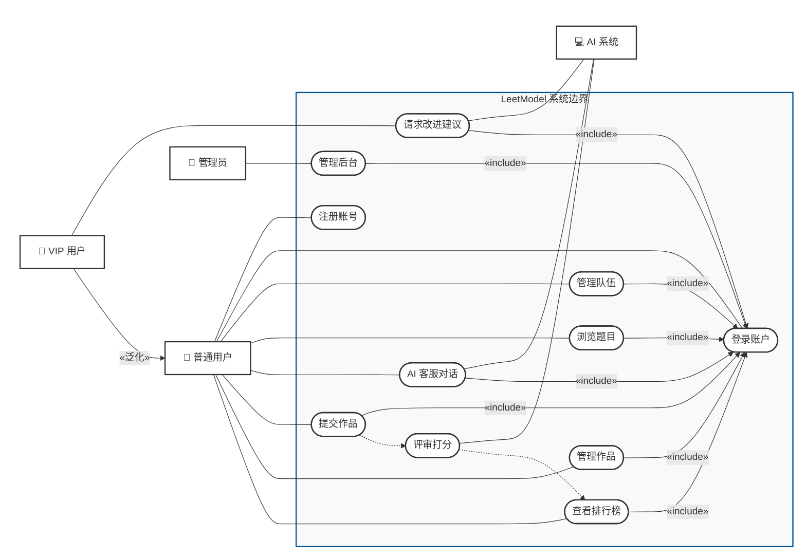

## 用例分析结论

> 创建日期：2026-07-25

本文档为用例分析的最终结论，去除所有分析过程和决策理由，直接作为后续模块拆分、接口设计、数据库设计的输入。

---

### 一、主要参与者

| 参与者 | 说明 |
|--------|------|
| 普通用户 | 注册登录、管理队伍、浏览题目、与 AI 客服交互、提交作品、管理作品、查看排行榜 |
| VIP 用户 | 继承普通用户全部用例，额外可使用「请求改进建议」功能 |
| 管理员 | 访问管理后台，查看统计数据与操作日志 |

### 二、次要参与者

| 参与者 | 说明 |
|--------|------|
| AI 系统 | 自动执行评审打分、生成改进建议，支持 AI 客服对话，为系统内部触发 |

### 三、用例清单

| 编号 | 用例名称 | 简述 |
|------|---------|------|
| UC-01 | 注册账号 | 用户注册账号以获取系统访问权限 |
| UC-02 | 登录账户 | 用户登录系统获取认证凭证 |
| UC-03 | 管理队伍 | 创建队伍、邀请成员、分配角色、解散队伍 |
| UC-04 | 浏览题目 | 浏览题目列表，按分类标签筛选，查看题目详情 |
| UC-05 | AI 客服对话 | 通过多轮对话获取题目推荐 |
| UC-06 | 提交作品 | 选题后上传 PDF 论文，触发评审 |
| UC-07 | 管理作品 | 查看提交历史、评审状态与评审结果 |
| UC-08 | 评审打分 | 系统多维度自动评分 |
| UC-09 | 请求改进建议 | VIP 用户获取论文改进建议 |
| UC-10 | 查看排行榜 | 每题独立排名，查看分维度分数与总分 |
| UC-11 | 管理后台 | 管理员查看统计数据与操作日志 |

### 四、用例图

#### 关系说明

| 关系类型 | 涉及元素 | 说明 |
|----------|---------|------|
| 关联 | 参与者 → 用例 | 参与者直接触发或参与用例 |
| 泛化 | VIP 用户 → 普通用户 | VIP 继承普通用户的全部用例 |
| 包含 | 8 个用例 → 登录账户 | 登录是这些用例的必需前置步骤 |
| 系统触发 | 提交作品 → 评审打分 → 查看排行榜 | 提交后自动触发评审，评审完成后更新排名 |
