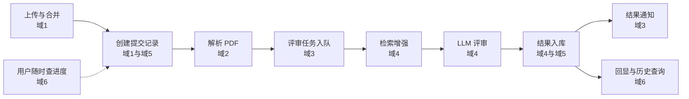

## 论文评审问题域

> 创建日期：2026-08-01
> 最后更新：2026-08-01

---

### 一、背景与范围

LeetModel 的论文评审功能面向数学建模竞赛论文，由 AI 自动完成评审。核心链路为：提交 PDF → 解析为结构化文本 → 检索增强 → AI 多维度打分 → 结果存储与回显。

评审功能横跨三个服务与一个公共模块：

| 服务或模块 | 端口 | 职责 |
|-----------|------|------|
| submission | 8085 | 提交记录管理、PDF 上传与对象存储 |
| review | 8087 | 消费评审任务，执行 AI 评审 |
| ai-gateway | 由部署配置确定 | 统一调用模型，记录 Token、成本和稳定性数据 |
| common-ai | 不独立部署 | AI 网关客户端、统一调用契约和测试支持 |

评审任务通过 MQ 由 submission 触发，review 消费后异步执行，状态可查询。

**本期范围**

- 仅支持 PDF 格式，单文件无附件
- AI 自动评审，无人工评审环节
- 评审维度固定三维：创新性、模型合理性、论文学术规范
- 同一用户或队伍可对同一题目多次提交，全部记录保留
- 用户只能查看自己或自己队伍的提交

**关联任务**

- A-06 AI 评审流程设计
- D-19 ~ D-26 提交与评审服务开发
- E-01 ~ E-09 AI 能力集成

---

### 二、问题域地图

本功能需要解决的问题按六个域组织。每个问题点有唯一编号，供后续设计与实现引用。

#### 域 1 论文提交

| 编号 | 问题 | 要解决什么 |
|------|------|-----------|
| 1-1 | 上传协议 | 一次性上传与分片上传的选择，决定 API 形态与断点续传能力 |
| 1-2 | 断点续传 | 服务端感知已传分片，上传凭证、分片记录、预检接口，中断后续传与临时分片回收 |
| 1-3 | 文件去重 | 内容哈希计算时机，去重命中后多提交记录共享存储对象，防伪造哈希 |
| 1-4 | 元数据获取 | 前端声明与后端解析的分工，页数与标题等只能服务端解析，防前端伪造 |
| 1-5 | 上传记录 | 上传任务与提交记录的关系，未完成上传的过期清理 |
| 1-6 | 大小与类型校验 | 单文件上限，校验层级，Magic Number 防伪装 PDF |
| 1-7 | 存储结构 | bucket 划分，对象 key 规则，临时分片区与正式区分离，生命周期管理 |
| 1-8 | 峰值并发 | 上传洪峰的限流策略，分片削峰，上传与评审资源隔离 |
| 1-9 | 安全性 | 认证、频率限制、超限资源防滥用 |

#### 域 2 PDF 解析

| 编号 | 问题 | 要解决什么 |
|------|------|-----------|
| 2-1 | 解析目标定义 | 结构化 Markdown 的标准，标题层级、段落、粗体、公式、表格、图片、引用的产出形式 |
| 2-2 | 版面结构识别 | PDF 只有文本流与坐标，从字体大小与加粗推断标题层级，从坐标推断段落与分栏 |
| 2-3 | 公式识别 | 数学公式转 LaTeX，识别失败时的降级策略 |
| 2-4 | 表格与图表 | 表格结构还原，图片与图表呈现给 LLM 的方式 |
| 2-5 | 引用识别 | 引用标记与参考文献是否结构化提取 |
| 2-6 | 解析产物数据结构 | 元素类型枚举、层级树、元素元数据的 schema，是评审消费的契约 |
| 2-7 | 质量与兜底 | 乱码、缺字体、扫描版 PDF 的处理，解析结果能否支撑评审的自检 |
| 2-8 | 执行方式与衔接 | 解析同步或异步，结果存储位置，解析失败后评审任务的衔接 |

#### 域 3 异步评审调度

| 编号 | 问题 | 要解决什么 |
|------|------|-----------|
| 3-1 | 生产端可靠性 | 提交成功后消息必达，事务消息与本地消息表的选择 |
| 3-2 | 消费端可靠性 | 消费失败重试次数与间隔，死信队列 |
| 3-3 | 消费幂等 | 重复消费不产生重复评审与重复入库 |
| 3-4 | 并发控制 | 消费者并发度，同一提交只消费一次，扩容机制 |
| 3-5 | 洪峰应对 | 短时大量任务的队列堆积监控，限流降级，排队或拒绝策略 |
| 3-6 | 状态一致性 | 消息处理与数据库状态最终一致，消费中宕机或重启的半成品恢复 |
| 3-7 | 结果通知 | 评审完成通知机制，通知可靠送达与去重 |

#### 域 4 评审流程

| 编号 | 问题 | 要解决什么 |
|------|------|-----------|
| 4-1 | 状态机设计 | 评审生命周期状态集合、触发事件、状态流转图、非法流转防护 |
| 4-2 | 工作流编排 | 解析、检索、分段评审、汇总打分的步骤编排，每步处理边界，断点恢复 |
| 4-3 | 正确性与一致性 | LLM 非确定性，多次评审结果一致性的保障手段，是否接受评审即共识 |
| 4-4 | 打分标准 | 多维度定义、权重、分值区间、评分依据来源 |
| 4-5 | 参考资料 | RAG 语料库来源与建设，检索相关性，引用可信度 |
| 4-6 | 安全性 | Prompt 注入防护，LLM 输出校验，内容安全 |
| 4-7 | 结果规范 | 评审结果数据结构，存储，同一论文多次评审的版本管理 |
| 4-8 | 失败处理 | LLM 超时、限流、熔断，步骤失败重试，降级方案 |
| 4-9 | 失败可见性与重试入口 | 评审失败的用户侧呈现，系统自动重试或用户手动重新评审 |

#### 域 5 数据结构与存储

| 编号 | 问题 | 要解决什么 |
|------|------|-----------|
| 5-1 | 存储分层 | MySQL、MinIO、Redis、MQ 各自的数据归属与边界 |
| 5-2 | 表规划 | 提交记录表、评审任务表、评审结果表的字段与关系，上传记录表取舍 |
| 5-3 | 数据关系模型 | 提交、解析产物、评审任务、评审结果的关联，多次提交的组织方式 |
| 5-4 | 解析产物与结果存储 | markdown 文本与评审结果 JSON 的存储位置，评审依据的存储 |
| 5-5 | 表设计规范落地 | 雪花主键、BaseEntity、字段化枚举、索引覆盖查询场景 |
| 5-6 | 数据生命周期 | 临时分片、解析中间产物、失败数据的清理，评审结果保留策略 |

#### 域 6 历史记录查询

| 编号 | 问题 | 要解决什么 |
|------|------|-----------|
| 6-1 | 查询场景清单 | 提交列表分页、单次提交详情、评审结果详情、评审进度查询的接口形态 |
| 6-2 | 评审进度查询 | 轮询或 SSE，进度来源字段，评审中与失败状态的呈现 |
| 6-3 | 数据权限 | 只能查看自己或自己队伍的提交，校验落在服务内或网关 |
| 6-4 | 队伍解散后的归属 | 历史提交归属保留方式，关联现队伍或提交时快照 |
| 6-5 | 版本管理 | 同一题目多次提交的纵向对比，同一提交重新评审的结果版本化 |
| 6-6 | 查询性能 | 分页、排序、筛选的索引设计，高频查询缓存 |

---

### 三、跨切面问题

| 编号 | 问题 | 要解决什么 |
|------|------|-----------|
| C-1 | API 契约先行 | 每个问题先定义接口契约再实现，这是统一的攻破方式 |
| C-2 | 错误码规划 | 06 提交与 07 评审号段已预留，新错误码按规范递增 |
| C-3 | 幂等与防重 | 用户重复点击提交，重复触发评审 |
| C-4 | 可观测性 | 队列深度、解析与评审耗时、失败率 |
| C-5 | 状态单一事实来源 | 进度查询读取的字段主从关系，散落多表的状态如何统一 |

---

### 四、全链路

---

### 五、攻破顺序

- 域 5 拆成两半：存储分层原则先行，表设计随各域推进
- 域 6 放最后，依赖全部表结构与状态机定义
- 每个域按统一流程攻破：问题定义确认 → API 契约 → 设计 → 确认 → 实现
